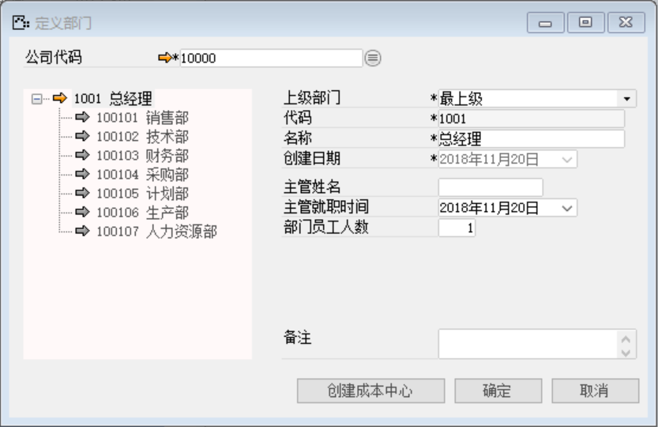
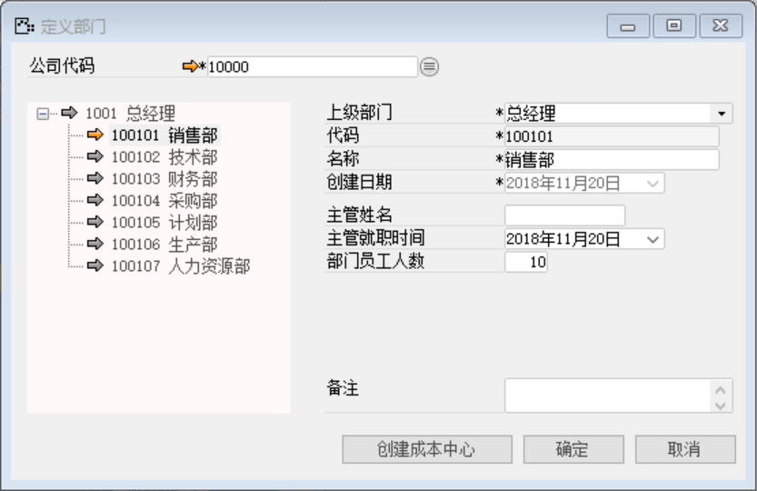
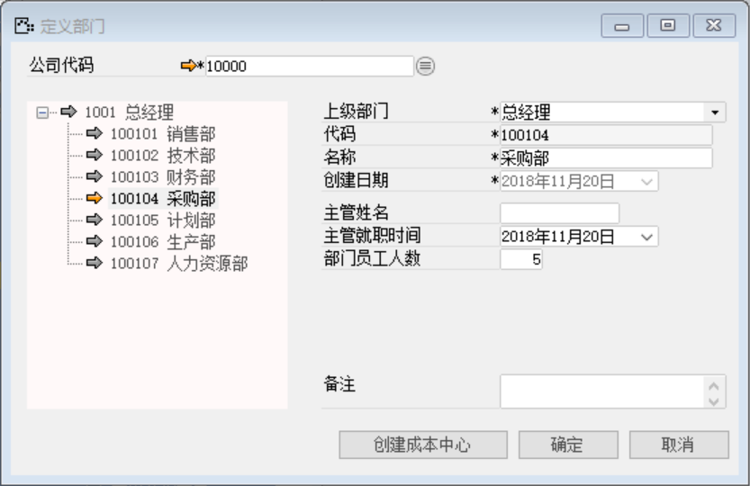
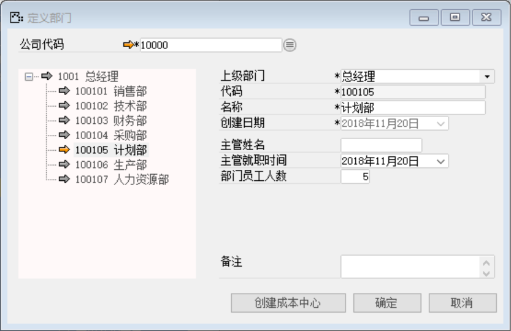
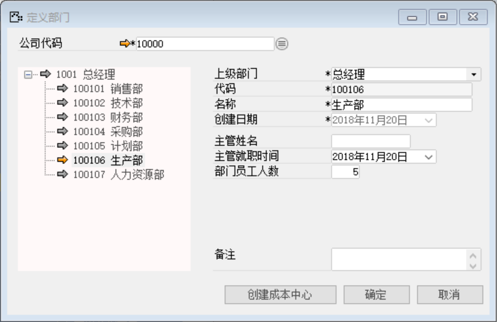
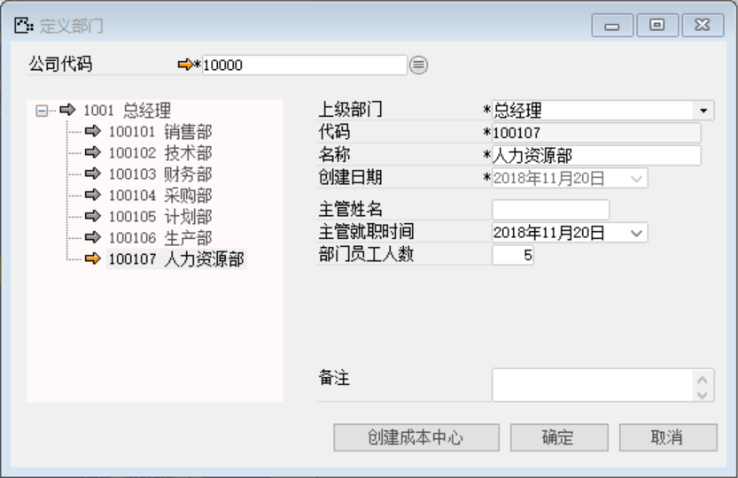

打开路径：【管理】-【基础定义】-【一般】-【定义部门】

(1) 总经理

内容表

| **字段** | **内容** |
| -------- | -------- |
| 公司代码 | 10000    |
| 上级部门 | 最上级   |
| 代码     | 1001     |
| 名称     | 总经理   |

 

(2) 销售部

内容表

| **字段** | **内容** |
| -------- | -------- |
| 公司代码 | 10000    |
| 上级部门 | 总经理   |
| 代码     | 100101   |
| 名称     | 销售部   |

 

(3) 技术部

内容表

| **字段** | **内容** |
| -------- | -------- |
| 公司代码 | 10000    |
| 上级部门 | 总经理   |
| 代码     | 100102   |
| 名称     | 技术部   |

 

(4) 财务部

内容表

| **字段** | **内容** |
| -------- | -------- |
| 公司代码 | 10000    |
| 上级部门 | 总经理   |
| 代码     | 100103   |
| 名称     | 财务部   |

 

(5) 采购部

内容表

| **字段** | **内容** |
| -------- | -------- |
| 公司代码 | 10000    |
| 上级部门 | 总经理   |
| 代码     | 100104   |
| 名称     | 采购部   |

 

(6) 计划部

内容表

| **字段** | **内容** |
| -------- | -------- |
| 公司代码 | 10000    |
| 上级部门 | 总经理   |
| 代码     | 100105   |
| 名称     | 计划部   |

 

(7) 生产部

内容表

| **字段** | **内容** |
| -------- | -------- |
| 公司代码 | 10000    |
| 上级部门 | 总经理   |
| 代码     | 100106   |
| 名称     | 生产部   |

 

(8) 人力资源部

内容表

| **字段** | **内容**   |
| -------- | ---------- |
| 公司代码 | 10000      |
| 上级部门 | 总经理     |
| 代码     | 100107     |
| 名称     | 人力资源部 |

