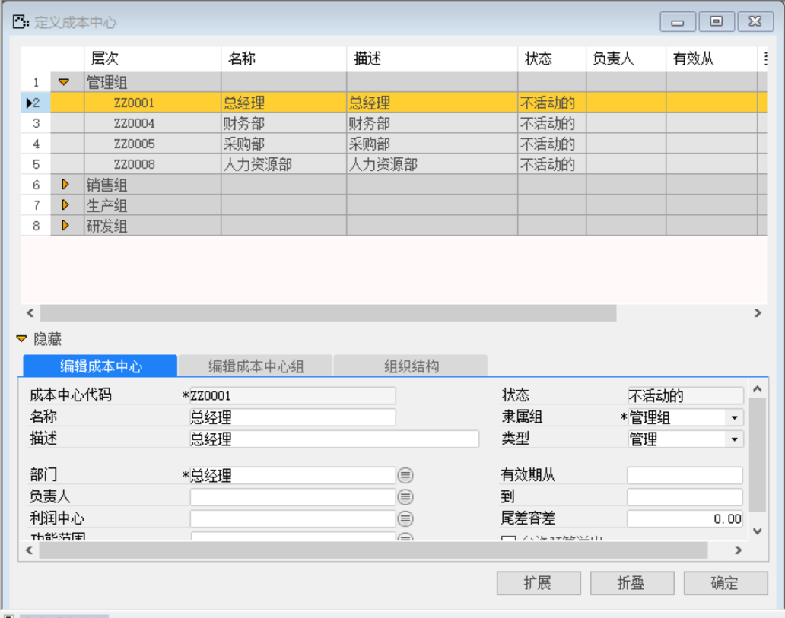
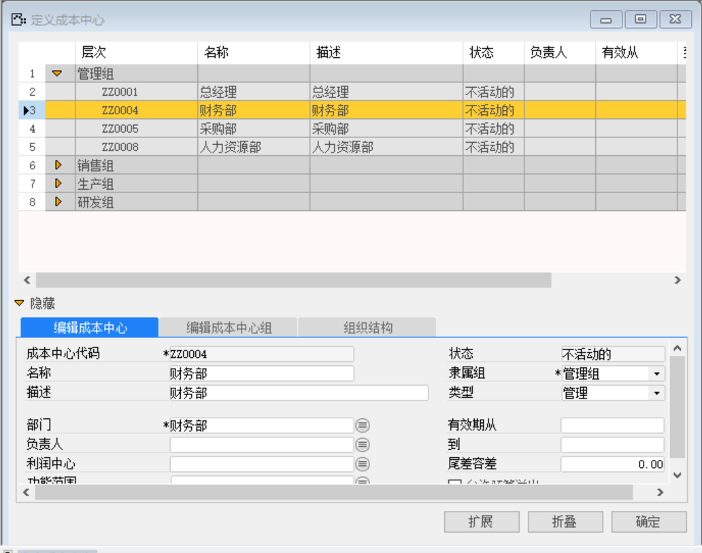
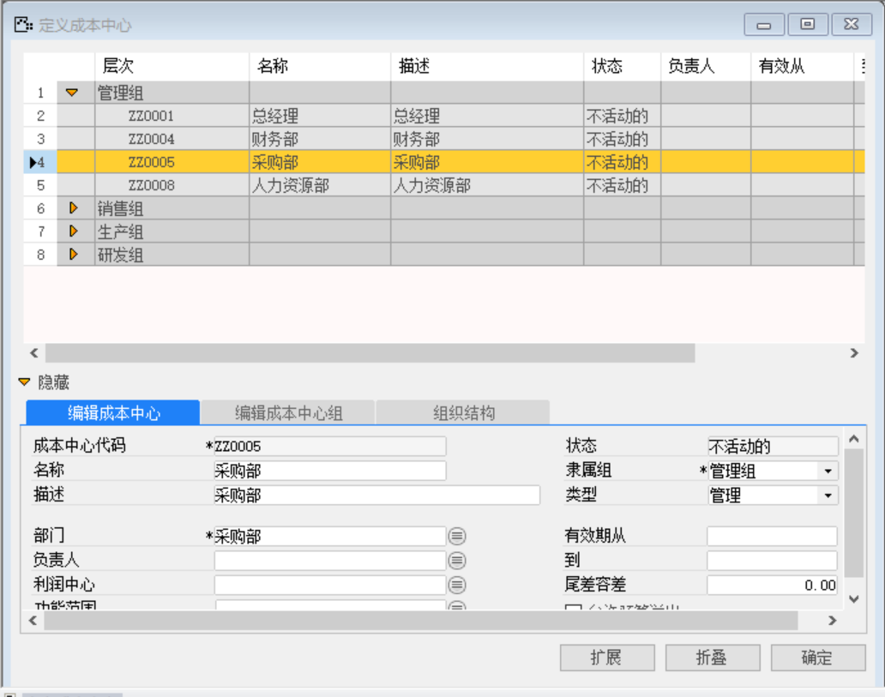
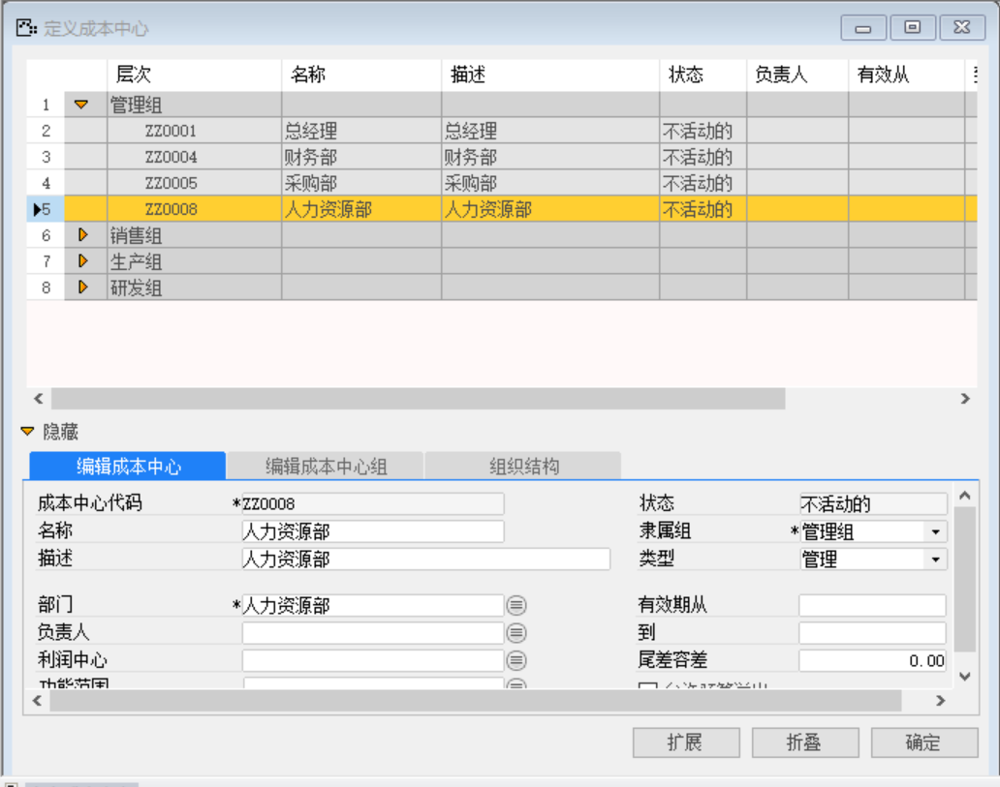
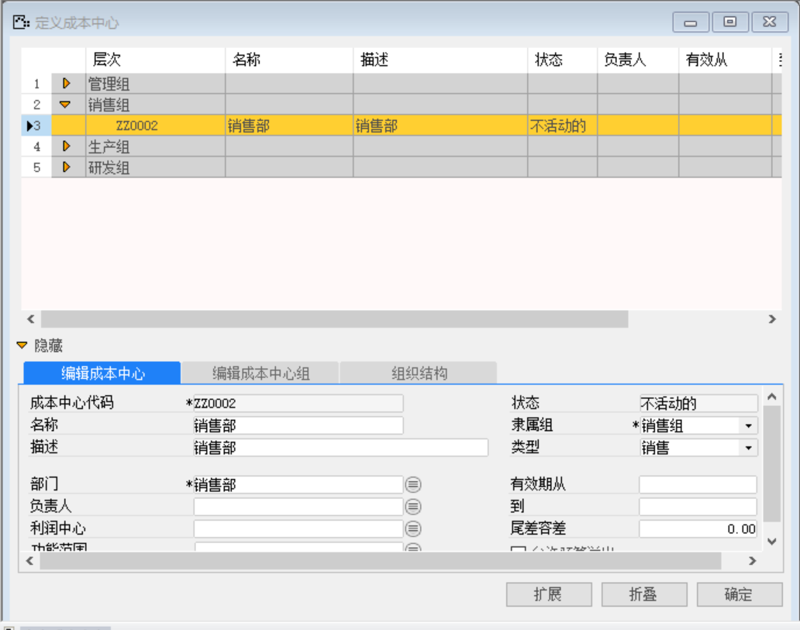
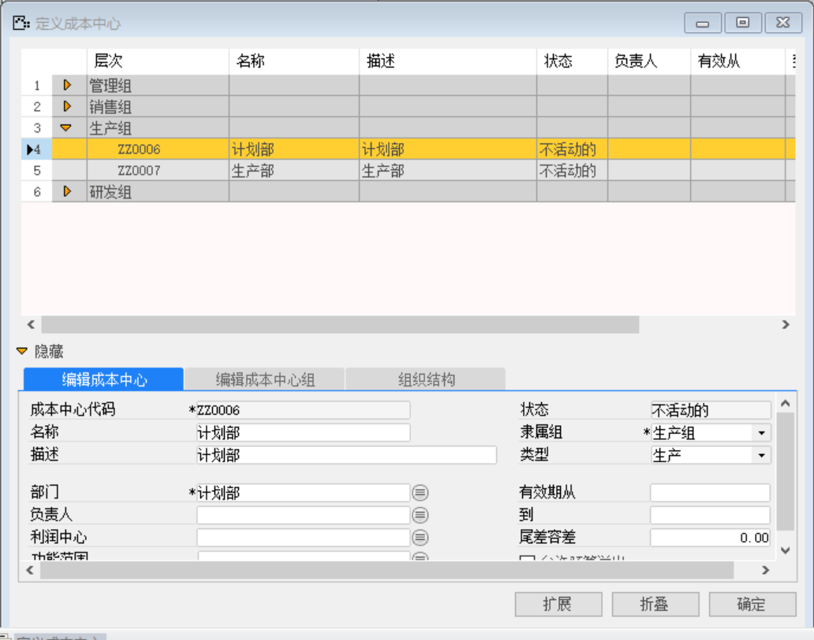
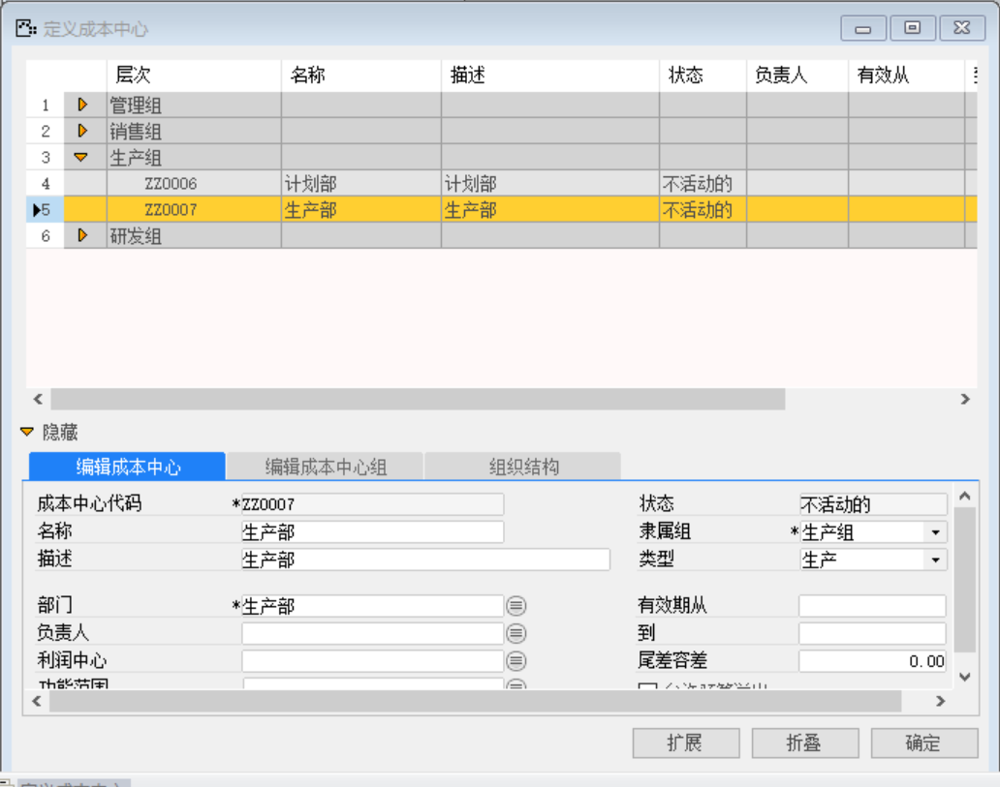
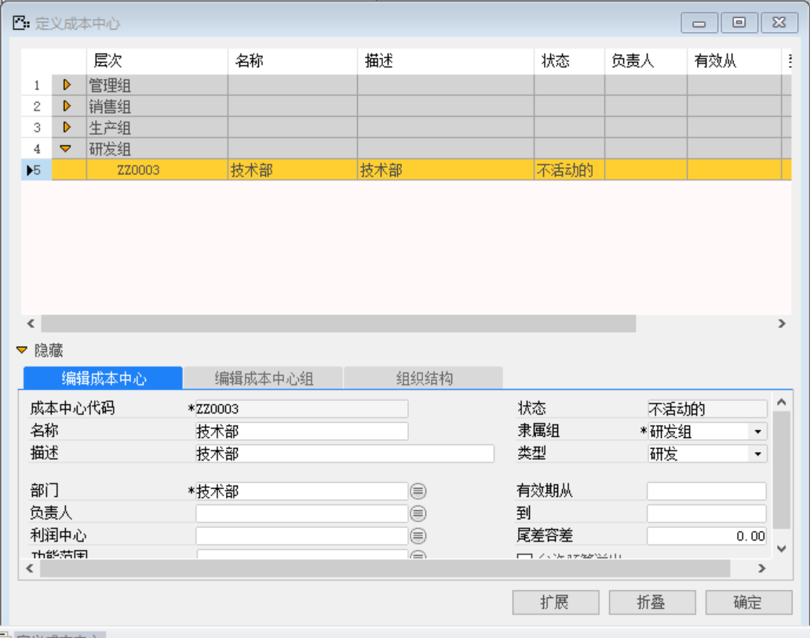

打开路径：【管理会计】-【定义】-【成本中心】-【编辑成本中心组】

#### 1. **编辑成本中心组**

组名表

| **组名** |
| -------- |
| 管理组   |
| 销售组   |
| 生产组   |
| 研发组   |

 

#### 2. **编辑成本中心**

   打开路径：【管理会计】-【定义】-【成本中心】-【编辑成本中心】

(1) 总经理

内容表

| **字段**     | **内容** |
| ------------ | -------- |
| 成本中心代码 | ZZ0001   |
| 名称         | 总经理   |
| 描述         | 总经理   |
| 部门         | 总经理   |
| 隶属组       | 管理组   |
| 类型         | 管理     |

 

(2) 财务部

内容表

| **字段**     | **内容** |
| ------------ | -------- |
| 成本中心代码 | ZZ0004   |
| 名称         | 财务部   |
| 描述         | 财务部   |
| 部门         | 财务部   |
| 隶属组       | 管理组   |
| 类型         | 管理     |

 

(3) 采购部

内容表

| **字段**     | **内容** |
| ------------ | -------- |
| 成本中心代码 | ZZ0005   |
| 名称         | 采购部   |
| 描述         | 采购部   |
| 部门         | 采购部   |
| 隶属组       | 管理组   |
| 类型         | 管理     |

 

(4) 人力资源部

内容表

| **字段**     | **内容**   |
| ------------ | ---------- |
| 成本中心代码 | ZZ0008     |
| 名称         | 人力资源部 |
| 描述         | 人力资源部 |
| 部门         | 人力资源部 |
| 隶属组       | 管理组     |
| 类型         | 管理       |

 

(5) 销售部

内容表	

| **字段**     | **内容** |
| ------------ | -------- |
| 成本中心代码 | ZZ0002   |
| 名称         | 销售部   |
| 描述         | 销售部   |
| 部门         | 销售部   |
| 隶属组       | 销售组   |
| 类型         | 销售     |

 

(6) 计划部

内容表	

| **字段**     | **内容** |
| ------------ | -------- |
| 成本中心代码 | ZZ0006   |
| 名称         | 计划部   |
| 描述         | 计划部   |
| 部门         | 计划部   |
| 隶属组       | 生产组   |
| 类型         | 生产     |

 

(7) 生产部

内容表	

| **字段**     | **内容** |
| ------------ | -------- |
| 成本中心代码 | ZZ0007   |
| 名称         | 生产部   |
| 描述         | 生产部   |
| 部门         | 生产部   |
| 隶属组       | 生产组   |
| 类型         | 生产     |

 

(8) 技术部

内容表	

| **字段**     | **内容** |
| ------------ | -------- |
| 成本中心代码 | ZZ0003   |
| 名称         | 技术部   |
| 描述         | 技术部   |
| 部门         | 技术部   |
| 隶属组       | 研发组   |
| 类型         | 研发     |

