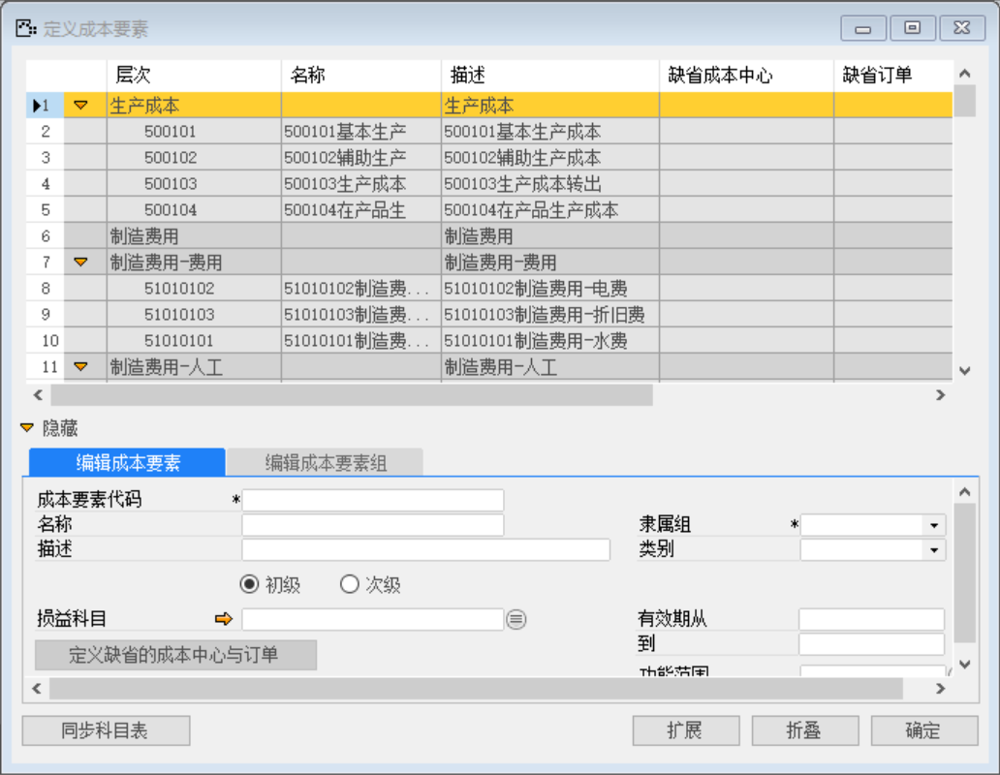
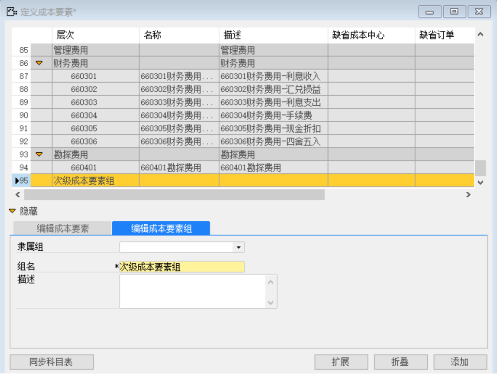
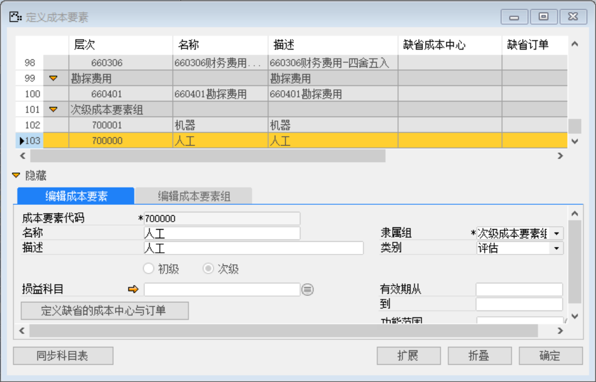
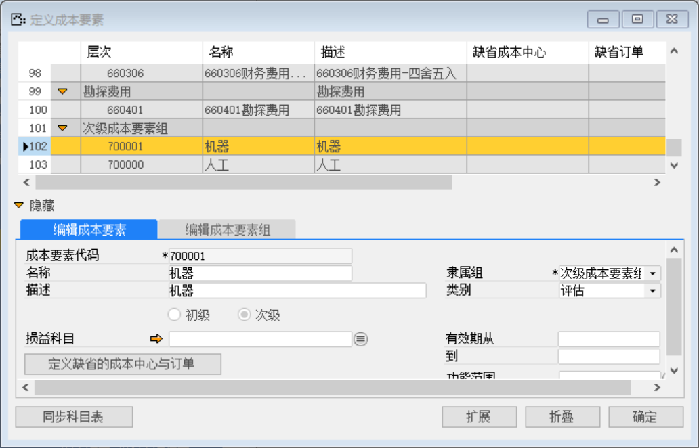

打开路径：【管理会计】-【定义】-【成本要素】

（1） 单击【同步科目表】

 

（2） 编辑成本要素组

组名：次级成本要素组

 

（3） 编辑成本要素—人工

内容表

| **字段**     | **内容**       |
| ------------ | -------------- |
| 成本要素代码 | 700000         |
| 名称         | 人工           |
| 描述         | 人工           |
| 隶属组       | 次级成本要素组 |
| 类别         | 评估           |

 

（4） 编辑成本要素—机器

内容表

| **字段**     | **内容**       |
| ------------ | -------------- |
| 成本要素代码 | 700001         |
| 名称         | 机器           |
| 描述         | 机器           |
| 隶属组       | 次级成本要素组 |
| 类别         | 评估           |

