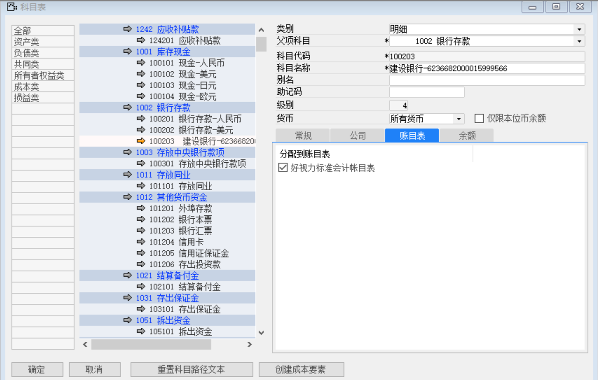

打开路径：【总账】-【科目表】

内容表

| **字段** | **内容**                     |
| -------- | ---------------------------- |
| 类别     | 明细                         |
| 父项科目 | 1002 银行存款                |
| 科目代码 | 100203                       |
| 科目名称 | 建设银行-6236682000015999566 |
| 货币     | 所有货币                     |
| 公司     | 10000                        |
| 账目表   | 好视力标准会计账目表         |

