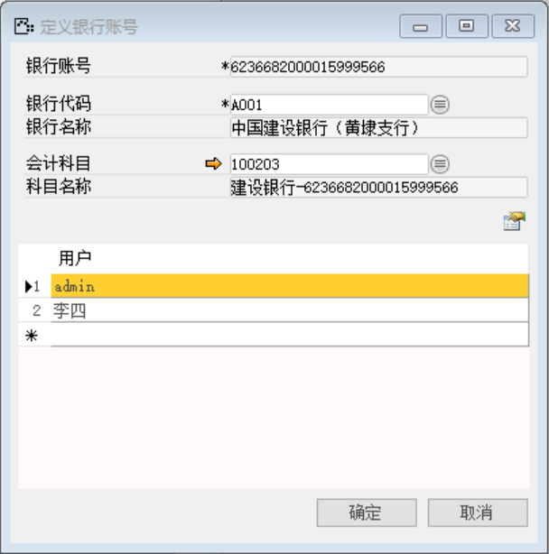

打开路径：【管理】-【基础定义】-【会计】-【定义银行账号】

内容表

| **字段** | **内容**                 |
| -------- | ------------------------ |
| 银行账号 | 6236682000015999566      |
| 银行代码 | 中国建设银行（黄埭支行） |
| 会计科目 | 100203                   |
| 用户     | admin、李四              |

