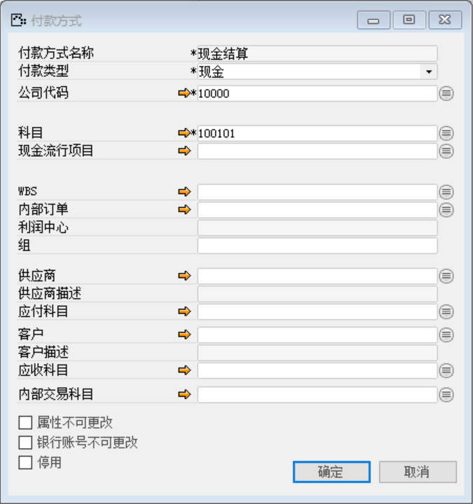
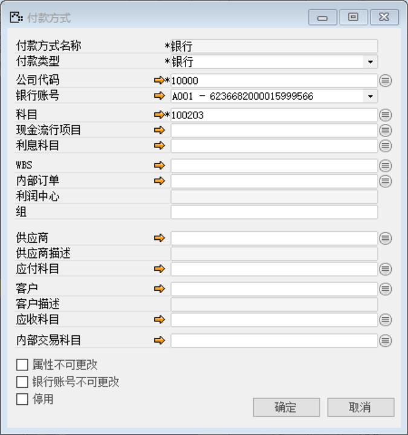

打开路径：【管理】-【基础定义】-【会计】-【定义收付款方式】

(1) 现金结算

内容表

| **字段**     | **内容** |
| ------------ | -------- |
| 付款方式名称 | 现金结算 |
| 公司代码     | 10000    |
| 科目         | 100101   |

 

(2) 银行

内容表

| **字段**     | **内容**                 |
| ------------ | ------------------------ |
| 付款方式名称 | 银行                     |
| 公司代码     | 10000                    |
| 科目         | 100203                   |
| 银行账号     | A001-6236682000015999566 |

