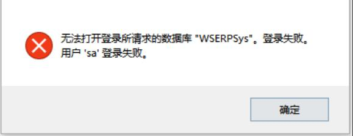
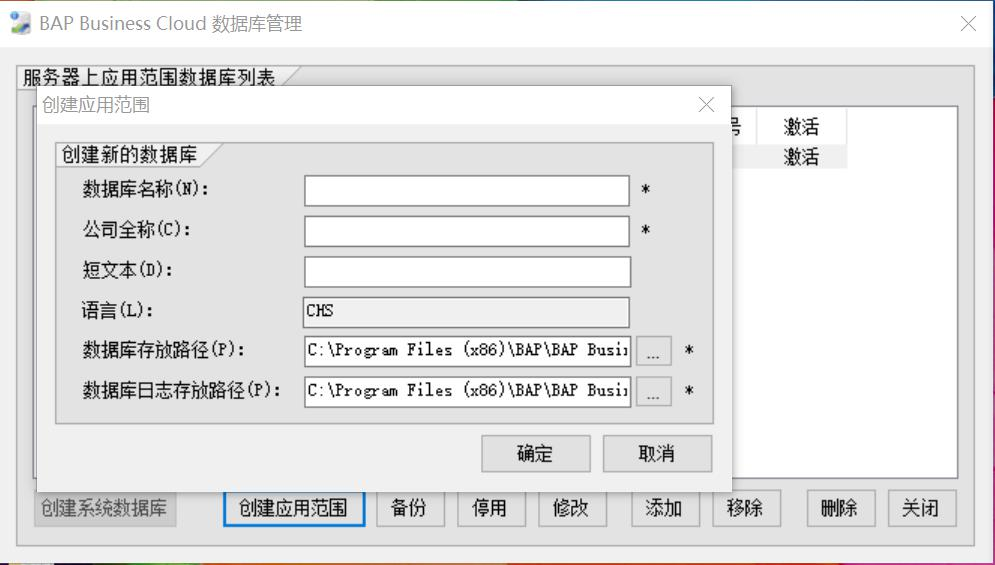
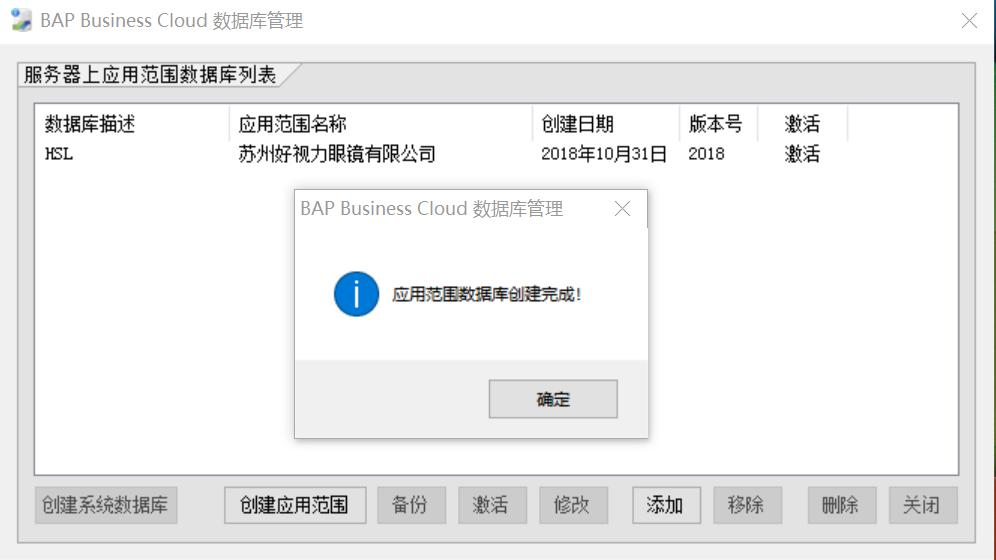

1.启动BAP Business Cloud应用范围配置，在第一个登录界面依次输入数据库服务器名称(或者IP地址)、数据库用户名、数据库用户密码，如下图所示，然后点击【确定】按钮

注意：首次登录时，BAP Business Cloud会出现对话框提示，请点击【确定】，该信息表示服务器尚未配置过BAP Business Cloud

2.在BAP Business Cloud应用范围配置主界面，点击【创建系统数据库】按钮，您可以选择数据库存放路径，也可以选择默认路径，点击【确定】按钮，如下图所示

3.系统数据库创建成功后，【创建系统数据库】按钮就被系统禁用了，【创建应用范围】按钮被允许使用了

4.点击【创建应用范围】按钮，在应用范围编辑窗口依次输入数据库名称、公司全称、短文本，您可以使用系统推荐的数据库存放路径和日志存放路径，您也可以选择其它存放路径，点击【确定】按钮，等待系统创建完成

5.应用范围配置完成，如下图所示

