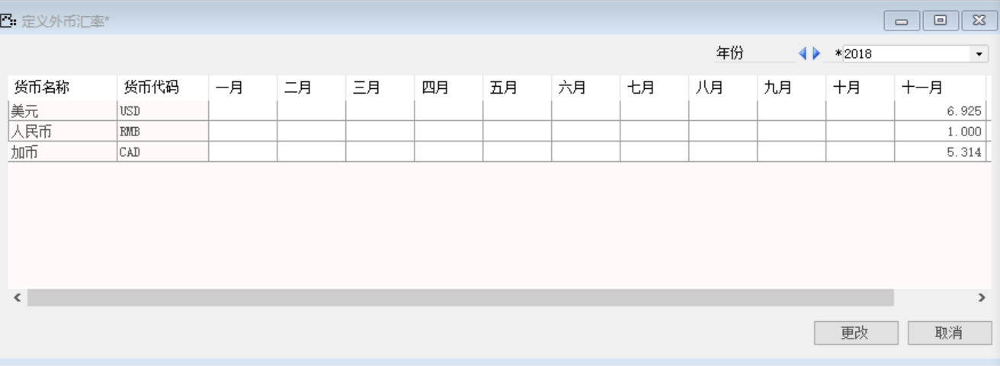

打开路径：【管理】-【定义外币汇率】

内容表

| **货币名称** | **货币代码** | **十一月** |
| ------------ | ------------ | ---------- |
| 美元         | USD          | 6.925      |
| 人民币       | RMB          | 1.000      |
| 加币         | CAD          | 5.314      |

