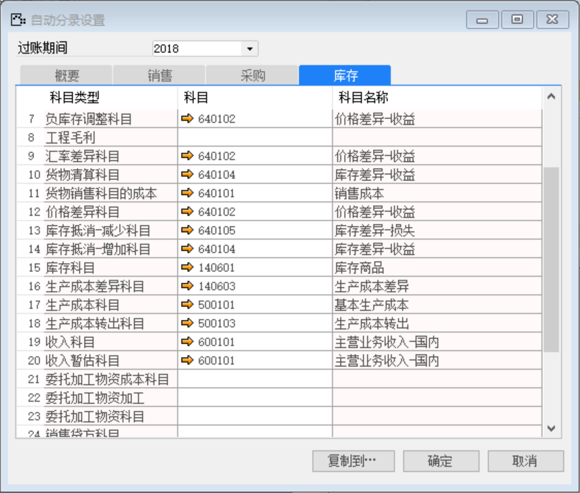
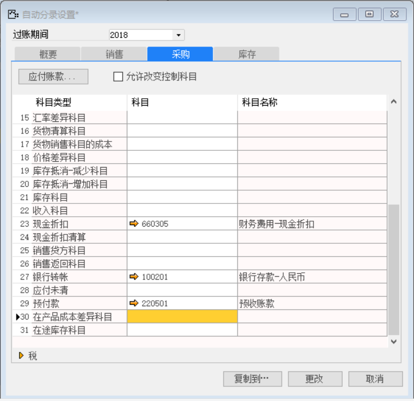
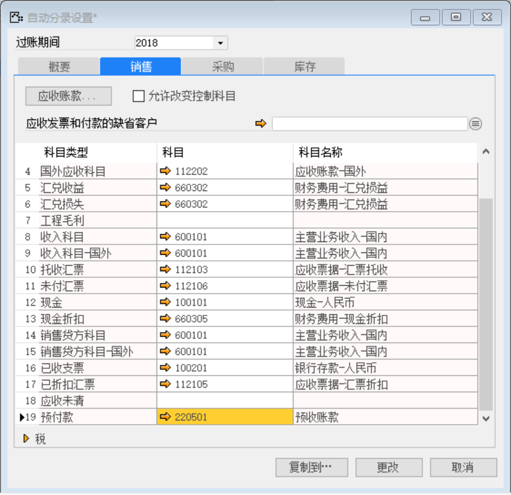

(1) 库存设置

打开路径：【总账】-【自动分录设置】-【库存】

内容表

| **科目类型** | **科目** |
| ------------ | -------- |
| 分配科目     | 220203   |
| 收入科目     | 600101   |
| 收入暂估科目 | 600101   |

 

(2) 采购设置

打开路径：【总账】-【自动分录设置】-【采购】

内容表

| **科目类型** | **科目** |
| ------------ | -------- |
| 预付款       | 220501   |

 

(3) 销售设置

打开路径：【总账】-【自动分录设置】-【销售】

内容表

| **科目类型** | **科目** |
| ------------ | -------- |
| 预付款       | 220501   |

