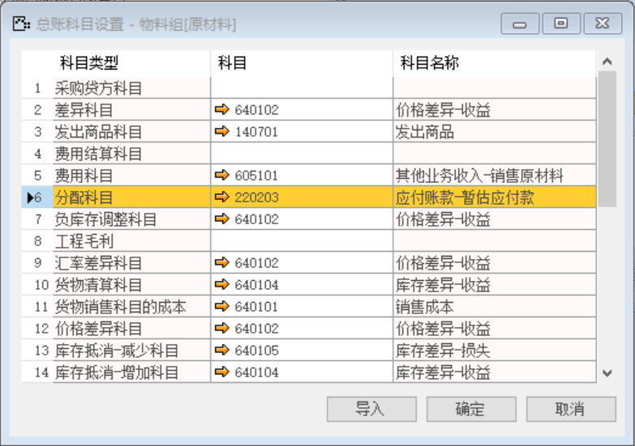
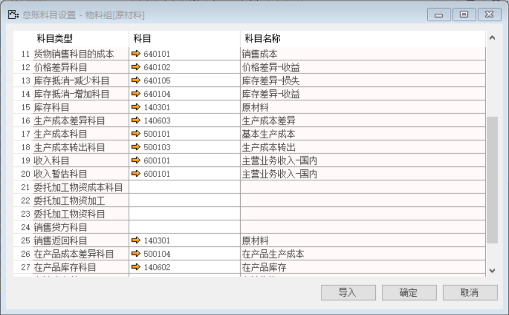

打开路径：【管理】-【基础定义】-【库存】-【物料组】-【会计】

#### 1. **产品**

内容表

| **科目类型** | **科目** |
| ------------ | -------- |
| 费用科目     | 605101   |
| 分配科目     | 220203   |

 

#### 2. **原材料**

内容表

| **科目类型** | **科目** |
| ------------ | -------- |
| 费用科目     | 605101   |
| 库存科目     | 140301   |
| 销售返回科目 | 140301   |
| 分配科目     | 220203   |

 