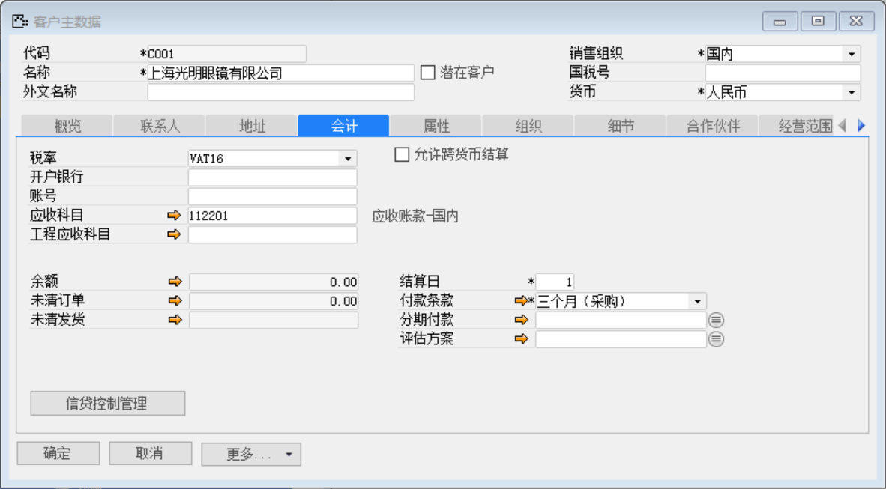
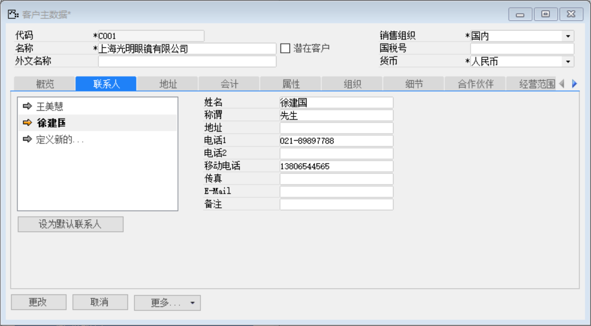
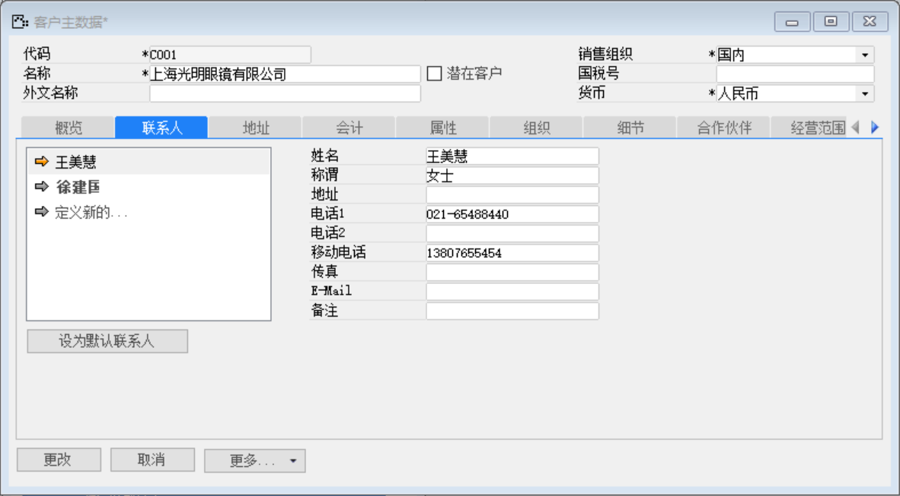
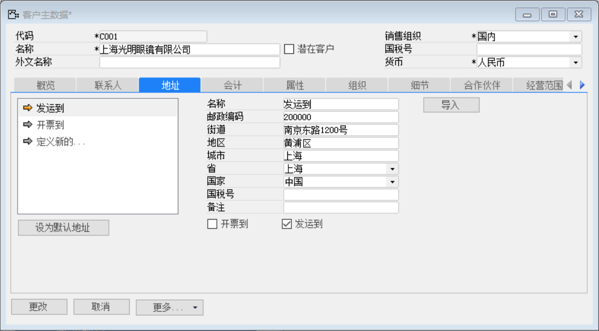
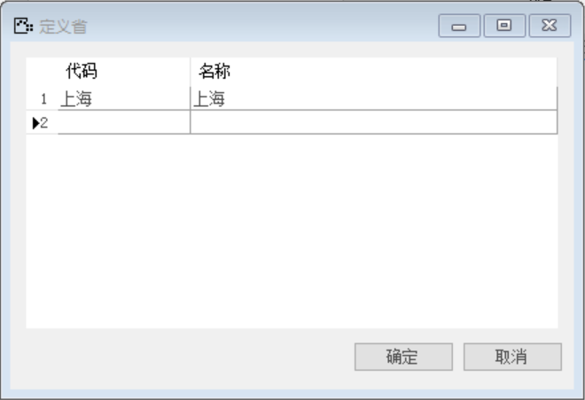
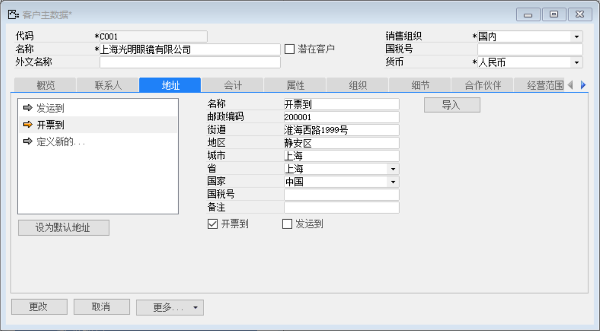
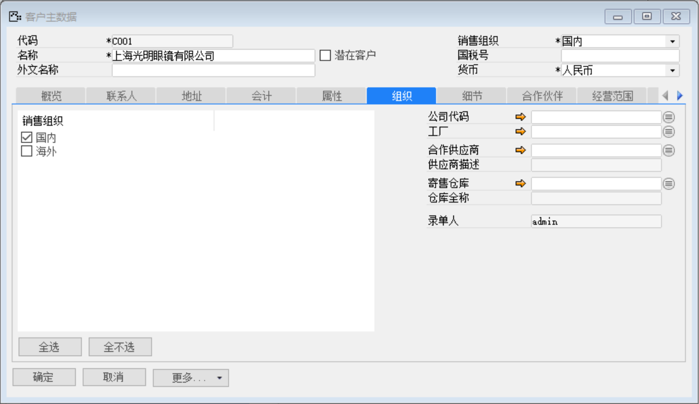
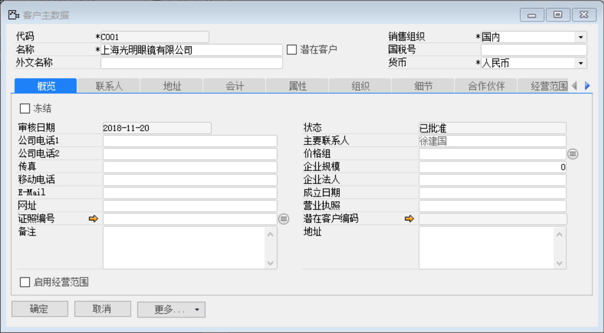

打开路径：【销售】-【客户主数据】

(1) 主表单内容

| **字段** | **内容**             |
| -------- | -------------------- |
| 代码     | C001                 |
| 名称     | 上海光明眼镜有限公司 |
| 销售组织 | 国内                 |
| 货币     | 人民币               |

(2) 会计标签页内容

| **字段** | **内容**       |
| -------- | -------------- |
| 税率     | VAT16          |
| 付款条款 | 三个月（采购） |

 

(3) 联系人标签页内容

| **字段** | **内容**     |
| -------- | ------------ |
| 姓名     | 徐建国       |
| 称谓     | 先生         |
| 电话1    | 021-89897788 |
| 移动电话 | 13806544565  |

 

| **字段** | **内容**     |
| -------- | ------------ |
| 姓名     | 王美慧       |
| 称谓     | 女士         |
| 电话1    | 021-65488440 |
| 移动电话 | 13807655454  |

 

(4) 地址标签页内容

| **字段** | **内容**       |
| -------- | -------------- |
| 名称     | 发运到         |
| 邮政编码 | 200000         |
| 街道     | 南京东路1200号 |
| 地区     | 黄浦区         |
| 城市     | 上海           |
| 省       | 上海（见下文） |
| 国家     | 中国           |

勾选发运到

 

注：定义省

内容表

| 代码 | 名称 |
| ---- | ---- |
| 上海 | 上海 |

 

| **字段** | **内容**       |
| -------- | -------------- |
| 名称     | 开票到         |
| 邮政编码 | 200001         |
| 街道     | 淮海西路1999号 |
| 地区     | 静安区         |
| 城市     | 上海           |
| 省       | 上海           |
| 国家     | 中国           |

勾选开票到

 

(5) 组织标签页内容

销售组织：勾选国内

 

(6) 点击【添加】按钮

(7) 点击按钮审批

 