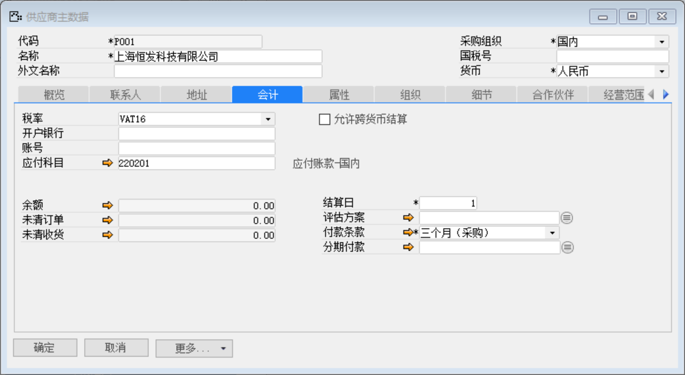
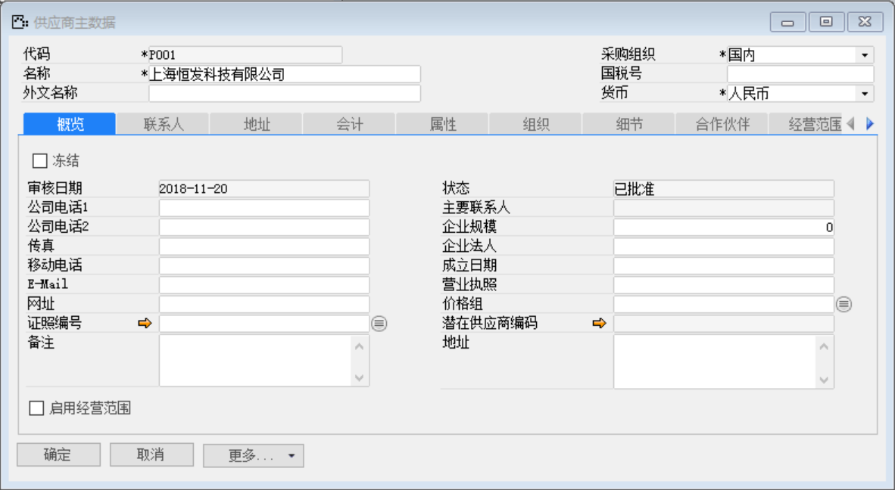

打开路径：【采购】-【供应商主数据】

(1) 主表单内容

| **字段** | **内容**             |
| -------- | -------------------- |
| 代码     | P001                 |
| 名称     | 上海恒发科技有限公司 |
| 采购组织 | 国内                 |
| 货币     | 人民币               |

(2) 会计标签页内容

| **字段** | **内容**       |
| -------- | -------------- |
| 税率     | VAT16          |
| 付款条款 | 三个月（采购） |

 

(3) 点击【添加】按钮

(4) 点击按钮审批

