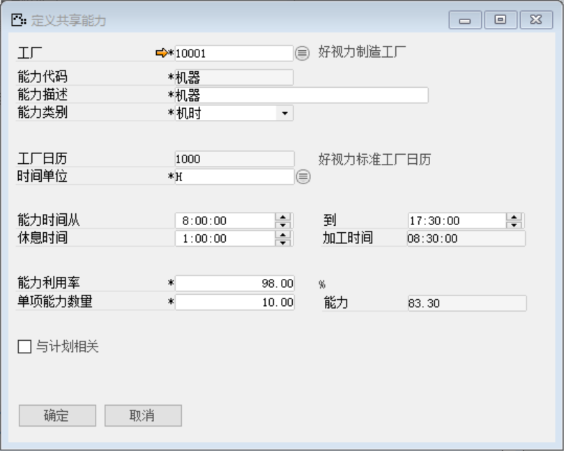
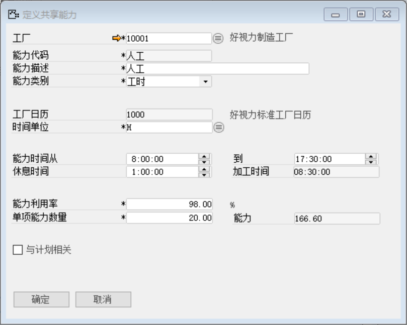

打开路径：【生产作业】-【定义】-【定义共享能力】

(1) 机器

内容表

| **字段**       | **内容**              |
| -------------- | --------------------- |
| 工厂代码       | 好视力制造工厂        |
| 能力代码       | 机器                  |
| 能力描述       | 机器                  |
| 能力类别       | 机时                  |
| 工厂日历       | 好视力标准工厂日历    |
| 时间单位       | H                     |
| 能力时间从…到… | 8：00：00到17：30：00 |
| 休息时间从…到… | 1：00：00到08：30：00 |
| 能力利用率     | 98.00%                |
| 单项能力数量   | 10.00                 |
| 能力           | 83.30                 |

 

(2) 人工

内容表

| **字段**       | **内容**              |
| -------------- | --------------------- |
| 工厂代码       | 好视力制造工厂        |
| 能力代码       | 人工                  |
| 能力描述       | 人工                  |
| 能力类别       | 工时                  |
| 工厂日历       | 好视力标准工厂日历    |
| 时间单位       | H                     |
| 能力时间从…到… | 8：00：00到17：30：00 |
| 休息时间从…到… | 1：00：00到08：30：00 |
| 能力利用率     | 98.00%                |
| 单项能力数量   | 20.00                 |
| 能力           | 166.60                |

