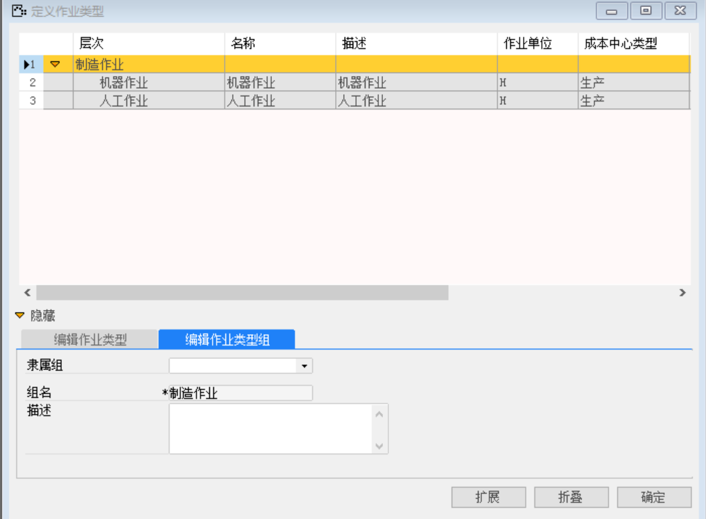
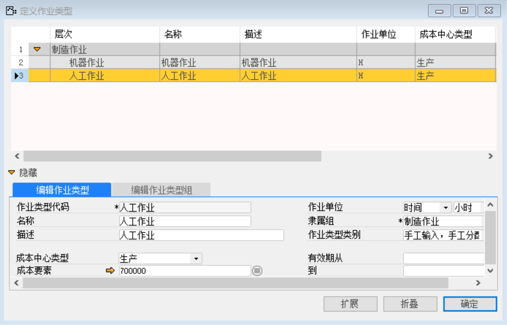
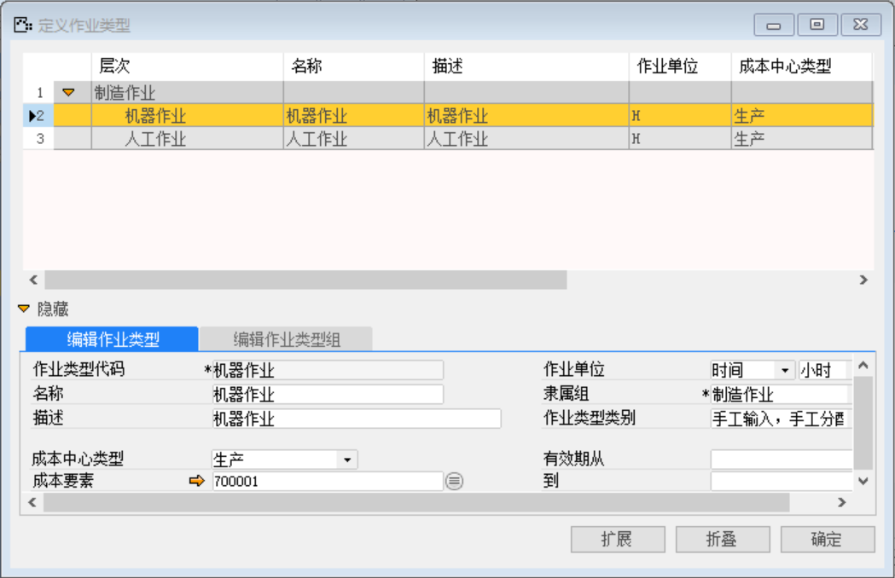

打开路径：【管理会计】-【定义】-【作业类型】

（1） 编辑作业类型组

组名：制造作业

 

（2） 编辑作业类型—人工

| **字段**     | **内容**           |
| ------------ | ------------------ |
| 作业类型代码 | 人工作业           |
| 名称         | 人工作业           |
| 描述         | 人工作业           |
| 成本中心类型 | 生产               |
| 作业单位     | 时间 小时          |
| 隶属组       | 制造作业           |
| 作业类型类别 | 手工输入，手工分配 |
| 成本要素     | 人工               |

 

（3） 编辑作业类型—机器

| **字段**     | **内容**           |
| ------------ | ------------------ |
| 作业类型代码 | 机器作业           |
| 名称         | 机器作业           |
| 描述         | 机器作业           |
| 成本中心类型 | 生产               |
| 作业单位     | 时间 小时          |
| 隶属组       | 制造作业           |
| 作业类型类别 | 手工输入，手工分配 |
| 成本要素     | 机器               |

