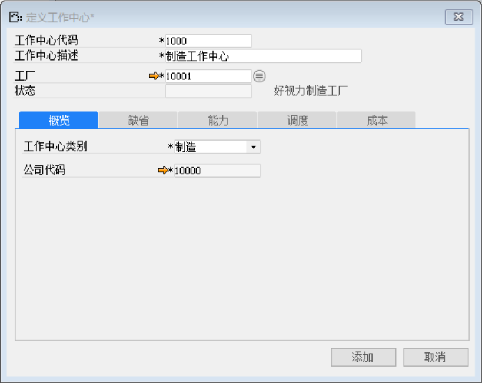
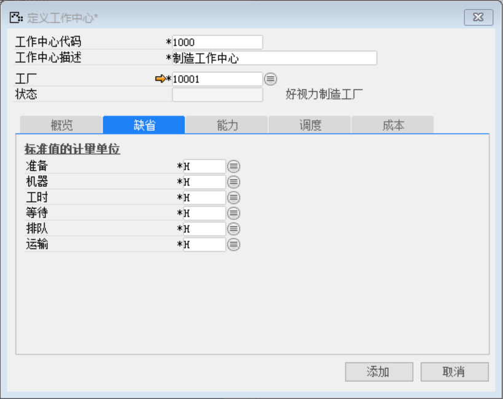
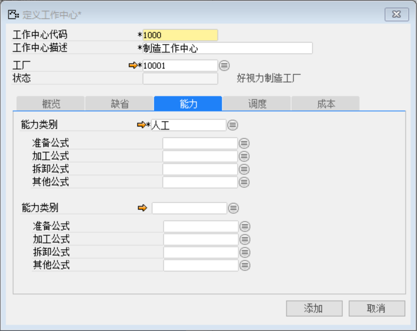
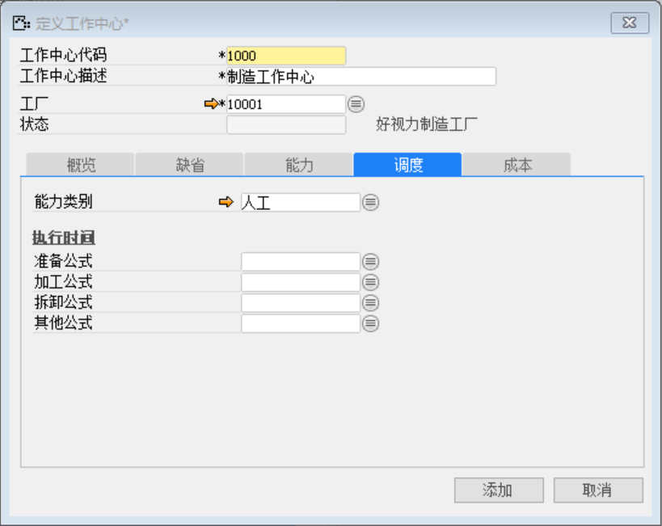
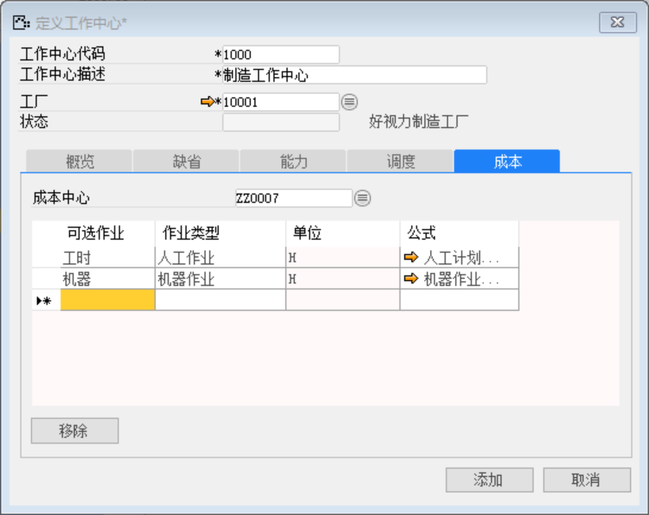
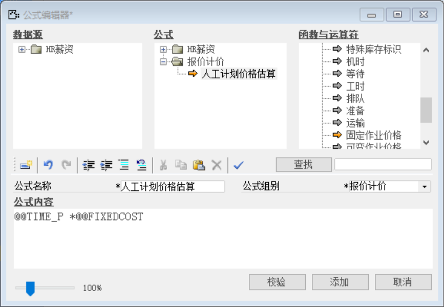
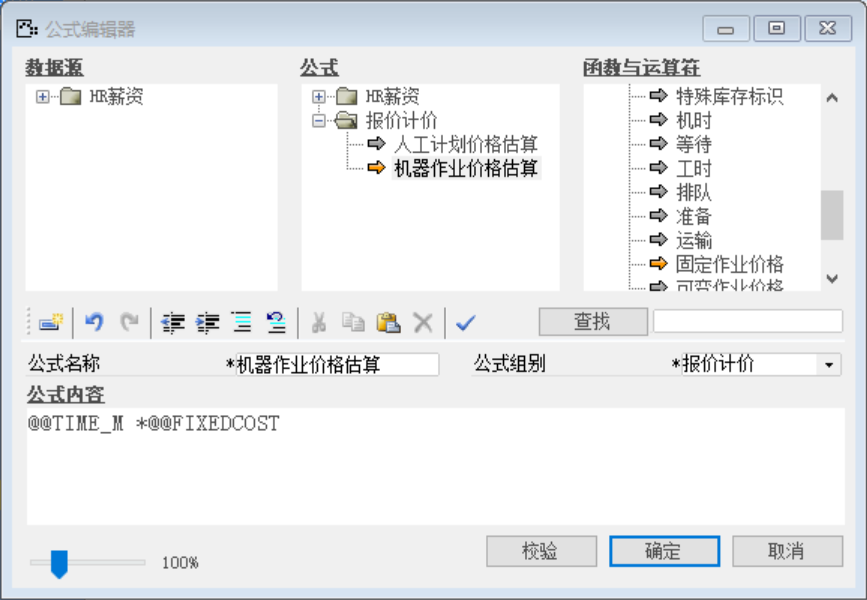

打开路径：【生产作业】-【定义】-【定义工作中心】

(1) 主表单内容

| **字段**     | **内容**     |
| ------------ | ------------ |
| 工作中心代码 | 1000         |
| 工作中心描述 | 制造工作中心 |
| 工厂         | 10001        |

(2) 概要标签页内容

| **字段**     | **内容**       |
| ------------ | -------------- |
| 工作中心类别 | 制造（见下文） |
| 公司代码     | 10000          |

 

注：工作中心类别定义

 

(3) 缺省标签页内容

| **字段** | **内容** |
| -------- | -------- |
| 准备     | H        |
| 机器     | H        |
| 工时     | H        |
| 等待     | H        |
| 排队     | H        |
| 运输     | H        |

 

(4) 能力标签页内容

| **字段** | **内容** |
| -------- | -------- |
| 能力类别 | 人工     |

 

(5) 调度标签页内容

| **字段** | **内容** |
| -------- | -------- |
| 能力类别 | 人工     |

 

(6) 成本标签页内容

成本中心：ZZ0007

| **可选作业** | **作业类型** | **单位** | **公式**                 |
| ------------ | ------------ | -------- | ------------------------ |
| 工时         | 人工作业     | H        | 人工计划价格估算(见下文) |
| 机器         | 机器作业     | H        | 机器作业价格估算(见下文) |

 

注：公式定义

打开路径：工具-公式编辑器

| **公式名称**     | **公式组别** | **公式内容**                              |
| ---------------- | ------------ | ----------------------------------------- |
| 人工计划价格估算 | 报价计价     | 工时*固定作业价格（在函数与运算符中选取） |
| 机器作业价格估算 | 报价计价     | 机时*固定作业价格（在函数与运算符中选取） |

 

