#### 1. **定义物料主数据—眼镜**

打开路径：【库存】-【物料主数据】

（1） 主表单和常规标签页

| **字段** | **内容** |
| -------- | -------- |
| 物料号   | KA00001  |
| 名称     | 眼镜     |
| 物料类型 | 物料     |
| 物料组   | 产品     |
| 色别     | 无       |
| 权限组   | 产品     |

勾选：允许销售、计库存

 

（2） 组织标签页

默认仓库：2000-产品仓库

勾选：隶属、MPS/MRP、直接MRP

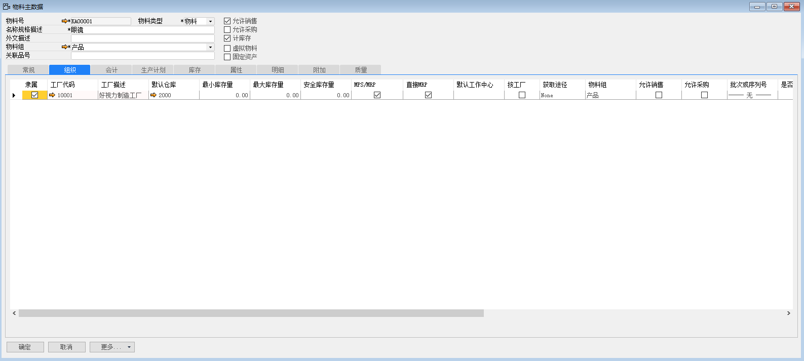 

（3） 会计标签页

成本核算方式：标准

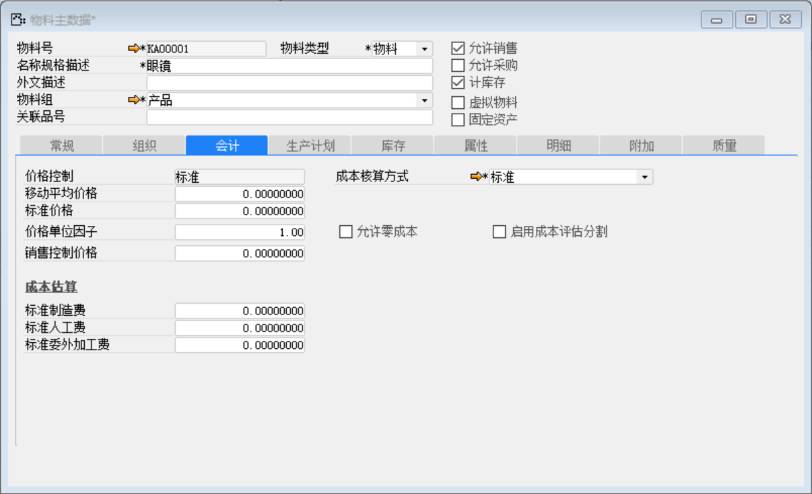 

（4） 生产计划标签页

舍入方式：四舍五入

获取途径：生产

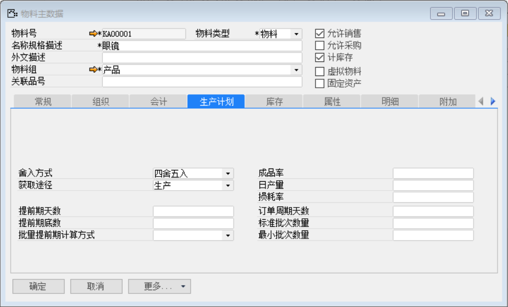 

（5） 库存标签页

总账科目设置：物料组

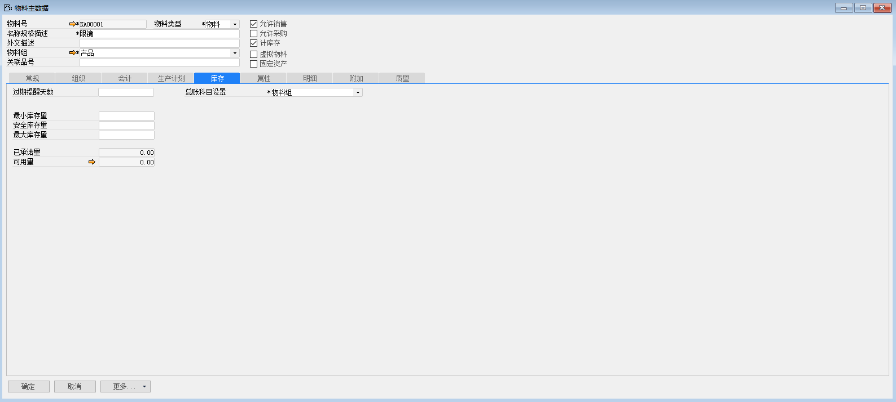 

（6） 点击【添加】按钮

（7） 定义标准成本

路径：单击成本核算右侧黄色箭头

内容

| 激活 | 公司代码 | 公司描述               | 成本核算方式 | 标准价格 |
| ---- | -------- | ---------------------- | ------------ | -------- |
| ✔    | 10000    | 苏州好视力眼镜有限公司 | 标准         | 240      |

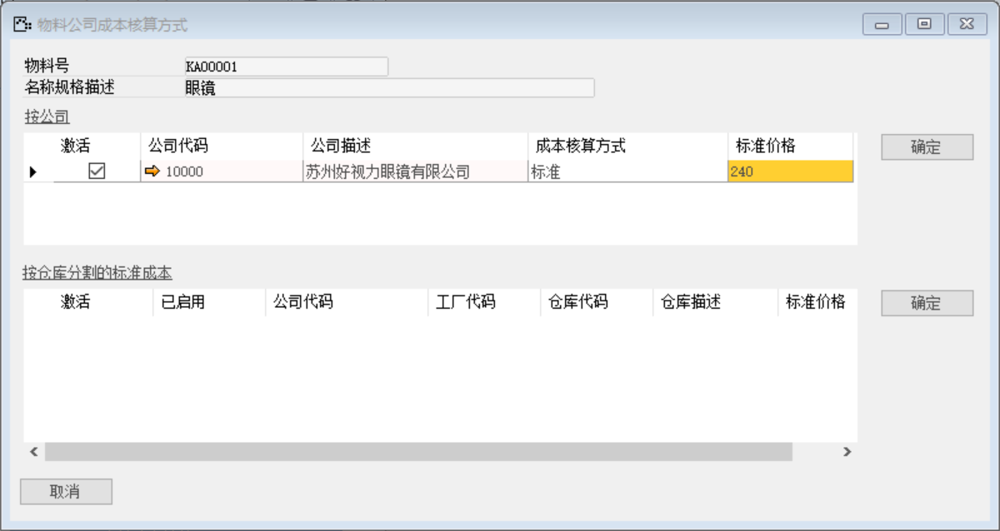 

（8） 点击按钮审批

#### 2. **定义物料主数据—镜片**

打开路径：【库存】-【物料主数据】

（1） 主表单和常规标签页

| **字段** | **内容** |
| -------- | -------- |
| 物料号   | CA00001  |
| 名称     | 镜片     |
| 物料类型 | 物料     |
| 物料组   | 原材料   |
| 色别     | 无       |
| 权限组   | 原材料   |

勾选：允许销售、允许采购、计库存

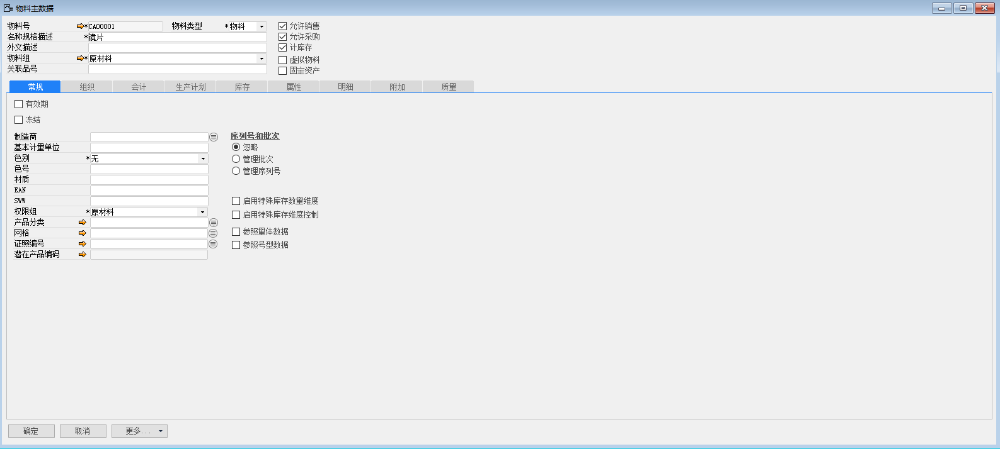 

（2） 组织标签页

默认仓库：1000-原材料仓库

勾选：隶属、MPS/MRP、直接MRP

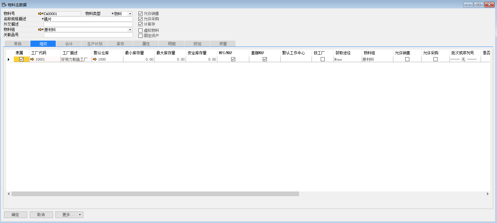 

（3） 会计标签页

成本核算方式：移动加权平均

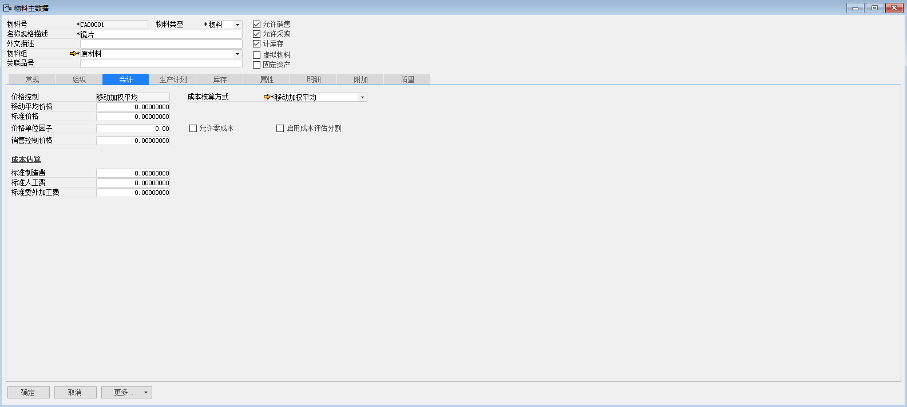 

（4） 生产计划标签页

舍入方式：四舍五入

获取途径：采购

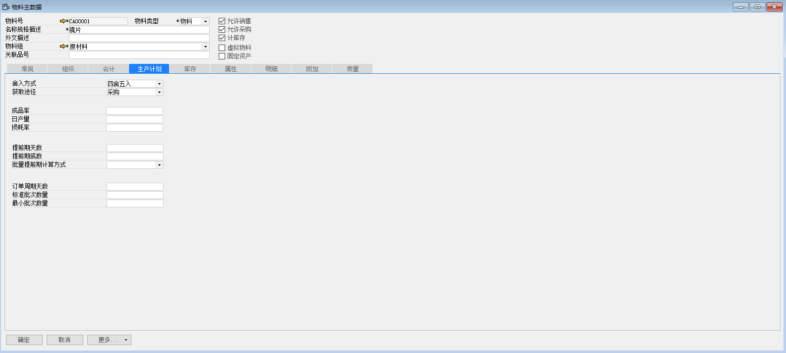 

（5） 库存标签页

总账科目设置：物料组

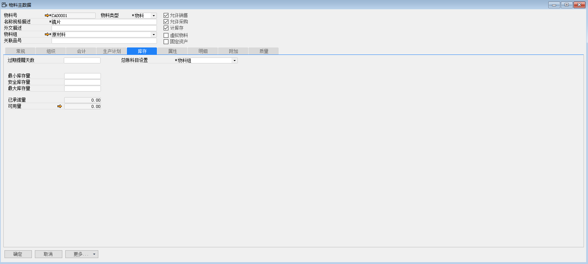 

（6） 点击【添加】按钮

（7） 点击按钮审批

#### 3. **定义物料主数据—镜架**

打开路径：【库存】-【物料主数据】

（1） 主表单和常规标签页

| **字段** | **内容** |
| -------- | -------- |
| 物料号   | CA00002  |
| 名称     | 镜架     |
| 物料类型 | 物料     |
| 物料组   | 原材料   |
| 色别     | 无       |
| 权限组   | 原材料   |

勾选：允许销售、允许采购、计库存

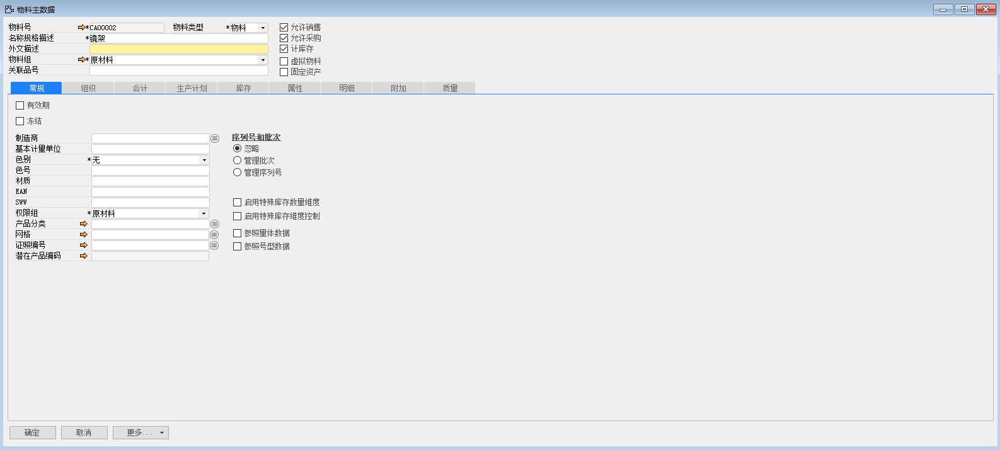 

（2） 组织标签页

默认仓库：1000-原材料仓库

勾选：隶属、MPS/MRP、直接MRP

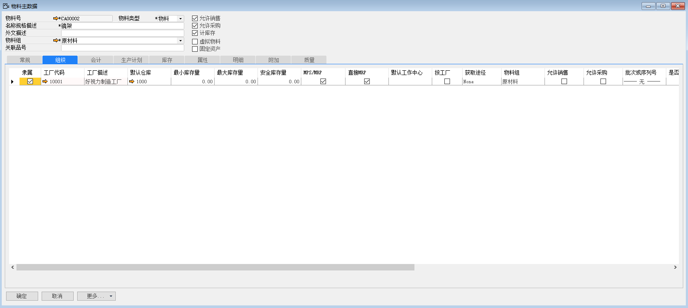 

（3） 会计标签页

成本核算方式：移动加权平均

 

（4） 生产计划标签页

舍入方式：四舍五入

获取途径：采购

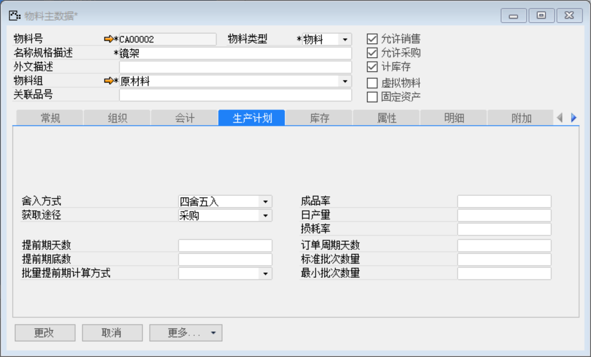 

（5） 库存标签页

总账科目设置：物料组

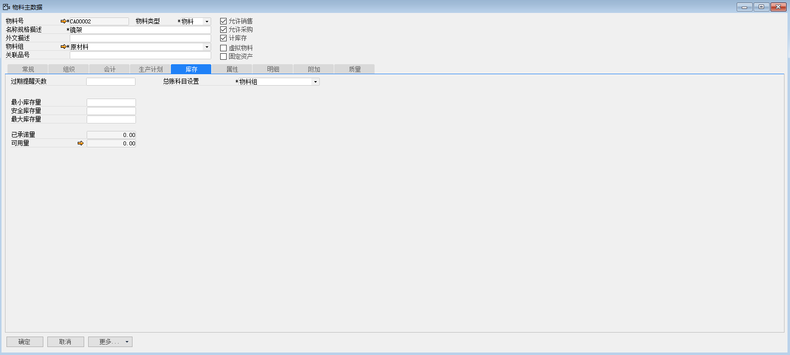 

（6） 点击【添加】按钮，然后点击按钮审批

#### 4. **定义物料主数据—镜腿**

打开路径：【库存】-【物料主数据】

（1） 主表单和常规标签页

| **字段** | **内容** |
| -------- | -------- |
| 物料号   | CA00003  |
| 名称     | 镜腿     |
| 物料类型 | 物料     |
| 物料组   | 原材料   |
| 色别     | 无       |
| 权限组   | 原材料   |

勾选：允许销售、允许采购、计库存

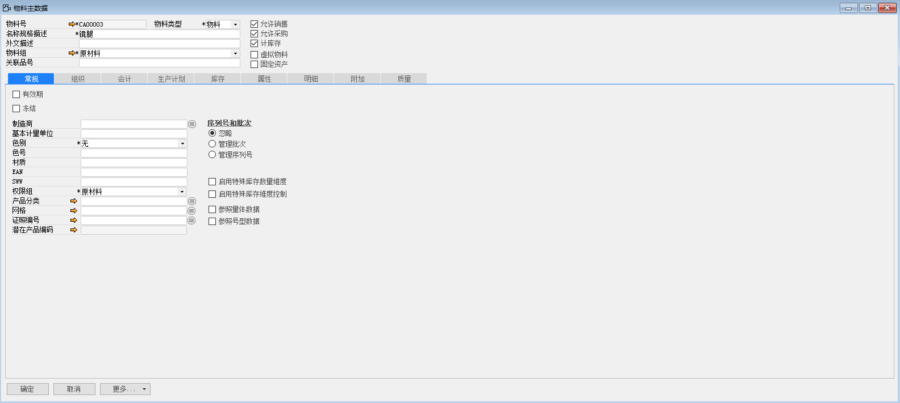 

（2） 组织标签页

默认仓库：1000-原材料仓库

勾选：隶属、MPS/MRP、直接MRP

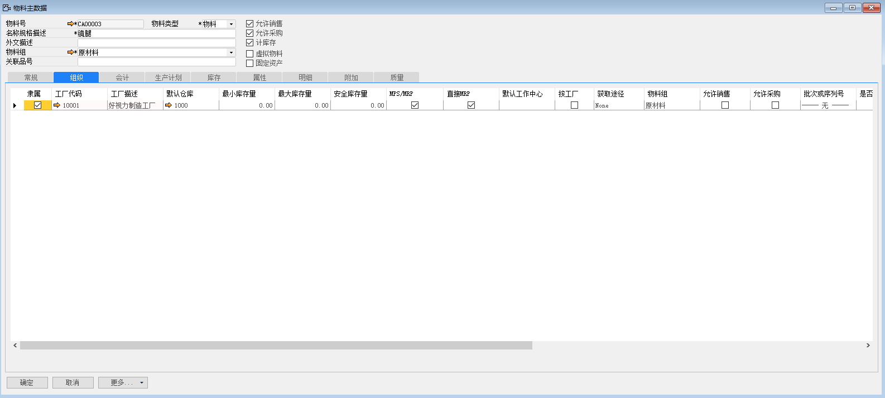 

（3） 会计标签页

成本核算方式：移动加权平均

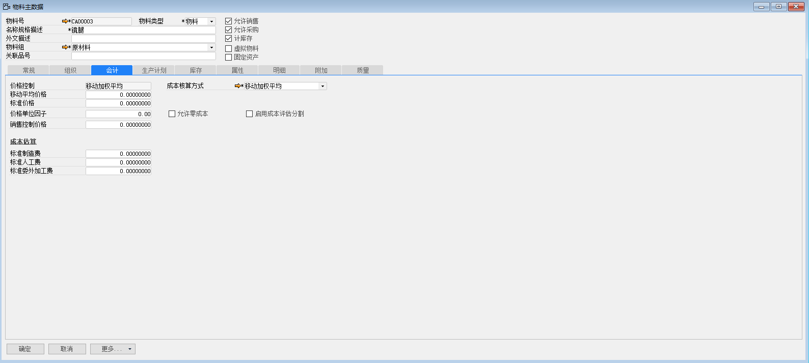 

（4） 生产计划标签页

舍入方式：四舍五入

获取途径：采购

 

（5） 库存标签页

总账科目设置：物料组

 

（6） 点击【添加】按钮，然后点击按钮审批

#### 5. **定义物料主数据—螺丝**

打开路径：【库存】-【物料主数据】

（1） 主表单和常规标签页

| **字段** | **内容** |
| -------- | -------- |
| 物料号   | CA00004  |
| 名称     | 螺丝     |
| 物料类型 | 物料     |
| 物料组   | 原材料   |
| 色别     | 无       |
| 权限组   | 原材料   |

勾选：允许销售、允许采购、计库存

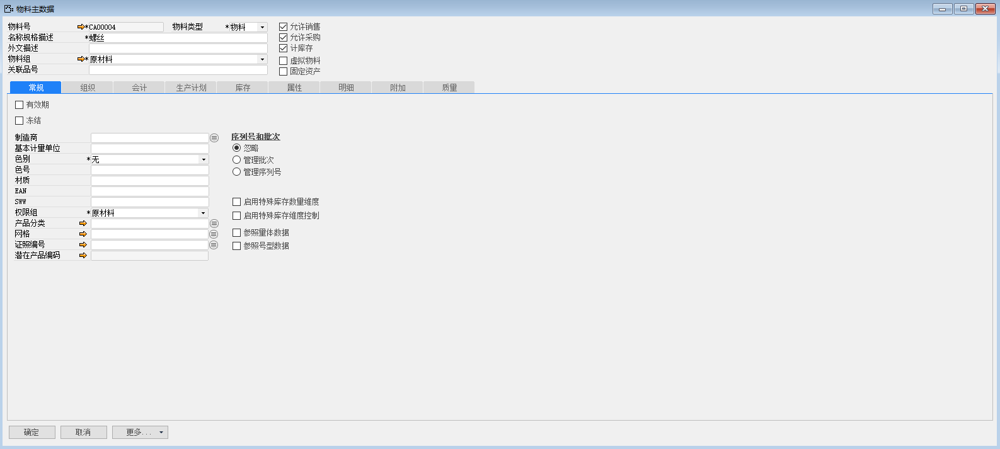 

（2） 组织标签页

默认仓库：1000-原材料仓库

勾选：隶属、MPS/MRP、直接MRP

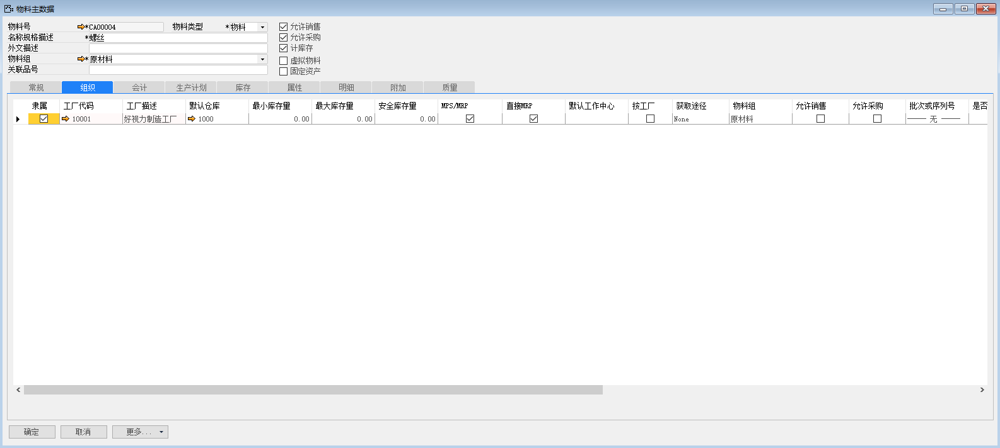 

（3） 会计标签页

成本核算方式：移动加权平均

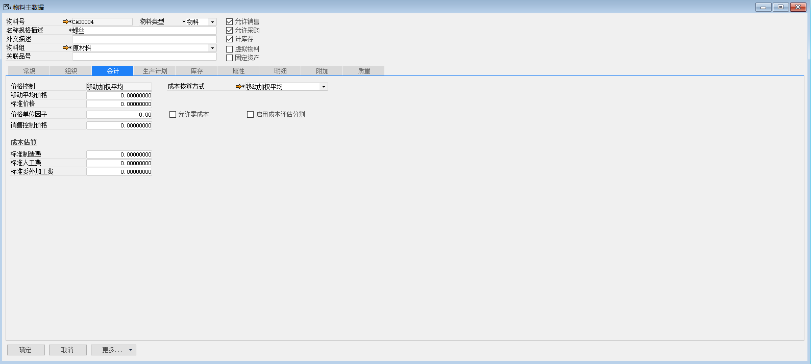 

（4） 生产计划标签页

舍入方式：四舍五入

获取途径：采购

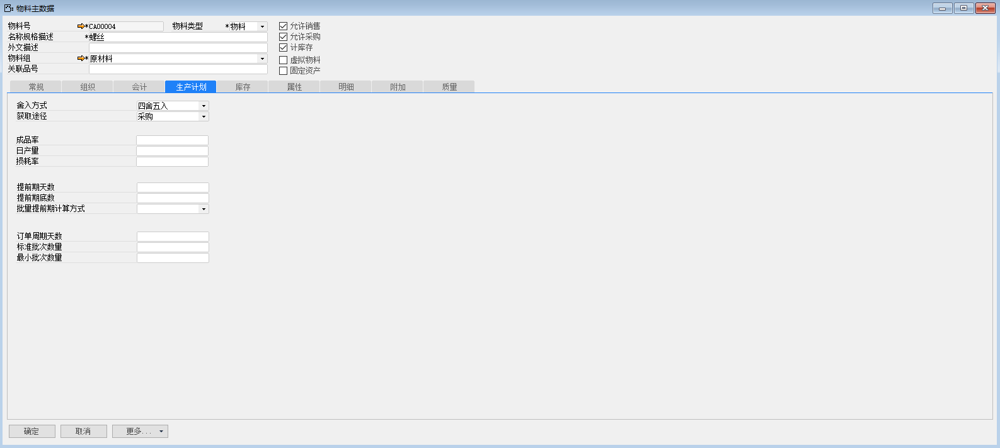 

（5） 库存标签页

总账科目设置：物料组

 

（6） 点击【添加】按钮，然后点击按钮审批