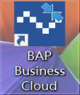
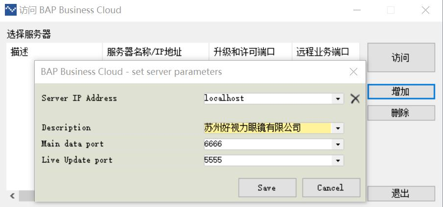
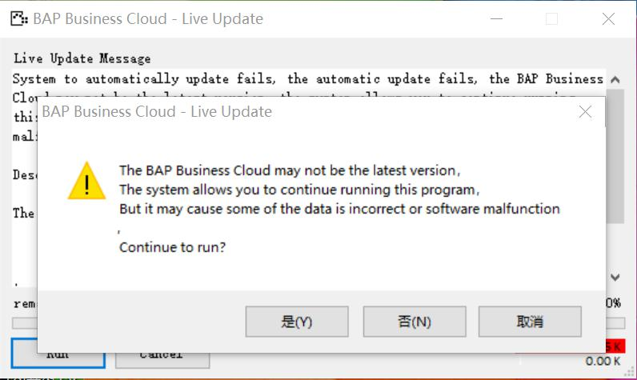
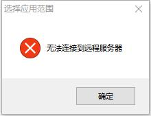
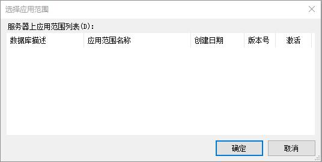
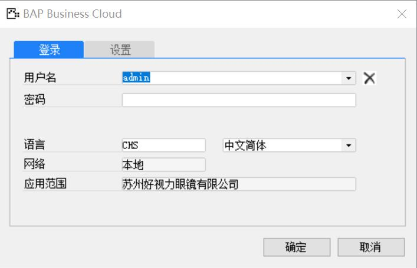

1.启动BAP Business Cloud

2.单击【增加】按钮，打开配置界面

3.依次输入配置变量参数，如下图所示，然后点击【Save】按钮

4.选中刚才创建的应用范围，点击【访问】按钮，在LiveUpdate界面点击【Run】按钮，在系统版本预警窗口选择【是】按钮，如下图所示：

5.系统主窗口打开后，首次登录配置变量参数会出现无法链接到远程服务器消息警报窗口，点击【确定】按钮

6.在选择应用范围窗口（下图）点击【取消】按钮

7.在登录窗口选择连接到本地服务器，点击【选择应用范围】按钮，在用户登录失败警报窗口中点击【确定】按钮，如下图所示：

8.在选择服务器上应用范围窗口依次输入服务器、数据库用户名、数据库密码，然后点击【刷新】按钮，已配置的应用范围就出现在服务器应用范围列表中，选中一个应用范围，然后单击【确定】按钮

9.选择登录选项卡，输入用户名:admin，密码：空，点击【登录】按钮，成功后配置完成，如下图所示：

