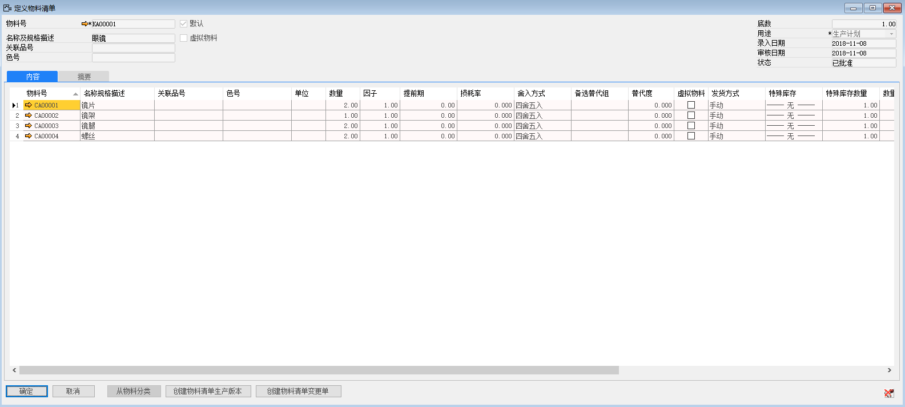
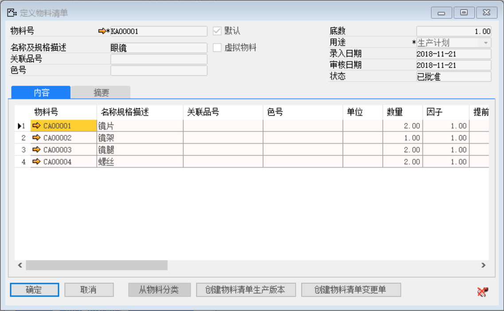

打开路径：【计划】-【定义】-【定义或更新物料清单】

(1) 主表单

| **字段** | **内容**                  |
| -------- | ------------------------- |
| 父级物料 | KA00001-眼镜（输入%查询） |
| 底数     | 1                         |
| 用途     | 生产计划                  |

勾选：默认

(2) 内容标签页

| **子级物料** | **数量** |
| ------------ | -------- |
| CA00001—镜片 | 2        |
| CA00002—镜架 | 1        |
| CA00003—镜腿 | 2        |
| CA00004—螺丝 | 2        |

 

(3) 点击【添加】按钮，然后点击按钮审批

