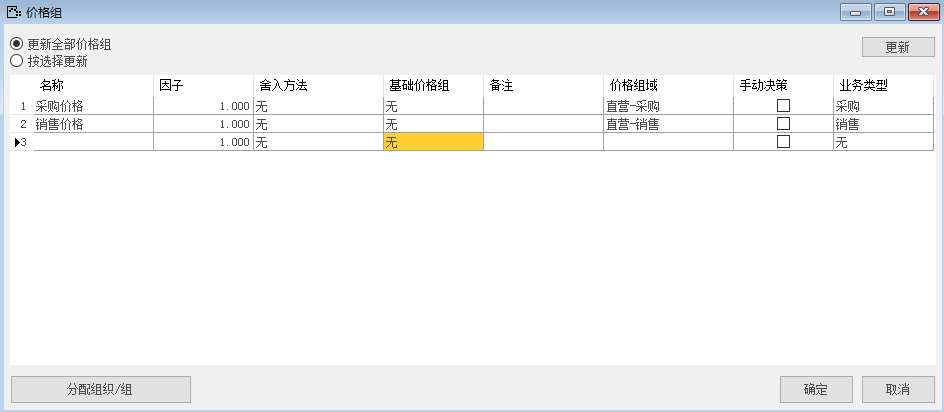
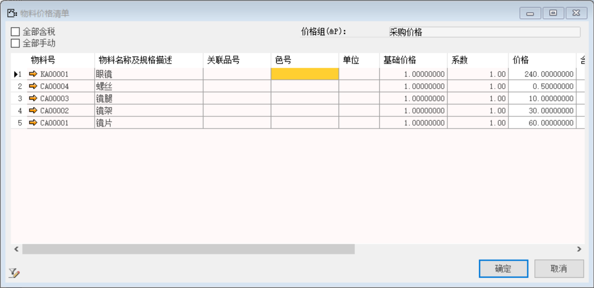
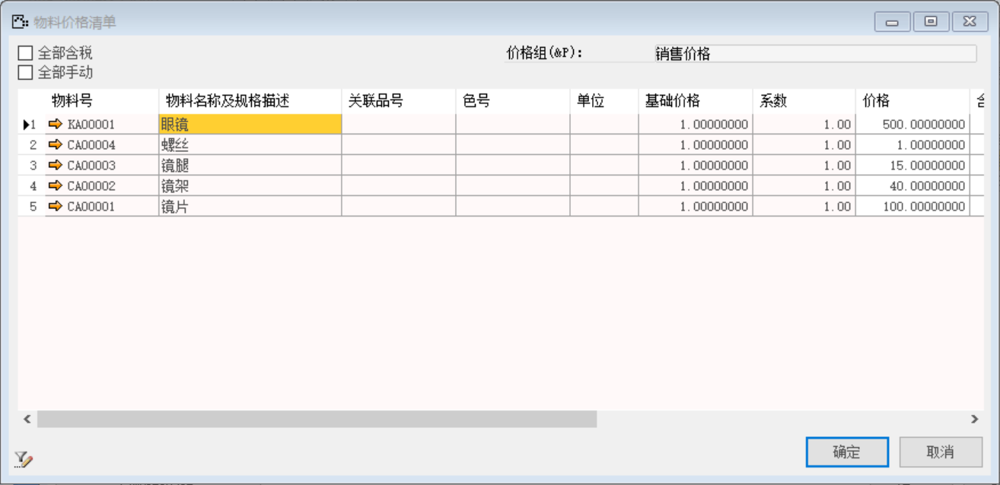
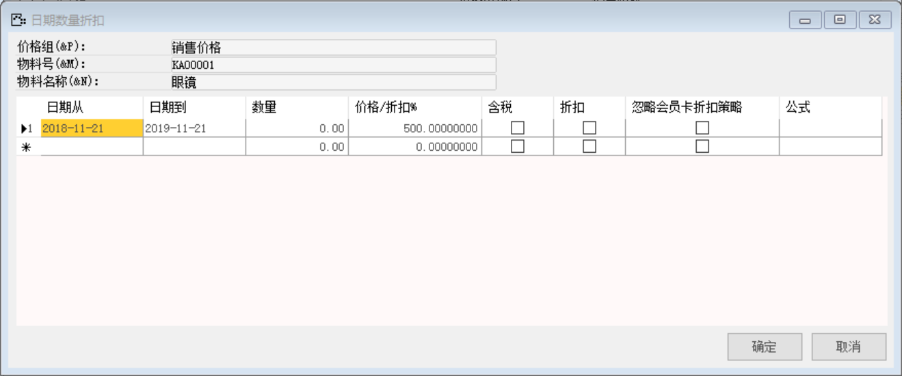
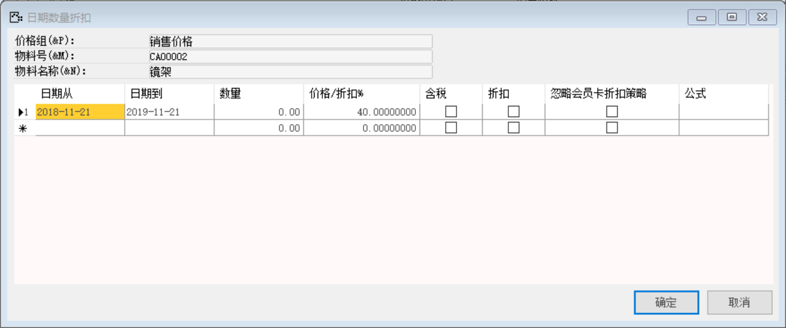
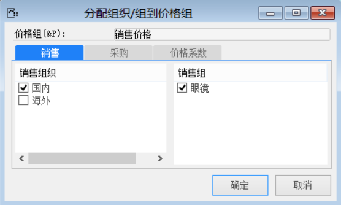
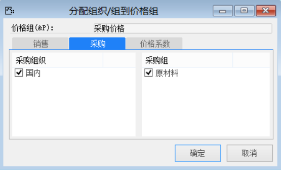

打开路径：【管理】-【基础定义】-【一般】-【定义价格组】

（1） 内容表

| **名称** | **价格组域** | **业务类型** |
| -------- | ------------ | ------------ |
| 采购价格 | 直营采购     | 采购         |
| 销售价格 | 直营销售     | 销售         |

 

（2） 双击采购价格行左侧小箭头

内容表

| **物料号** | **价格** |
| ---------- | -------- |
| KA00001    | 240      |
| CA00004    | 0.5      |
| CA00003    | 10       |
| CA00002    | 30       |
| CA00001    | 60       |

 

（3） 单击日期数量折扣左侧的小箭头

内容表

| **物料号** | **描述** | **日期从** | **日期到** | **价格/折扣** |
| ---------- | -------- | ---------- | ---------- | ------------- |
| KA00001    | 眼镜     | 2018-11-21 | 2019-11-21 | 240           |
| CA00004    | 螺丝     | 2018-11-21 | 2019-11-21 | 0.5           |
| CA00003    | 镜腿     | 2018-11-21 | 2019-11-21 | 10            |
| CA00002    | 镜架     | 2018-11-21 | 2019-11-21 | 30            |
| CA00001    | 镜片     | 2018-11-21 | 2019-11-21 | 60            |

  

 

 

 

 

（4） 双击销售价格行左侧小箭头

内容表

| **物料号** | **价格** |
| ---------- | -------- |
| KA00001    | 500      |
| CA00004    | 1        |
| CA00003    | 15       |
| CA00002    | 40       |
| CA00001    | 100      |

 

（5） 单击日期数量折扣左侧的小箭头

内容表

| **物料号** | **描述** | **日期从** | **日期到** | **价格/折扣** |
| ---------- | -------- | ---------- | ---------- | ------------- |
| KA00001    | 眼镜     | 2018-11-21 | 2019-11-21 | 500           |
| CA00004    | 螺丝     | 2018-11-21 | 2019-11-21 | 1             |
| CA00003    | 镜腿     | 2018-11-21 | 2019-11-21 | 15            |
| CA00002    | 镜架     | 2018-11-21 | 2019-11-21 | 40            |
| CA00001    | 镜片     | 2018-11-21 | 2019-11-21 | 100           |

 

 

 

  

 

（6） 选中销售价格行-左击【分配组织/组】

销售组织：国内；

销售组：眼镜

 

（7） 选中采购价格行-左击【分配组织/组】

采购组织：国内

采购组：原材料

 