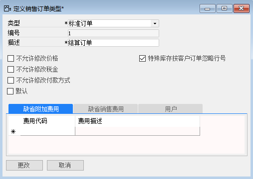
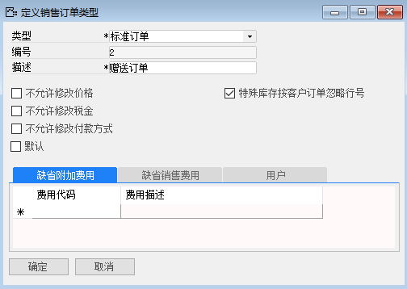
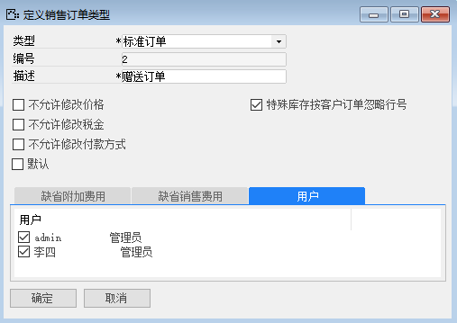
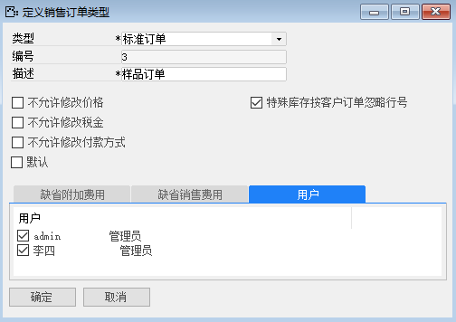

#### 1. **定义销售订单类型—结算订单**

打开路径：【管理】-【基础定义】-【销售】-【销售订单类型】

(1)内容

类型：标准订单

描述：结算订单

勾选：特殊库存按客户订单忽略行号

 

(2)勾选用户：admin、李四

 

#### 2. **定义销售订单类型—赠送订单**

打开路径：【管理】-【基础定义】-【销售】-【销售订单类型】

（1）内容

类型：标准订单

描述：赠送订单

勾选：特殊库存按客户订单忽略行号

 

（2）勾选用户：admin、李四

  

#### 3. **定义销售订单类型—样品订单**

打开路径：【管理】-【基础定义】-【销售】-【销售订单类型】

（1）内容

类型：标准订单

描述：样品订单

勾选：特殊库存按客户订单忽略行号

（2）勾选用户：admin、李四

