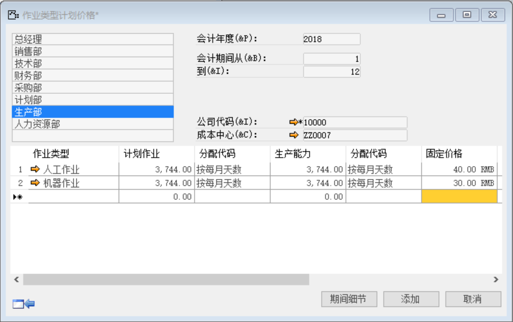

打开路径：【管理会计】-【成本中心】-【成本中心要素/作业类型计划】

(1)  选择公司代码：10000-苏州好视力眼镜有限公司

(2)  单击【确定】按钮进入

(3) 左击生产部

(4) 定义

内容表

| **作业类型** | **计划作业** | **分配代码** | **生产能力** | **分配代码** | **固定价格** |
| ------------ | ------------ | ------------ | ------------ | ------------ | ------------ |
| 人工作业     | 3744         | 按每月天数   | 3744         | 按每月天数   | 40RMB        |
| 机器作业     | 3744         | 按每月天数   | 3744         | 按每月天数   | 30RMB        |

