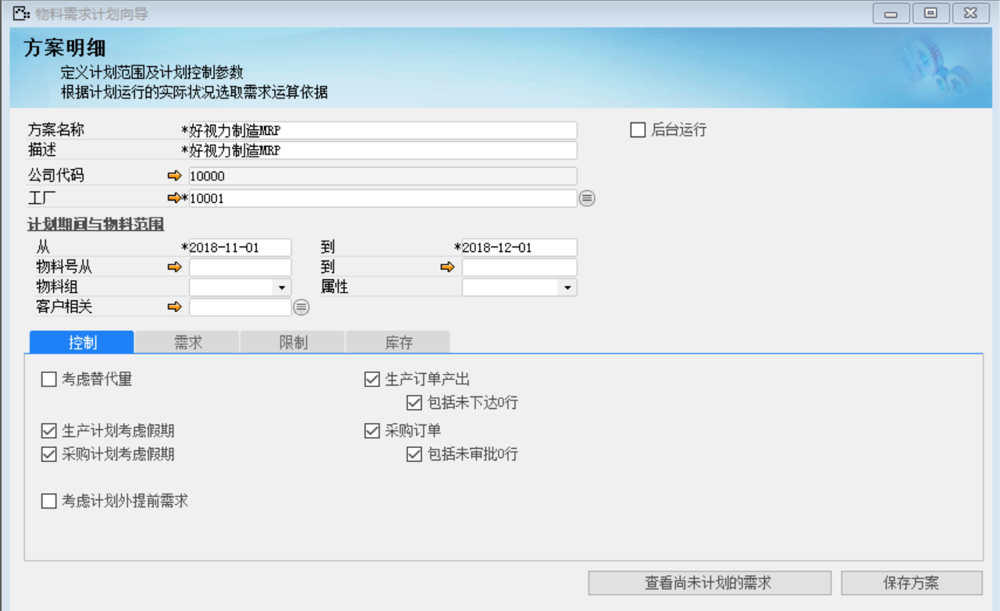
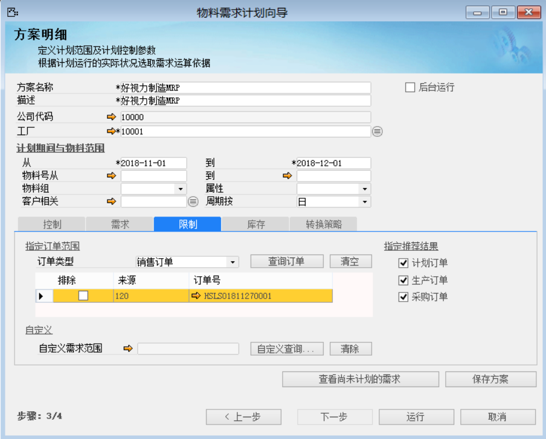
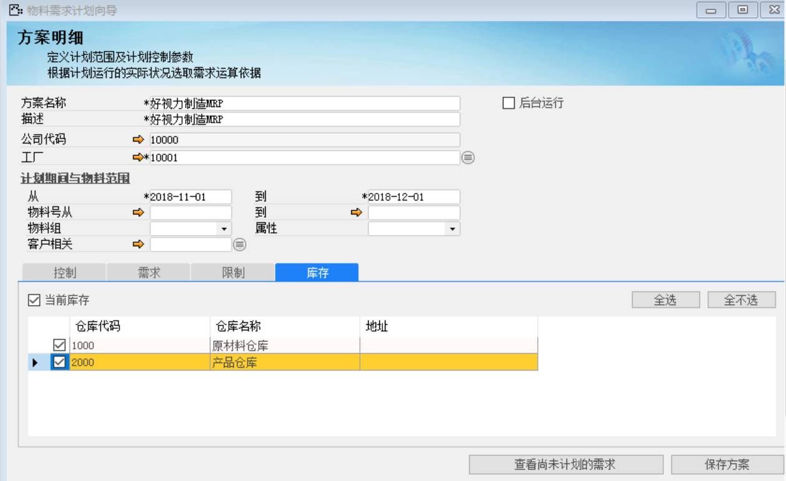
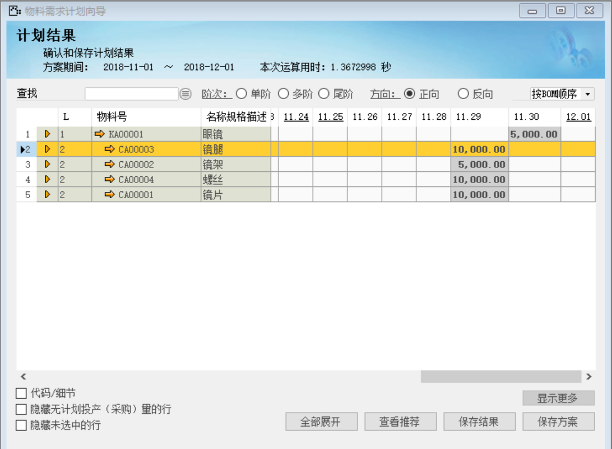

## 四十七、物料需求计划运算

打开路径：【计划】-【物料需求计划运算】

(1) 创建新方案

(2) 主表单

| **字段**                 | **内容**               |
| ------------------------ | ---------------------- |
| 方案名称                 | 好视力制造MRP          |
| 描述                     | 好视力制造MRP          |
| 工厂                     | 10001                  |
| 计划期间与物料范围从…到… | 2018-11-01到2018-12-01 |

(3) 控制标签页

勾选：生产计划考虑假期，采购计划考虑假期，生产订单产出，包括未下达0行，采购订单，包括未审核0行

(4) 需求标签页

勾选：销售订单需求

(5) 限制标签页

选择订单类型：销售订单，然后点击【查询订单】按钮，选择销售订单

指定推荐结果勾选：计划订单、生产订单、采购订单

(6) 库存标签页

勾选：当前库存；1000、2000仓库

(7) 点击【运行】按钮

点击【保存结果】按钮和【保存方案】按钮 