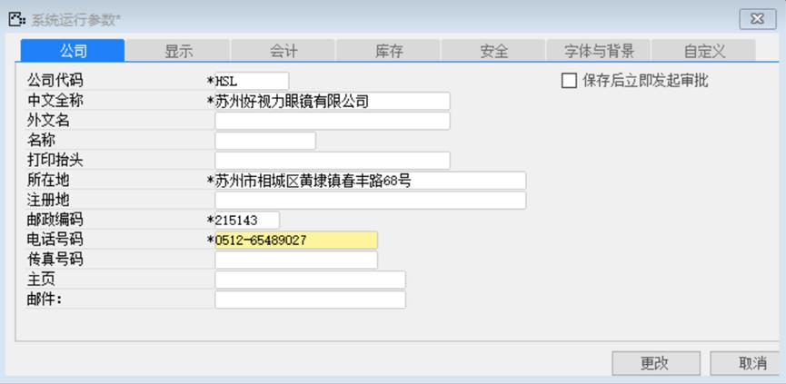
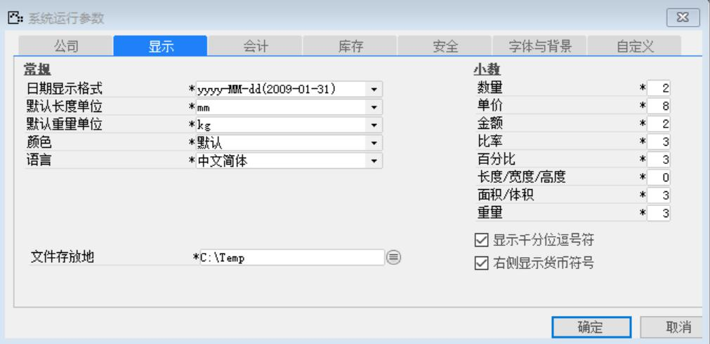
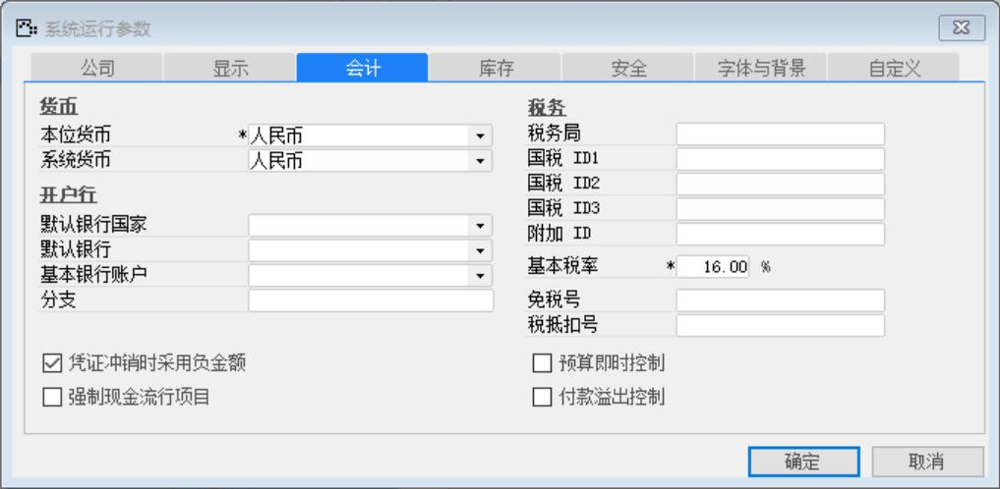

打开路径为：【管理】-【系统初始化】-【系统运行参数】
## 1.公司标签页
内容表

| **字段** | **内容** |
| --- | --- |
| 公司代码 | HSL |
| 中文全称 | 苏州好视力眼镜有限公司 |
| 所在地 | 苏州市相城区黄埭镇春丰路68号 |
| 邮政编码 | 215143 |
| 电话号码 | 0512-65489027 |

## 2.显示标签页
内容表

| **字段** | **内容** |
| --- | --- |
| 日期显示格式 | yyyy-MM-dd(2009-01-31) |
| 默认长度单位 | mm |
| 默认重量单位 | kg |
| 颜色 | 默认 |
| 语言 | 中文简体 |
| 文件存放地 | C:\Temp |
| 数量 | 2 |
| 单价 | 8 |
| 金额 | 2 |
| 比率 | 3 |
| 百分比 | 3 |
| 长度/宽度/高度 | 0 |
| 面积/体积 | 3 |
| 重量 | 3 |

勾选显示千分位逗号符 
勾选右侧显示货币符号

## 3.会计标签页
内容表

| **字段** | **内容** |
| --- | --- |
| 本位货币 | 人民币 |
| 系统货币 | 人民币 |
| 基本税率 | 16.00% |

勾选凭证冲销时采用负金额

