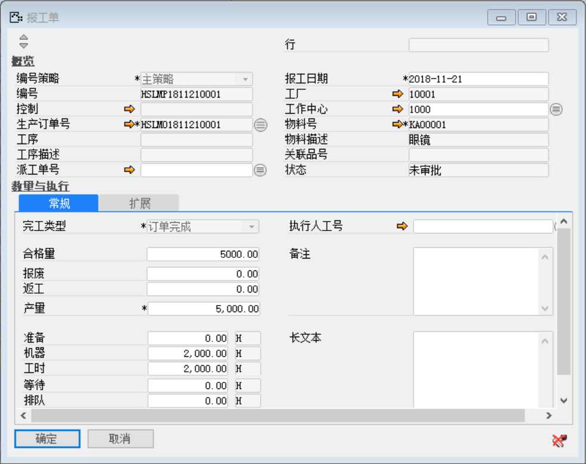
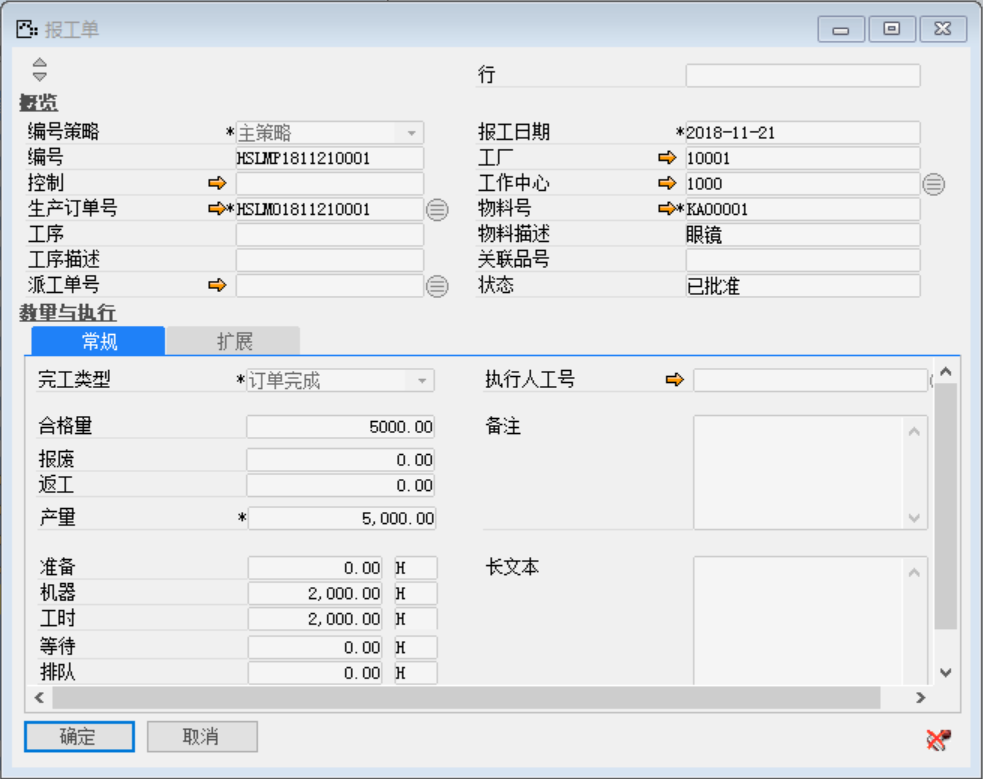

打开路径：【生产作业】-【报工】-【报工单】

（1）   选择生产订单号：HSLMO1811210001

（2）   常规标签页

内容表 

| **字段** | **内容** |
| -------- | -------- |
| 完工类型 | 订单完成 |
| 合格量   | 5000     |
| 产量     | 5000     |
| 机器     | 2000H    |
| 工时     | 2000H    |

（3）   点击【添加】按钮，再点击按钮审批

