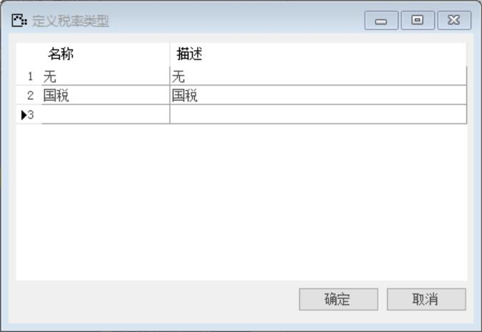
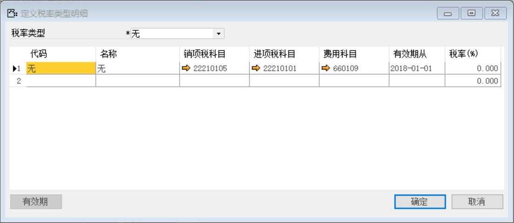
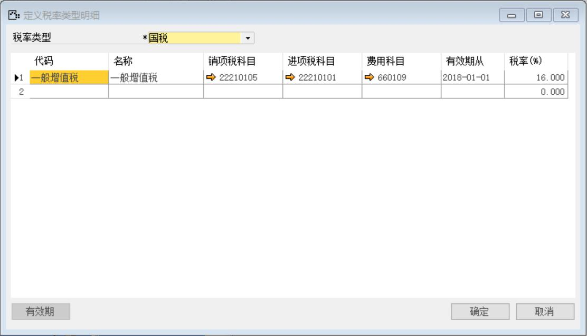
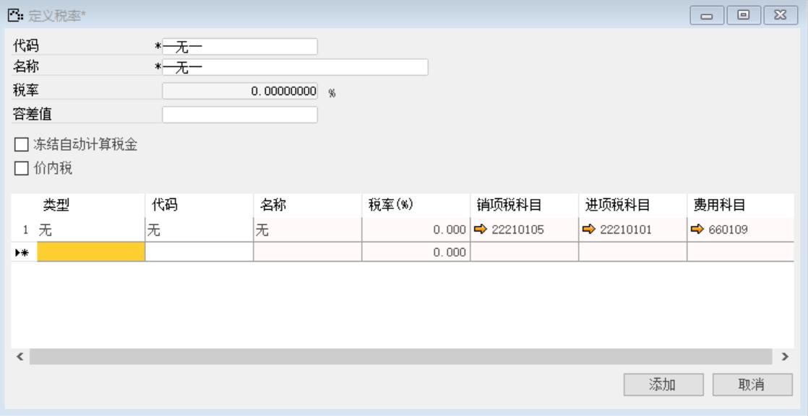
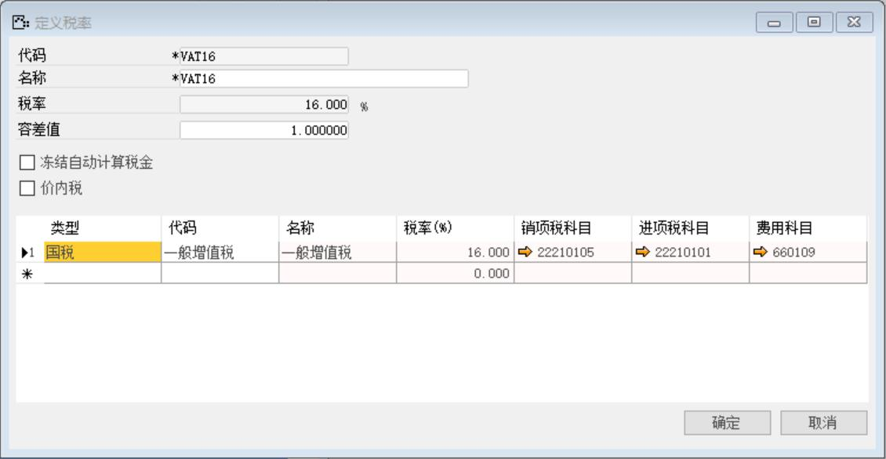

## 1.定义税率类型
打开路径：【管理】-【基础定义】-【会计】-【定义税率类型】
内容表

| **名称** | **描述** |
| --- | --- |
| 无 | 无 |
| 国税 | 国税 |

## 2.定义税率类型明细
打开路径：【管理】-【基础定义】-【会计】-【定义税率类型明细】
内容表

| **字段** | **内容** |
| --- | --- |
| 税率类型 | 无 |
| 代码 | 无|
| 名称 | 无 |
| 销项税科目 | 销项税额|
| 进项税科目 | 进项税额 |
| 费用科目 | 其他费用 |
| 有效期从 | 2018/1/1 |

内容表

| **字段** | **内容** |
| --- | --- |
| 税率类型 | 国税 |
| 代码 | 一般增值税|
| 名称 | 一般增值税 |
| 销项税科目 | 销项税额|
| 进项税科目 | 进项税额 |
| 费用科目 | 其他费用 |
| 有效期从 | 2018/1/1 |
| 税率（%） | 16 |

## 3.定义税率
打开路径：【管理】-【基础定义】-【会计】-【定义税率】
内容表

| **字段** | **内容** |
| --- | --- |
| 代码 | --无-- |
| 名称 | --无-- |
| 类型 | 无 |
| 代码 | 无 |

内容表

| **字段** | **内容**   |
| -------- | ---------- |
| 代码     | VAT16      |
| 名称     | VAT16      |
| 类型     | 国税       |
| 代码     | 一般增值税 |
| 容差值   | 1.000000   |

