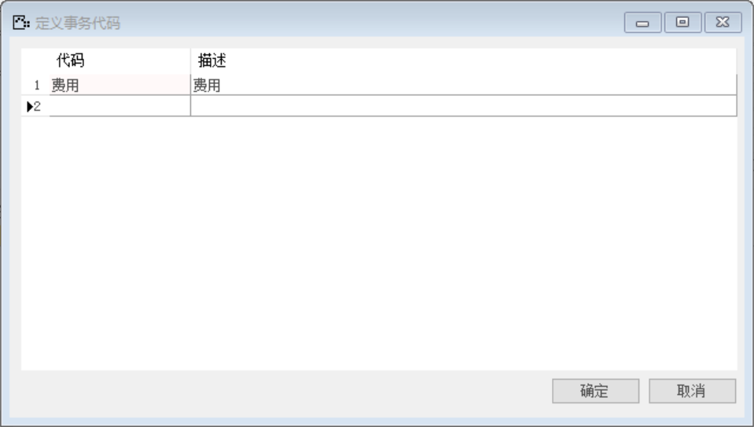
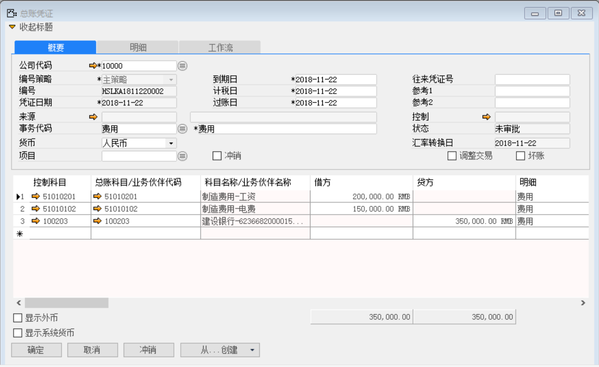
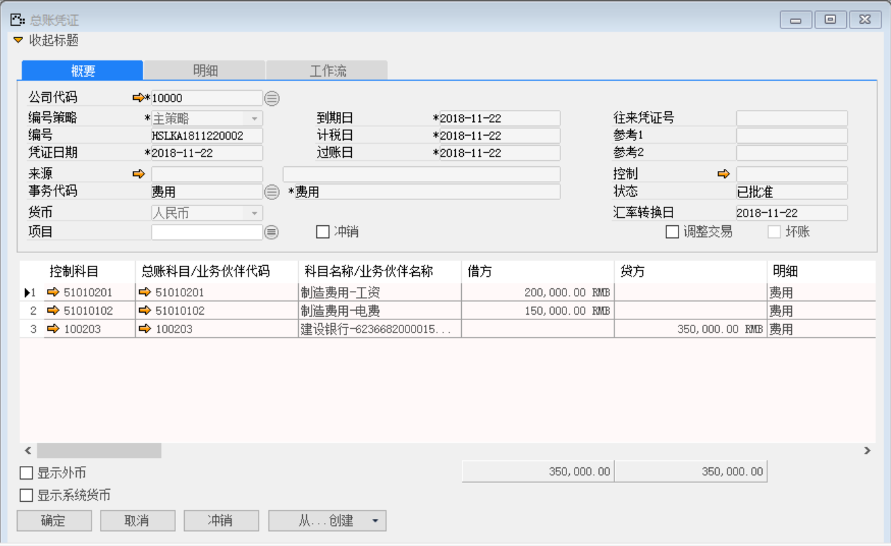

（1）   创建事务代码

打开路径：【管理】-【基础定义】-【会计】-【定义事务代码】

（2）   创建总账凭证

打开路径：【总账】-【总账凭证】

公司代码：10000

事务代码：费用

总账科目/业务伙伴代码：51010201；借方：200000；成本中心：ZZ0007

总账科目/业务伙伴代码：51010102；借方：150000；成本中心：ZZ0007

总账科目/业务伙伴代码：100203；贷方：350000

（3）   点击【添加】按钮，然后点击按钮审批

    