打开路径：【管理会计】-【产品成本结算】-【作业价格计算】

(1) 成本中心从：ZZ0007到：ZZ0007 

勾选模拟，点击【计算】按钮

(2) 不勾选模拟。点击【计算】按钮

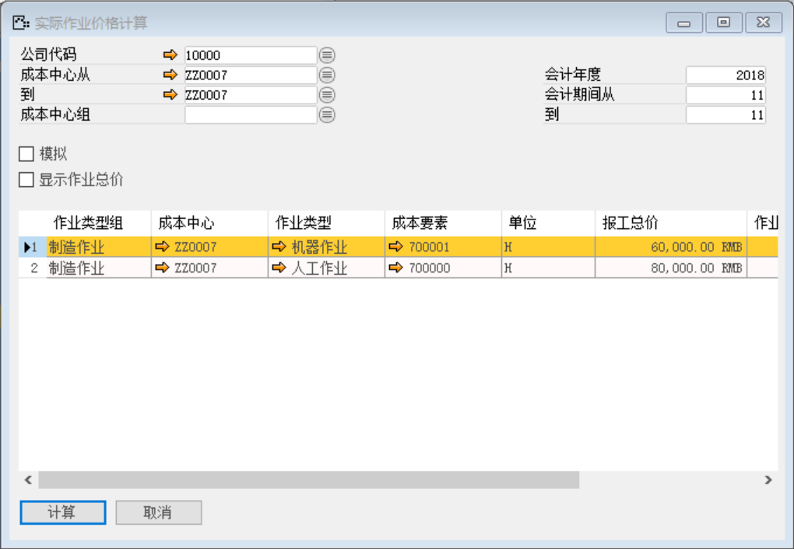

(3) 查看实际作业价格

打开路径：【管理会计】-【产品成本结算】-【查看实际作业价格】

成本中心从：ZZ0007生产部；到：ZZ0007生产部

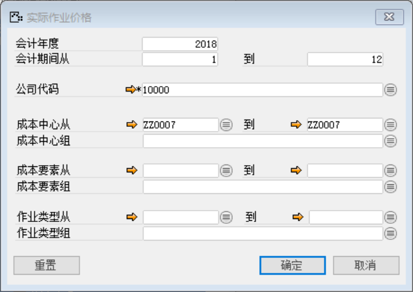

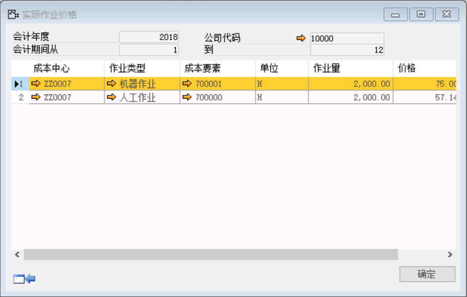

(4) 重估生产订单

打开路径：【管理会计】-【产品成本结算】-【重估生产订单】

选择生产订单：HSLMO1811210001；勾选模拟，点击【重估】按钮

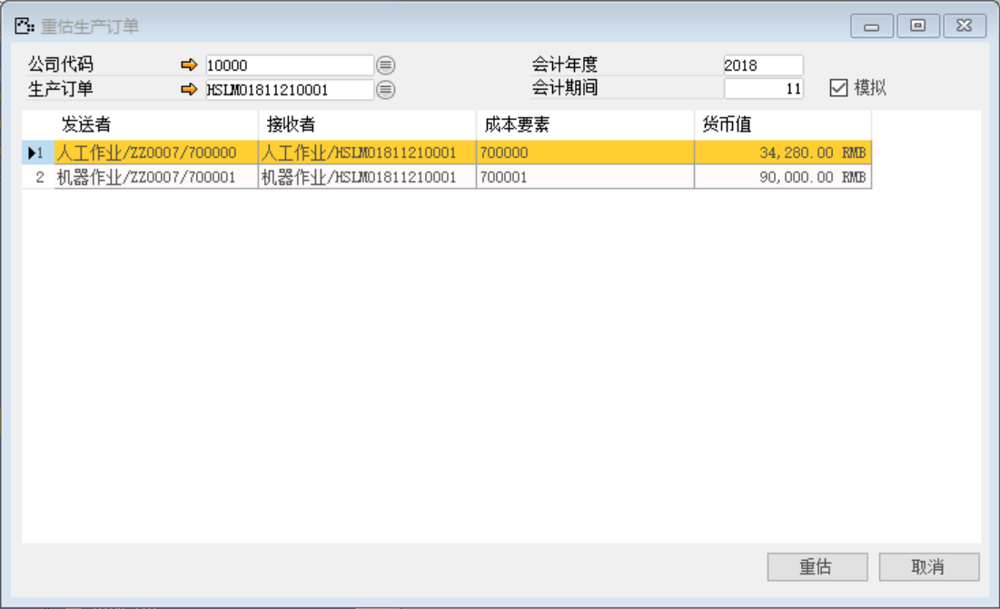

不勾选模拟，点击【重估】按钮

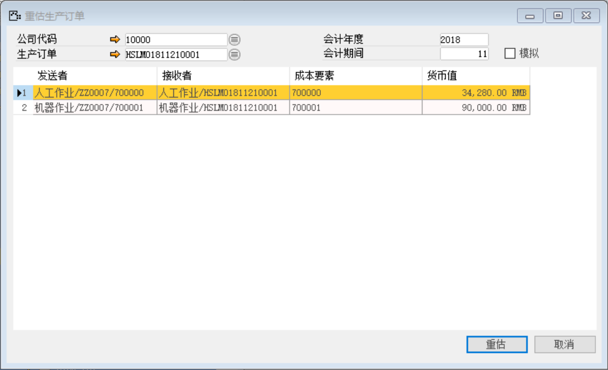

(5) 成本结算

打开路径：【管理】-【系统初始化】-【期间状态管理】-【期间同步】

选择公司代码：10000，勾选成本结算，点击【更改】按钮

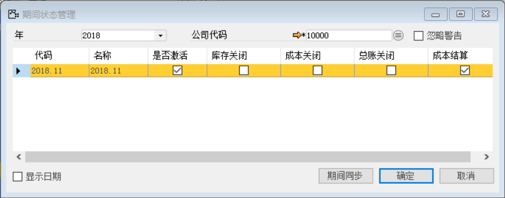

(6) 在产品结算

打开路径：【管理会计】-【产品成本结算】-【在产品结算】

选择生产订单号：HSLMO1811210001；勾选模拟，点击【结算】按钮

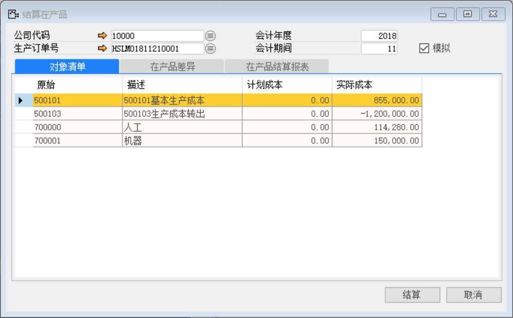

不勾选模拟，点击【结算】按钮

(7) 生产订单结算

打开路径：【管理会计】-【产品成本结算】-【生产订单结算】

选择生产订单号：HSLMO1811210001；勾选模拟，点击【结算】按钮

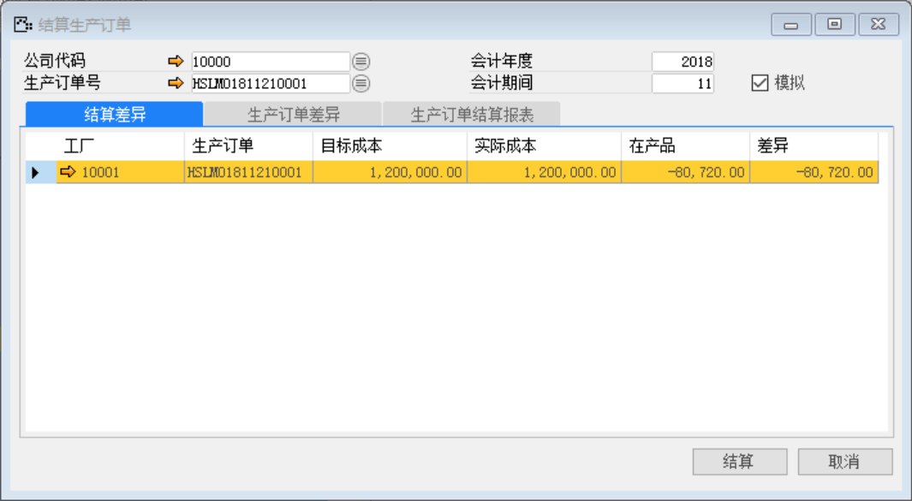

不勾选模拟，点击【结算】按钮

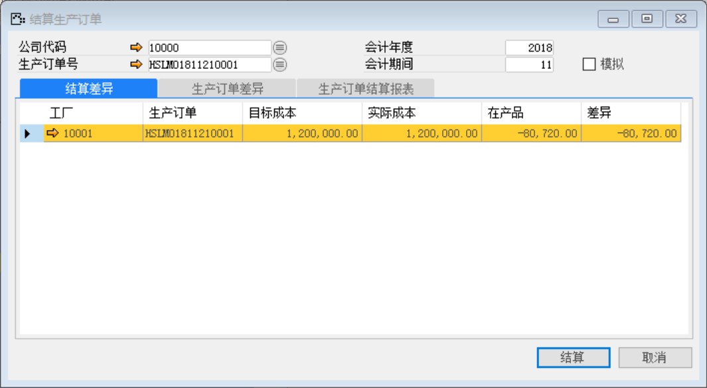

(8)     查看日记账分录

打开路径：【生产作业】-【生产作业】-【生产订单】-【凭证流】

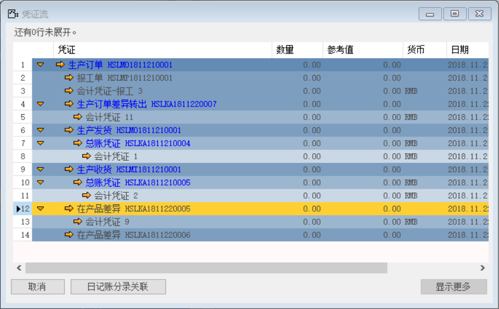

点击两个在产品差异的超链接箭头

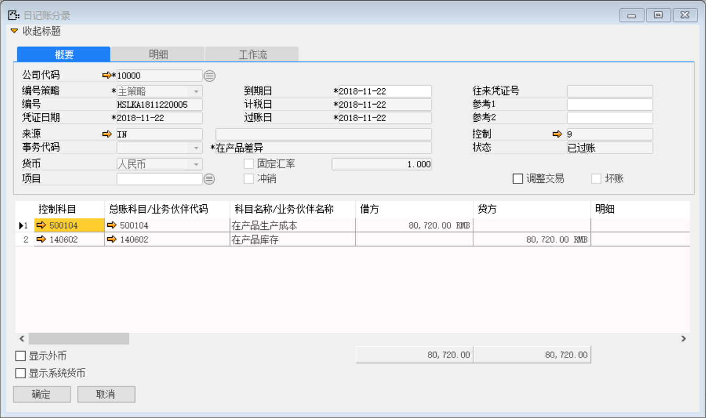

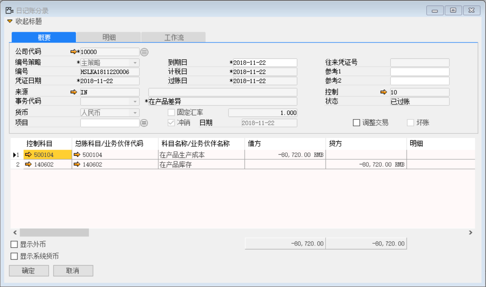

  