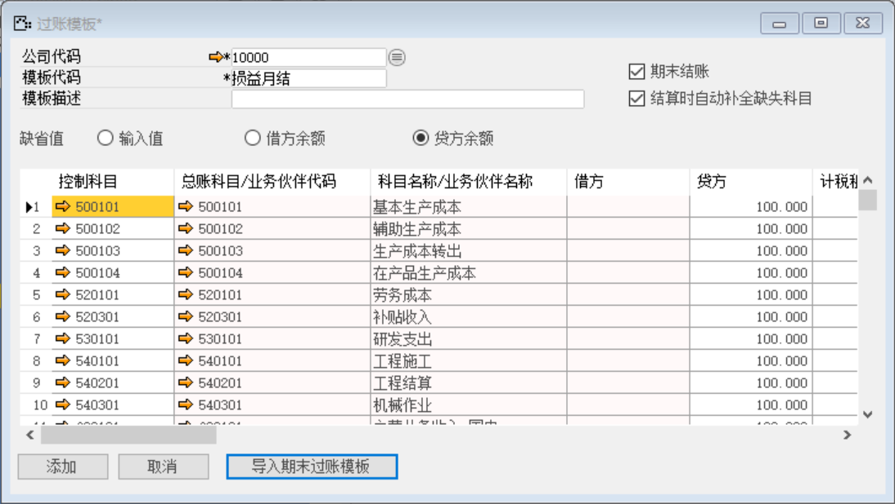
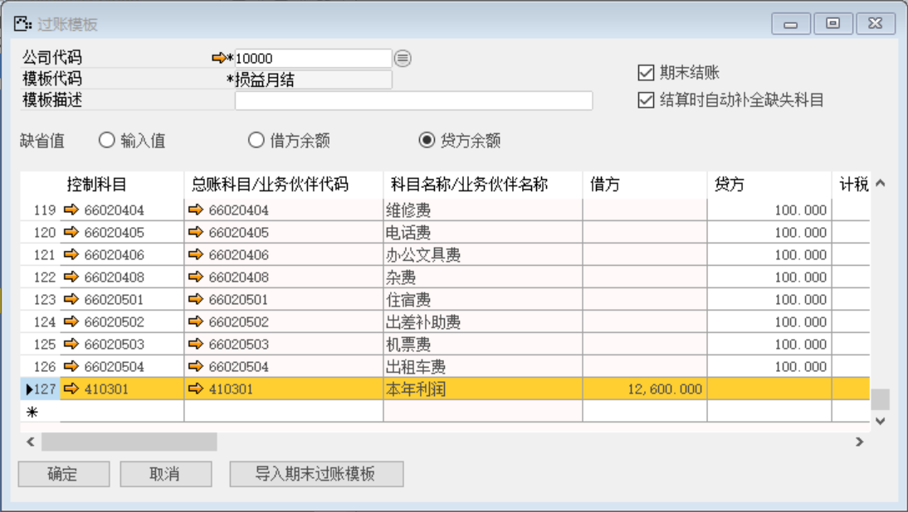
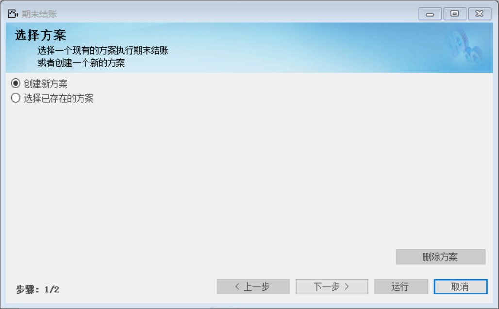
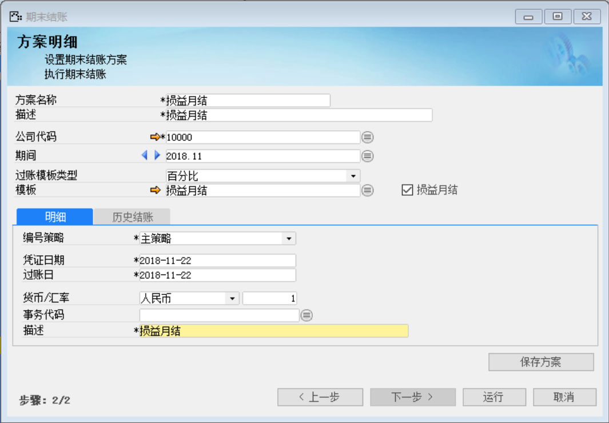
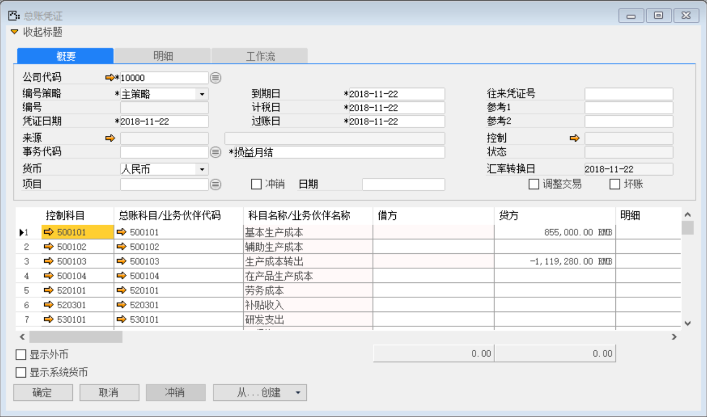
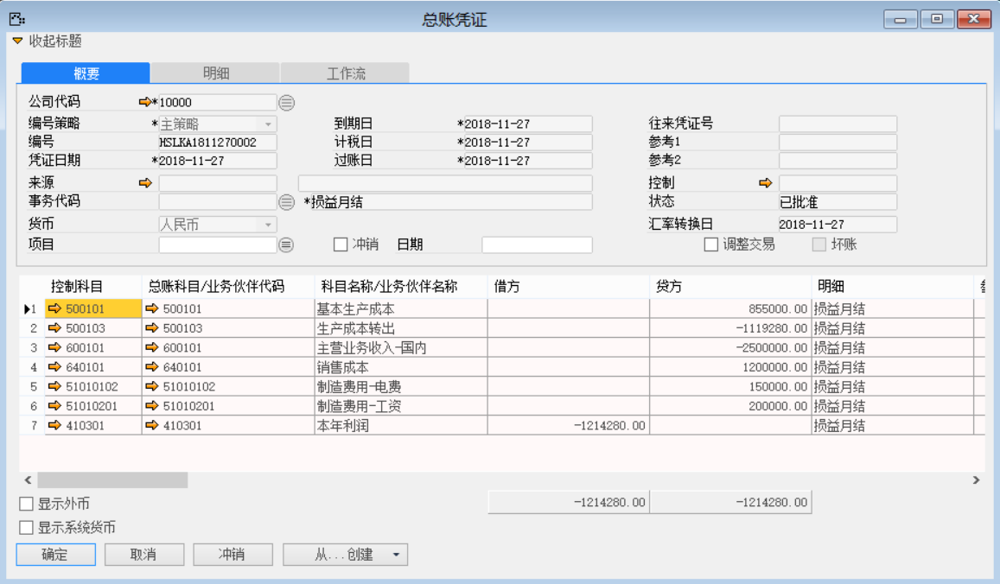
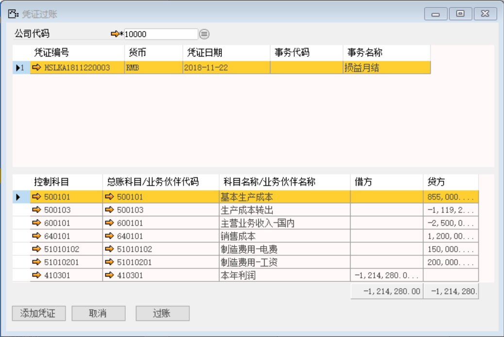

(1) 定义过账模板

打开路径：【总账】-【过账模板】

模板代码：损益月结

勾选：期末结账、结算时自动补全缺失科目

缺省值：贷方金额。

点击【导入期末过账模板】按钮

添加总账科目/业务伙伴代码：本年利润

(2) 期末结账

打开路径：【总账】-【期末结账】

选择创建新方案

内容表

| **字段**     | **内容** |
| ------------ | -------- |
| 方案名称     | 损益月结 |
| 描述         | 损益月结 |
| 过账模板类型 | 百分比   |
| 模板         | 损益月结 |
| 描述         | 损益月结 |

点击【运行】按钮 

点击【确定】按钮，再点击按钮审批

(3) 凭证过账

打开路径：【总账】-【凭证过账】

选中所要过账的凭证

点击【过账】按钮