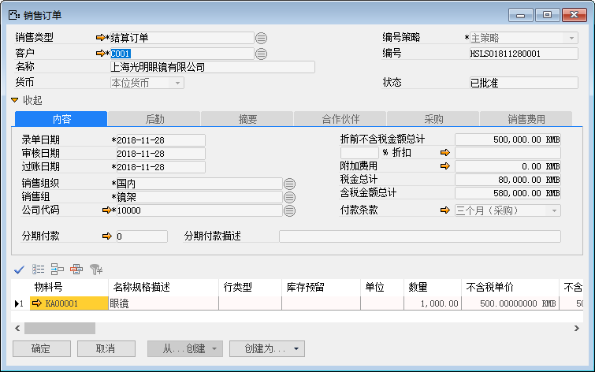
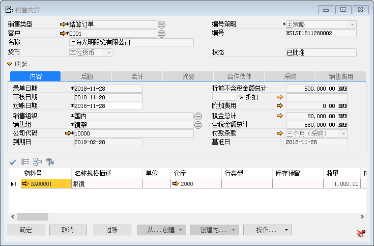
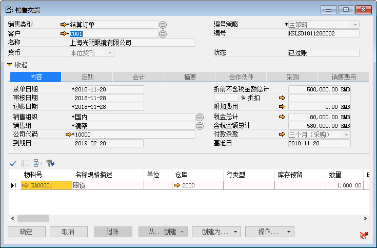

#### **概述** 

当有业务流程需要过账时可以先通过分录模拟功能来查看该业务的财务分录是否正确，如果财务分录正确的话再对该业务进行过账处理。

#### **步骤**

**业务场景：销售交货需要进行过账，在过账前先通过分录模拟查看财务分录是否正确。**

1、 创建一张销售订单； 

- 客户：C001；

- 物料号：KA00001；

- 数量：1000；

 

2、 基于销售订单创建销售交货； 

 

3、 打开【数据】-【日记账分录模拟】，查看销售交货的日记账分录模拟； 

 

 

4、 财务分录正确，对销售交货订单进行过账； 

