###### **结算订单类型销售流程：**

例如：我公司以每副580元（含税）的价格销售给上海光明眼镜有限公司500副眼镜 并以快递的方式运输给客户运费是110元。签订销售合同后上海光明眼镜有限公司先付了20400元现金。

打开路径：系统菜单—销售—订单—销售订单

1、 打开【销售订单】界面，创建一张销售类型为结算类型的销售订单：HSLSO1811260002；

- 选择公司代码、客户等基础信息；

- 创建物料为KA00001和KA00002，数量分别为200、150的销售订单；

- 保存单据并对其进行审批操作。

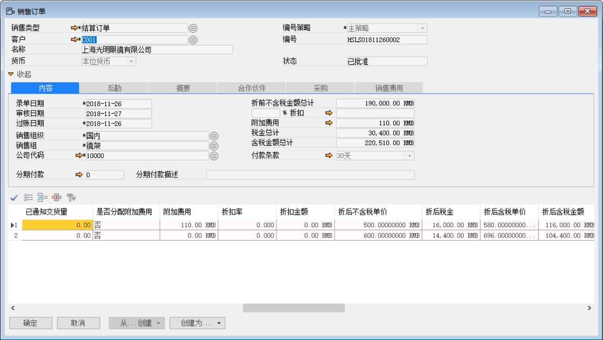 

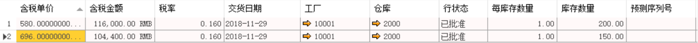 

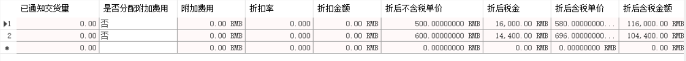 

打开路径：系统菜单—销售—销售交货通知

2、 打开【销售交货通知单】界面，基于销售订单：HSLSO1811260002创建一张销售交货知单：HSLSN1811270001；

- 选择客户等基础性息；

- 点击【从…创建】从销售订单清单中选择销售订单与明细行信息；

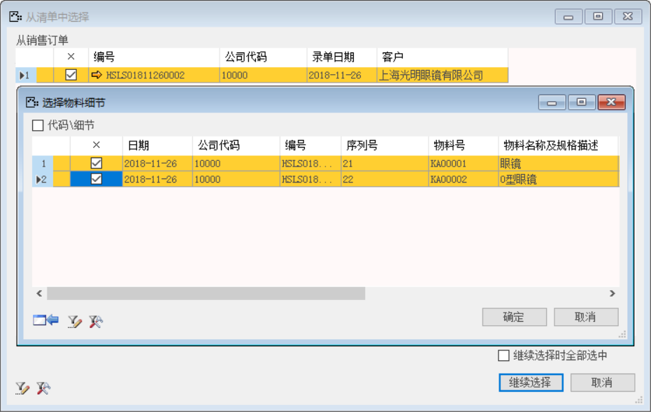 

- 保存单据并对其进行审批操作。

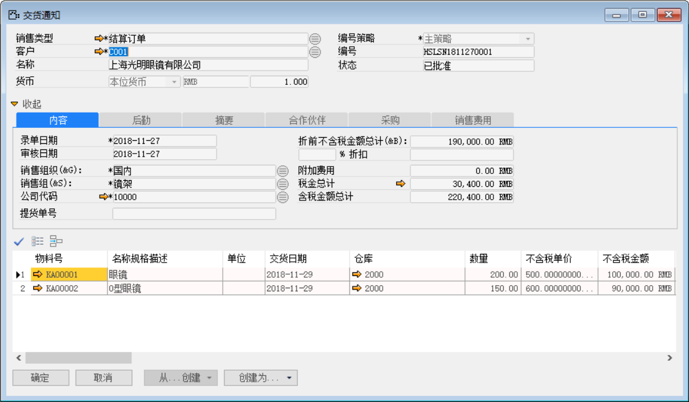 

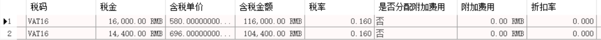 

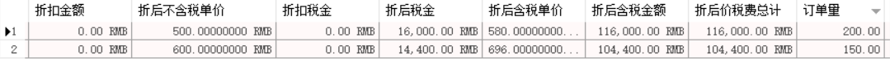 

打开路径：系统菜单—销售—销售交货

3、 打开【销售交货】界面，基于销售交货通知单：HSLSN1811270001创建一张销售通交货单：HSLSD1811270001；

- 选择客户等基础性息；

- 点击【从…创建】从销售交货通知清单中选择销售交货通知单与明细行信息；

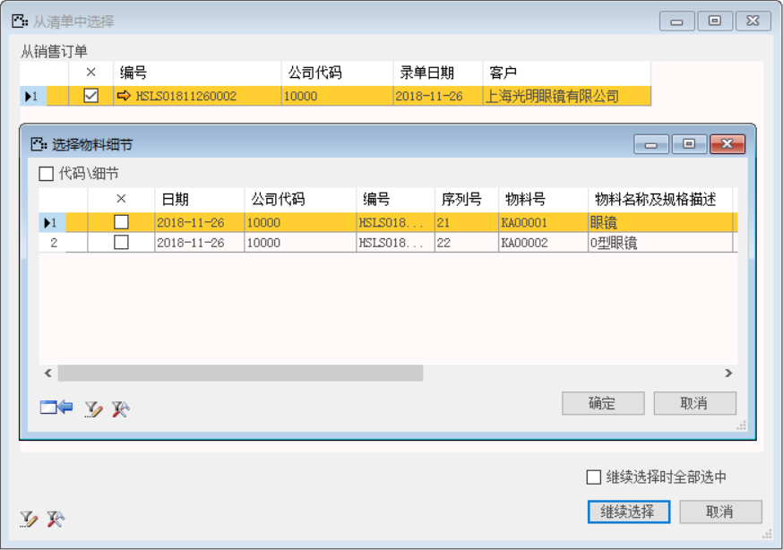 

- 保存单据并对其进行审批过账操作；

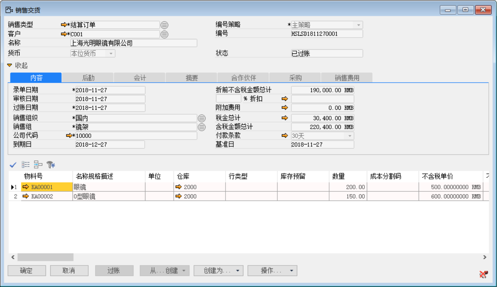 

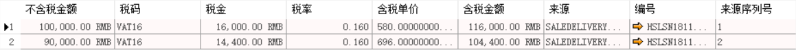 

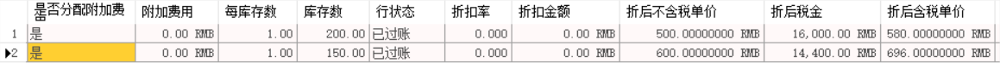 

- 点击【会计】标签下凭证号右侧按钮，打开凭证号：HSLKA1811270002的销售交货财务凭证。

**借（Dr）：发出商品**

**贷（Cr）：库存商品**

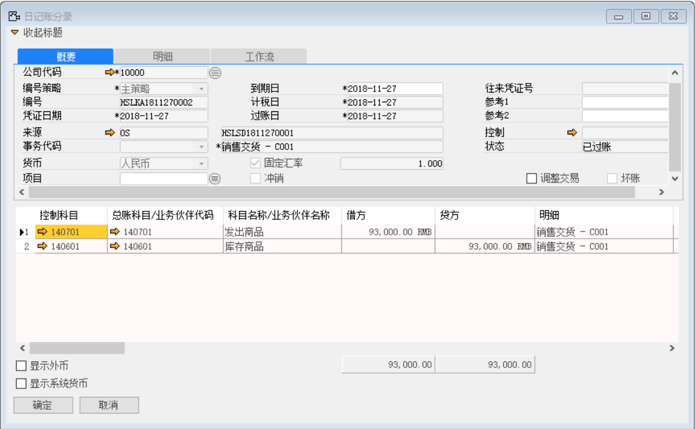 

打开路径：系统菜单—应收账款—应收发票

4、 打开【应收发票】界面，基于销售交货单：HSLSN1811270001创建一张应收发票：HSLSI1811270001；

- 选择客户等基础性息；

- 点击【从…创建】从销售交货清单中选择销售交货单与明细行信息；

 

- 保存单据并对其进行审批操作；

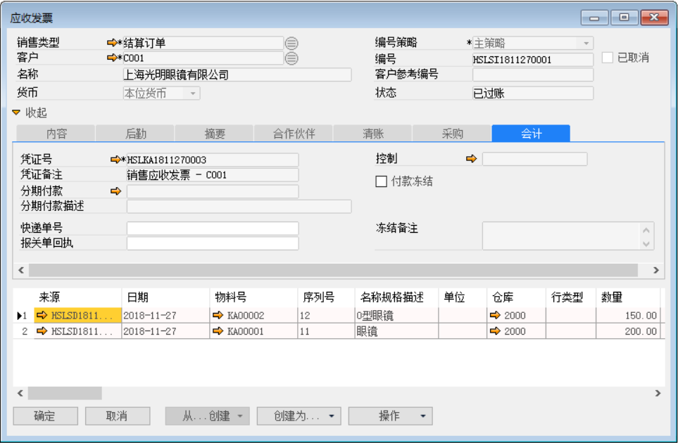 

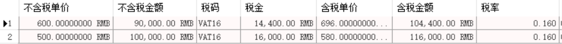 

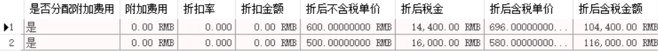 

- 点击【会计】标签下凭证号右侧按钮，打开凭证号：HSLKA1811270003的应收发票财务凭证。

**借（Dr）:销售成本** 

**贷（Cr）:发出商品**

**借（Dr）: 应收账款-上海光明眼镜有限公司**

**贷（Cr）:应交增值税-销项税**

**贷（Cr）：主营业务收入-现金**

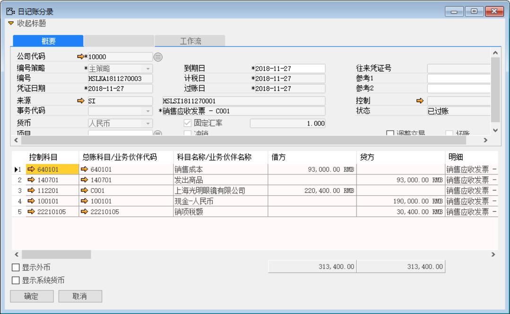 

打开路径：系统菜单—应收账款—收款通知

5、 打开【收款通知】界面，创建一张预收款通知单：HSLRM1811270001；

- 选择客户等基础性息并勾选预收账款复选框；

- 填写金额和点击按钮选择收款内容；

- 保存单据并对其进行审批过账操作；

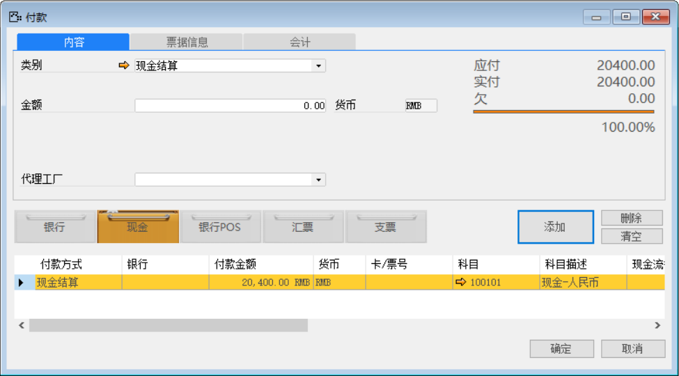 

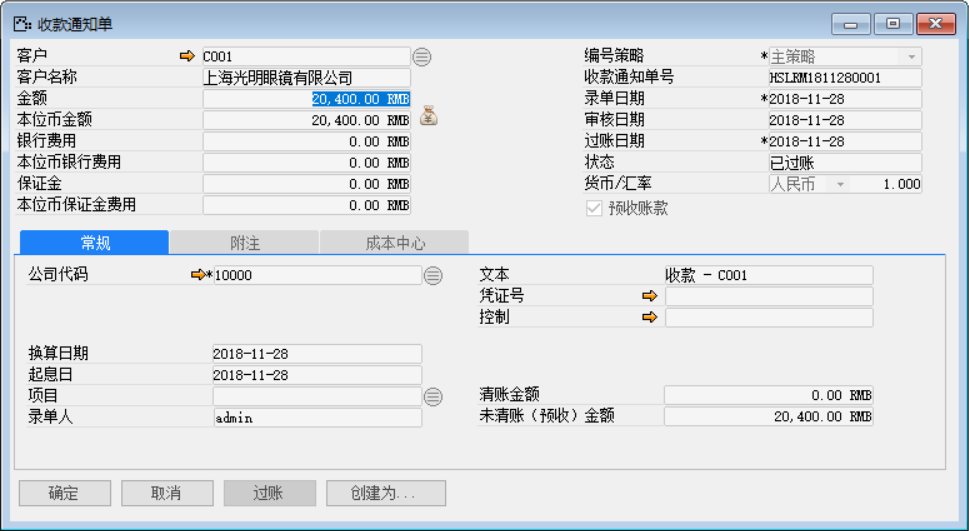 

- 点击【创建为…】按钮创建为清账收款：HSLPM1811280001输入收款金额和勾选预收款复选款；

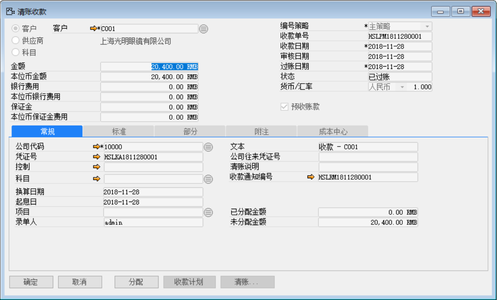 

- 点击【清账收款】界面凭证号右边的按钮，打开凭证号：HSLKA1811280001的预收款财务凭证。

**借（Dr）：现金-人民币**

**贷（Cr）：预收账款-上海光明眼镜有限公司**

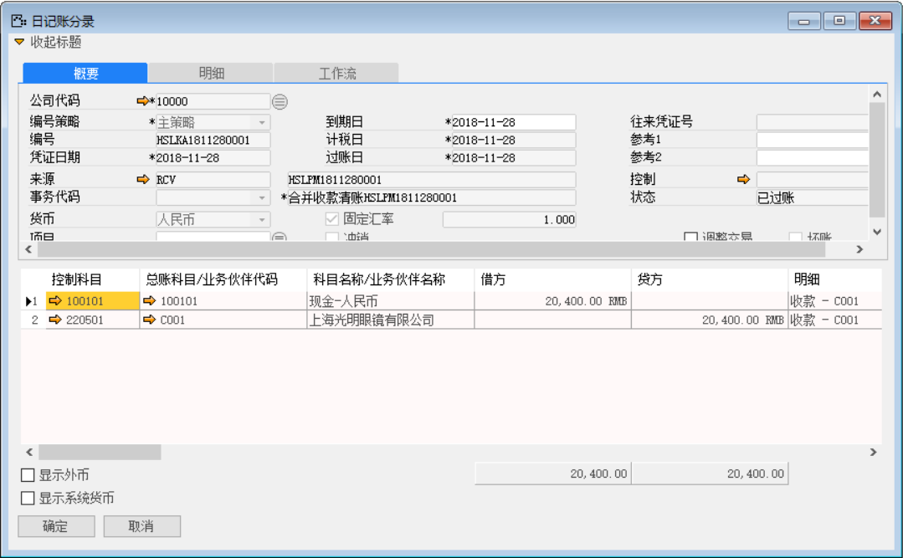 

6、 打开【收款通知】界面，创建一张收款通知单：HSLRM1811280002；

- 选择客户等基础性息；

- 填写金额和点击按钮选择收款内容；

- 保存收款通知单据并对其进行审批过账操作；

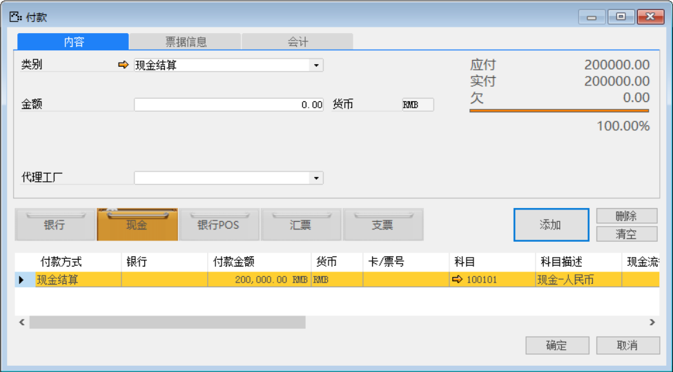 

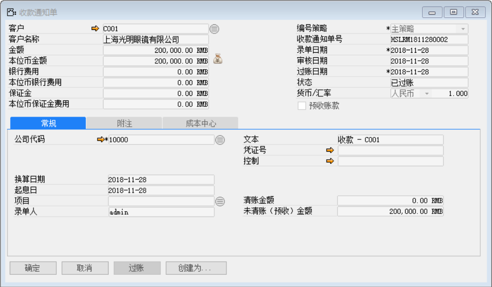 

- 点击【创建为…】按钮创建为清账收款：HSLPM1811280002输入收款金额并点击【清账】按钮选择关联应收发票和预收款；

- 保存单据并对其进行审批过账操作；

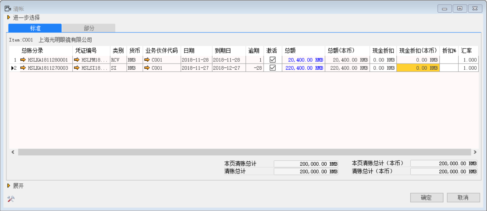 

 

- 点击【清账收款】界面凭证号右边的按钮，打开凭证号：HSLKA1811280002的收款财务凭证。

**借（Dr）：预收账款-上海光明眼镜有限公司**

**借（Dr）：现金-人民币**

**贷（Cr）：应收账款-上海光明眼镜有限公司**

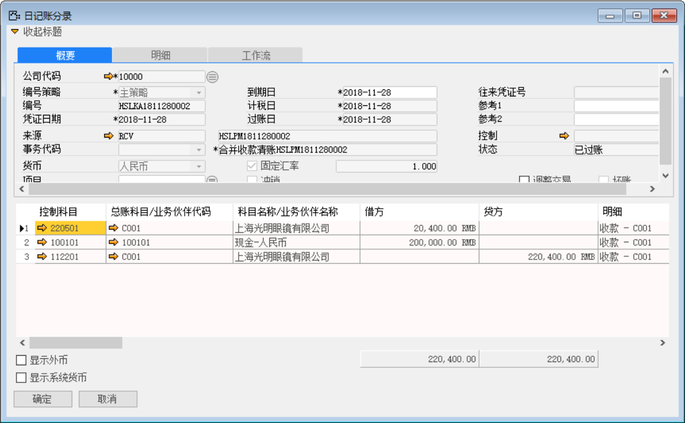
