例如：我公司对上海光明眼镜有限公司销售50副眼镜，并赠送了50个眼镜盒子。

1、 打开【销售订单】界面，创建一张销售类型为结算类型的销售订单：HSLSO1811280001，物料：KA00003行类型为免费（S）；

- 选择公司代码、客户等基础信息；

- 创建物料为KA00001和KA00003，数量分别为50、50,不含税单价分别为500、0并在KA00003物料行中行类型选择S（标准免费）的销售订单；

- 保存单据并对其进行审批操作。

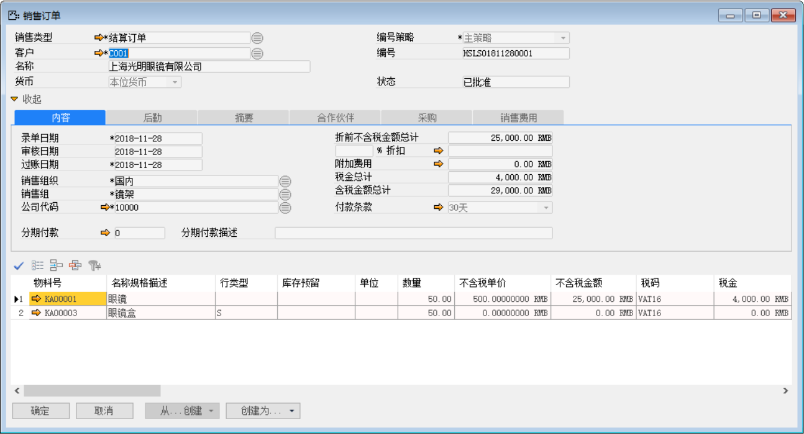 

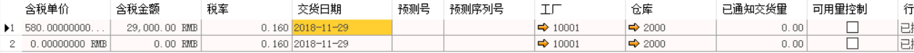 

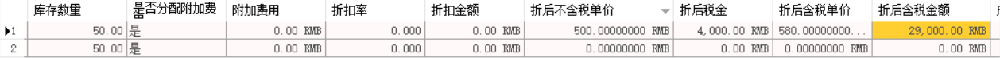 

2、 打开【销售交货通知单】界面，从销售订单：HSLSO1811280001创建一张销售通交货知单：HSLSN1811280001；

- 选择客户等基础性息；

- 点击【从…创建】从销售订单清单中选择销售订单与明细行信息；

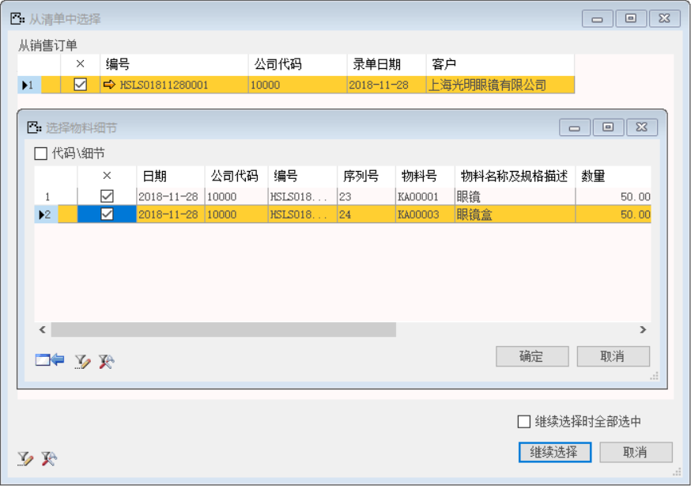 

- 保存单据并对其进行审批操作。

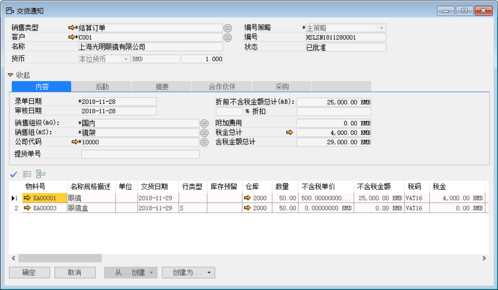 

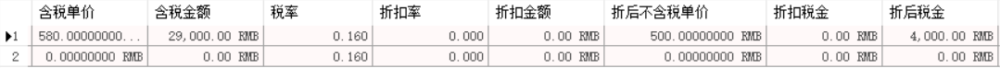 

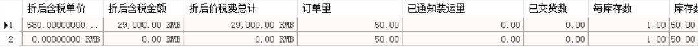 

3、 打开【销售交货】界面，从销售交货通知单：HSLSN1811280001创建一张销售通交货单：HSLSD1811280001；

- 选择客户等基础性息；

- 点击【从…创建】从销售交货通知清单中选择销售交货知单与明细行信息；

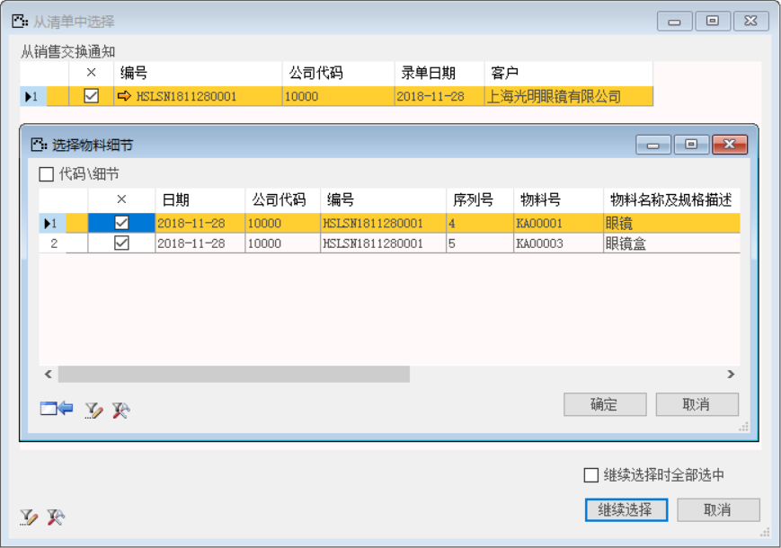 

- 保存单据并对其进行审批过账操作；

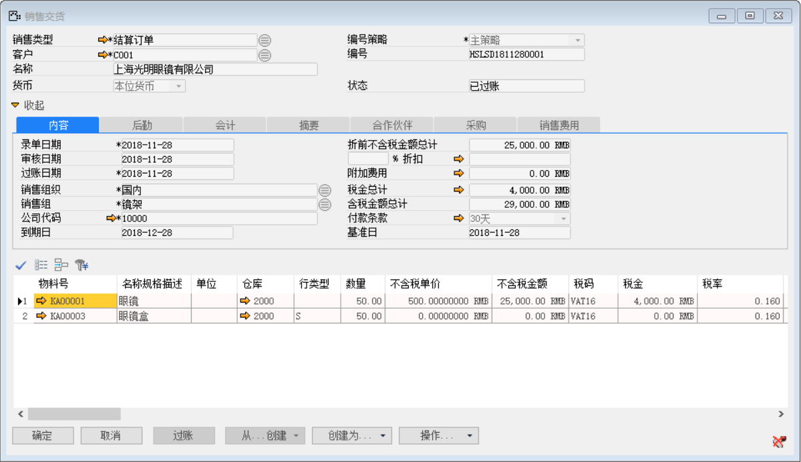 

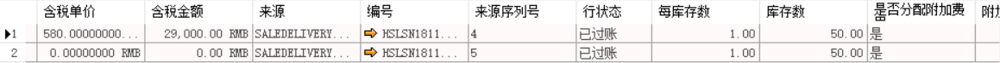 

 

- 点击【会计】标签下凭证号右侧按钮，打开凭证号：HSLKA1811280002的销售交货财务凭证。

**借（Dr）：发出商品**

**借（Dr）：销售费用-其他**

**贷（Cr）：库存商品**

**贷（Cr）：应交增值税-销项税**

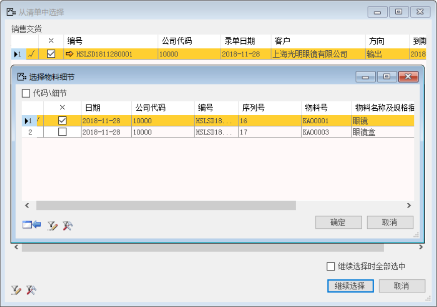 

4、 打开【应收发票】界面，从销售交货单：HSLSN1811270001创建一张应收发票：HSLSI1811270001,赠送物料不进入发票，在销售交货时成本结转入销售费用；

- 选择客户等基础性息；

- 点击【从…创建】从销售交货清单中选择销售交单与明细行信息；

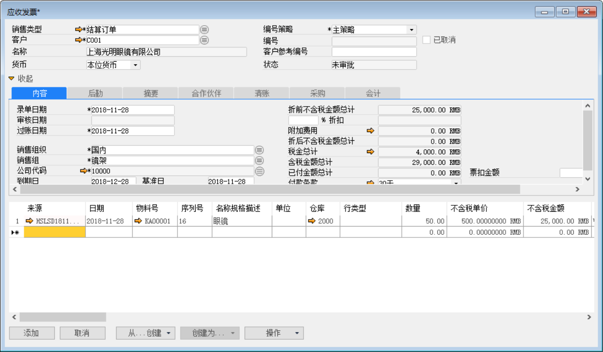 

- 保存单据并对其进行审批操作；

 

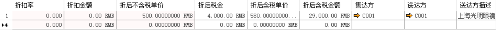 

 

- 点击【会计】标签下凭证号右侧按钮，打开凭证号：HSLKA1811280005的应收发票财务凭证。

**借（Dr）：销售成本** 

**贷（Cr）：发出商品**

**借（Dr）：应收账款-上海光明眼镜有限公司**

**贷（Cr）：应交增值税-销项税**

**贷（Cr）：主营业务收入-现金**

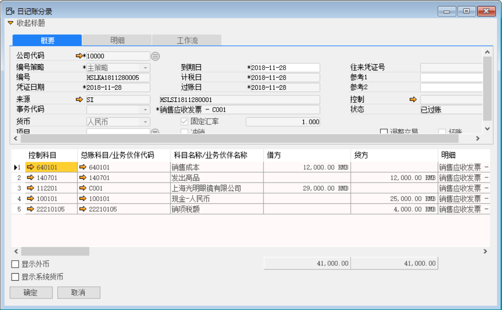 

5、 打开【收款通知】界面，创建一张收款通知单：HSLRM1811280003；

- 选择客户等基础性息；

- 填写金额和点击按钮选择收款内容；

- 保存收款通知单据并对其进行审批过账操作；

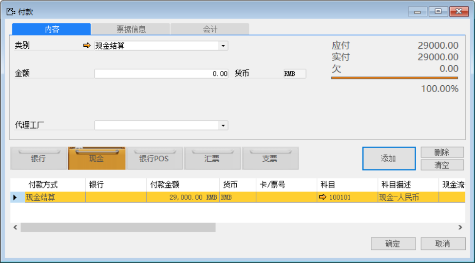 

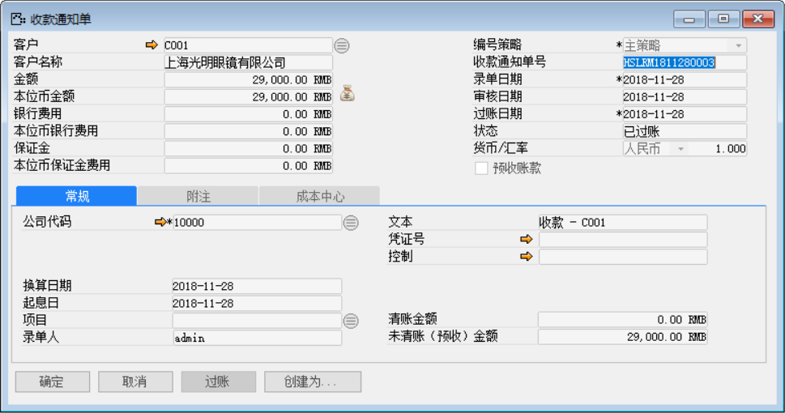 

- 点击【创建为…】按钮创建为清账收款：HSLPM1811280003输入收款金额并点击【清账】按钮选择关联应收发票和预收款；

- 保存单据并对其进行审批过账操作；

 

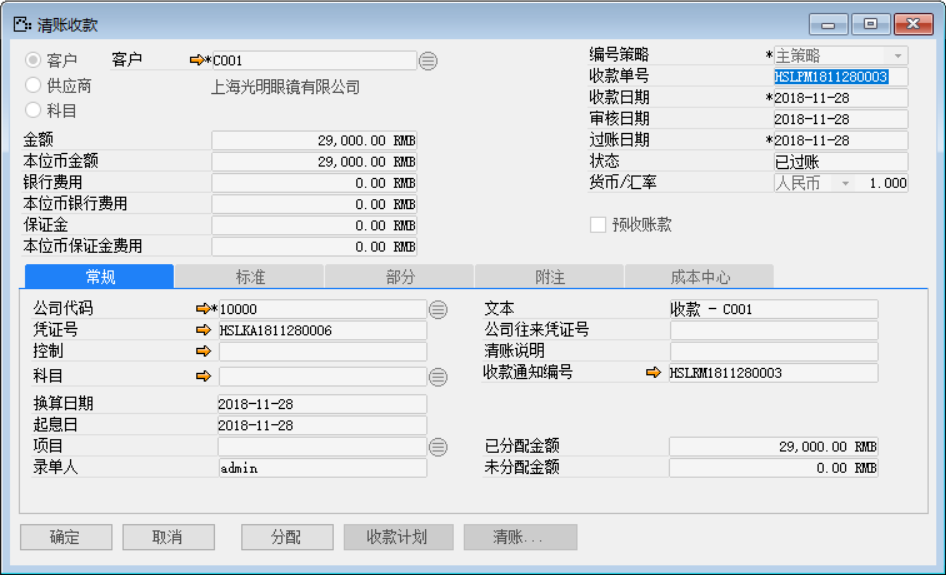 

- 点击【清账收款】界面凭证号右边的按钮，打开凭证号：HSLKA1811280006的收款财务凭证。

**借（Dr）：现金-人民币**

**贷（Cr）：应收账款-上海光明眼镜有限公司**

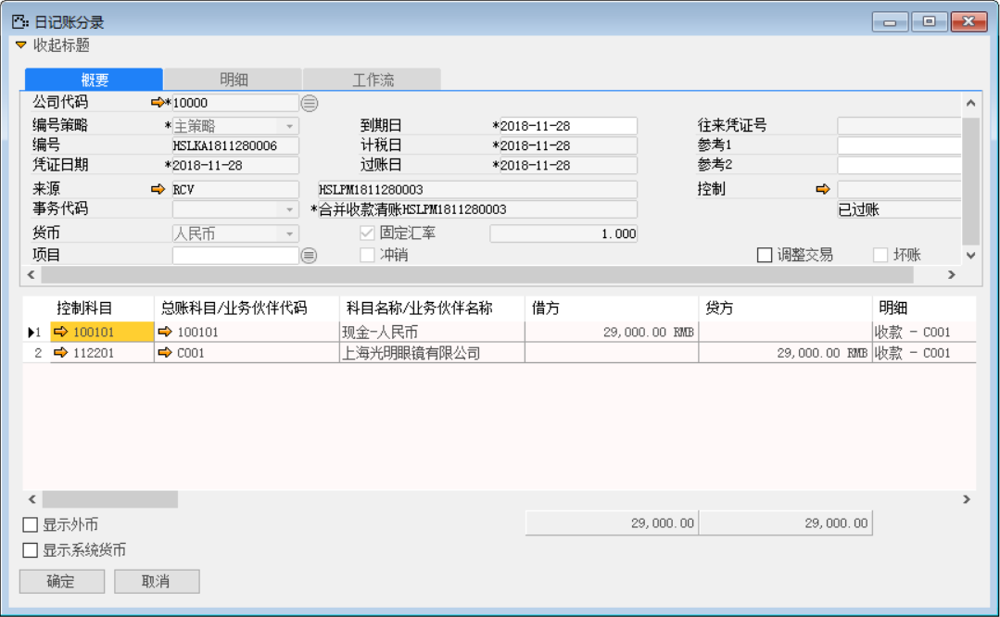

