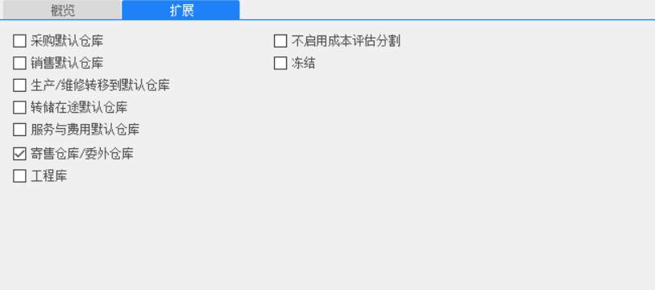
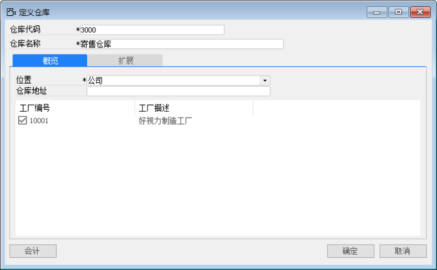
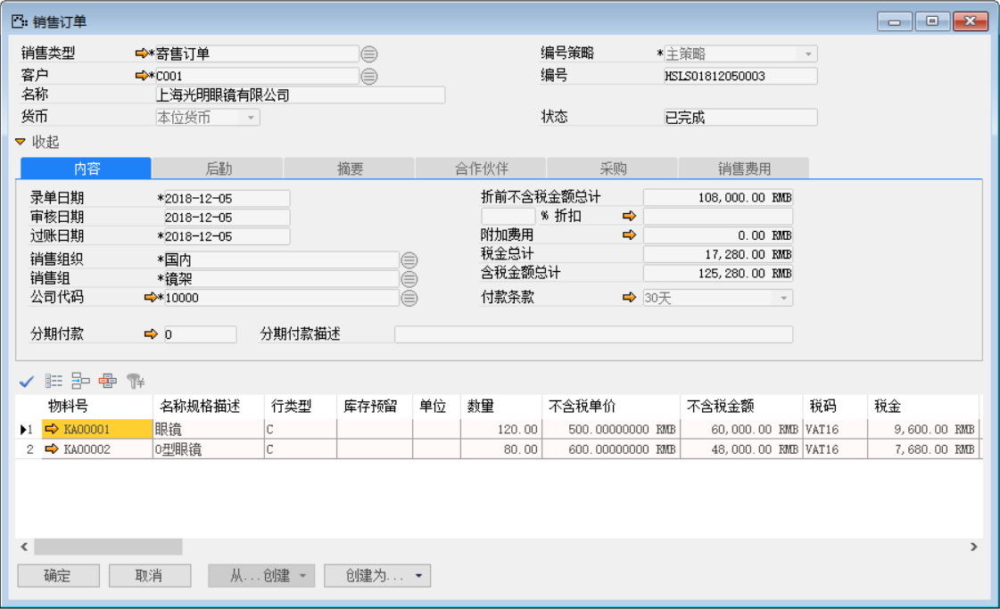
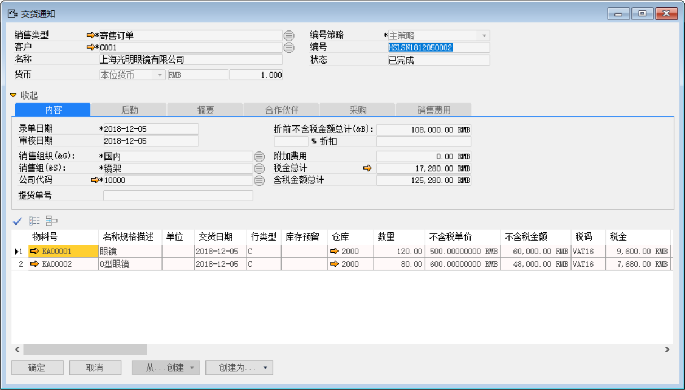
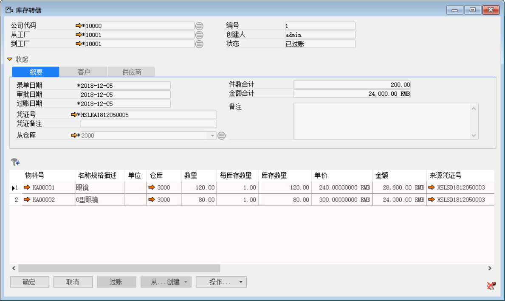
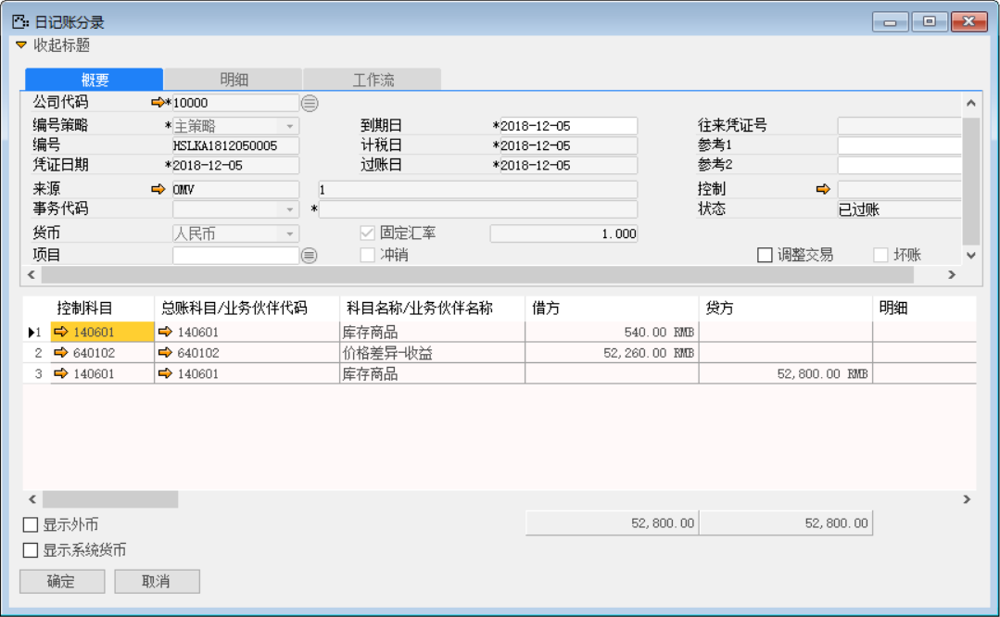

例如：我公司有一批产品委托上海光明眼镜有限公司代替我公司销售。

打开路径：系统菜单—基础定义—库存—仓库

1、 打开【仓库】界面，创建寄售仓库；

- 输入仓库代码、公司名称、选择位置、勾选工厂和勾选【扩展】标签下寄售仓库/委托仓库；

- 对其保存操作。

 

 

打开路径：系统菜单—销售—订单—销售订单

2、 打开【销售订单】界面，创建一张销售订单：

- 选择寄售销售类型、客户等信息；

- 创建物料为KA00001和KA00002，数量分别为120、80的销售订单；

- 在【后勤】标签下到仓库选择寄售仓库：3000；

- 保存单据并对其进行审批操作。

 

打开路径：系统菜单—销售—销售交货通知

3、 打开【销售交货通知】界面，基于销售订单：创建销售交货通知单：HSLSN1812050002；

- 选择客户等基础性息；

- 点击【从…创建】从销售订单清单中选择销售订单与明细行信息；

- 保存单据并对其进行审批操作。

 

打开路径：系统菜单—销售—销售交货

4、 打开【销售交货】界面，基于销售交货通知单：创建一张销售通交货单：HSLSD1812050003；

- 选择客户等基础性息；

- 点击【从…创建】从销售交货通知清单中选择销售交货通知单与明细行信息；

- 保存单据并对其进行审批过账操作；

 

- 根据销售交货单：HSLSD1812050003自动生成库存转储-收发货单状态为已过帐并生成财务凭证：HSLKA1812050005

 

