例如：我公司对上海光明眼镜有限公司物料KA00001和KA00002数量各为100，120，物料KA00001、KA00002退货数量各为50、60。

打开路径：系统菜单—销售—订单—销售订单

1、 打开【销售订单】界面，与上述结算订单类型流程一致创建一张销售订单：HSLSO1811280002；

- 选择公司代码、客户等基础信息；

- 创建物料为KA00001和KA00002，数量分别为100、120的销售订单；

- 保存单据并对其进行审批操作。

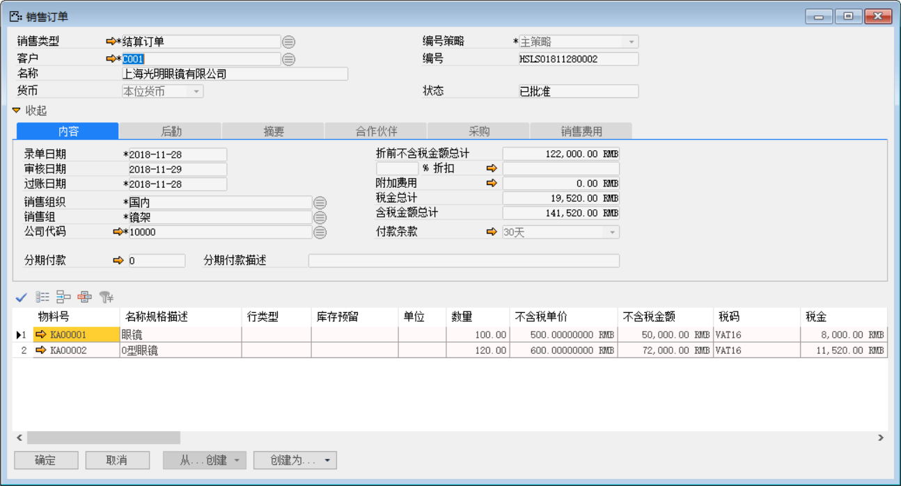 

 

 

打开路径：系统菜单—销售—销售交货

2、 打开【销售交货通知单】界面，基于销售订单：HSLSO1811280002创建一张销售交货通知单：HSLSN1811290001；

- 选择客户等基础性息；

- 点击【从…创建】从销售订单清单中选择销售订单与明细行信息；

- 保存单据并对其进行审批操作。

 

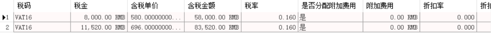 

 

打开路径：系统菜单—销售—销售交货

3、 打开【销售交货】界面，基于销售交货通知单：HSLSN1811290001创建一张销售交货单：HSLSD1811290001；

- 选择客户等基础性息；

- 点击【从…创建】从销售交货通知清单中选择销售交货通知单与明细行信息；

- 保存单据并对其进行审批过账操作；

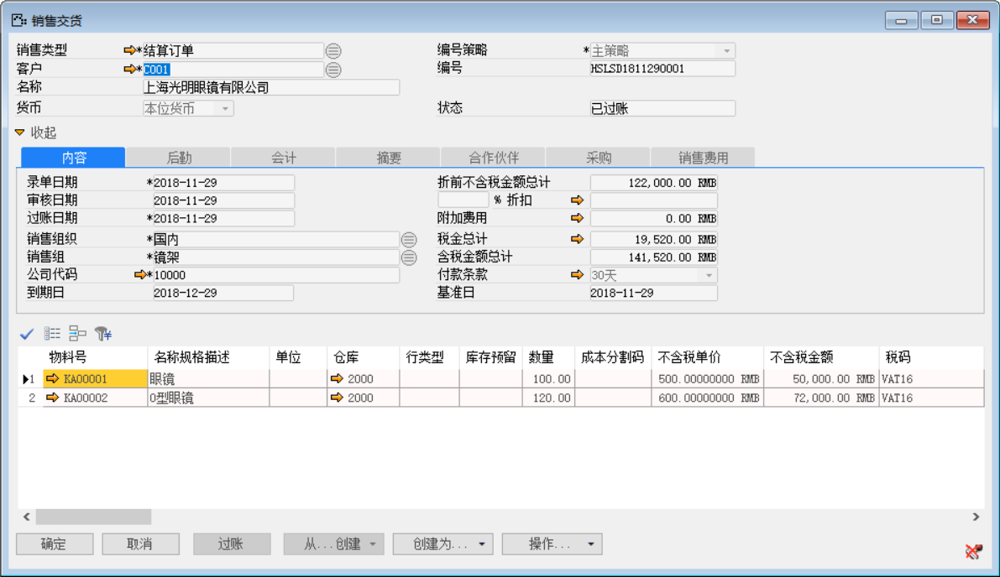 

 

 

- 点击【会计】标签下凭证号右侧按钮，打开凭证号：HSLKA1811290001的销售交货财务凭证。

**借（Dr）：发出商品**

**贷（Cr）：库存商品**

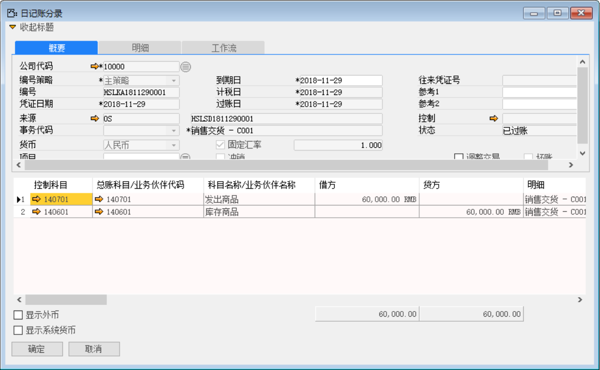 

打开路径：系统菜单—销售—销售退货通知单

4、 打开【销售退货通知单】界面，基于销售交货单：HSLSD1811290001创建一张销售退货通知单：HSLSN1811290001；

- 选择客户等基础性息；

- 点击【从…创建】从销售交货清单中选择销售交货单与明细行信息；

- 保存单据并对其进行审批操作；

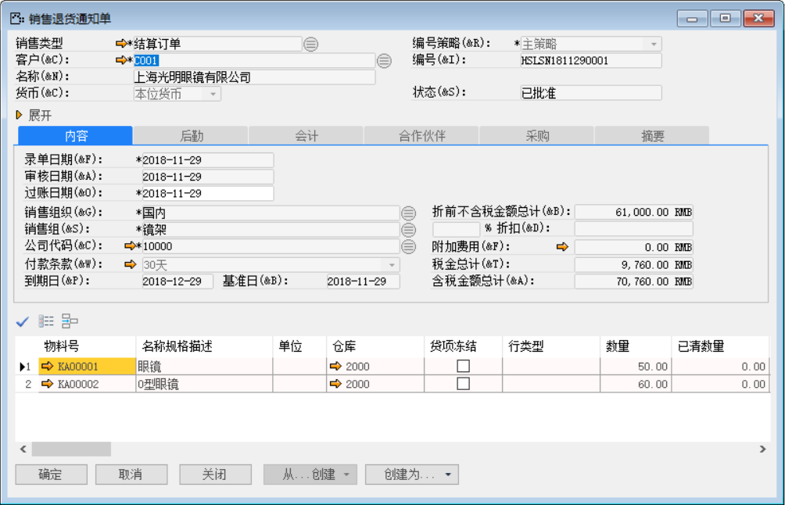 

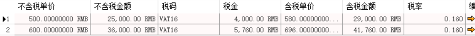 

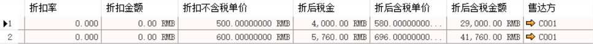 

打开路径：系统菜单—销售—销售退货

5、 打开【销售退货】界面，基于销售退货通知单：HSLSN1811290001创建一张销售退货单：HSLSB1811290001；

- 选择客户等基础性息；

- 点击【从…创建】从销售退货通知清单中选择销售退货通知单与明细行信息；

- 保存单据并对其进行审批过账操作；

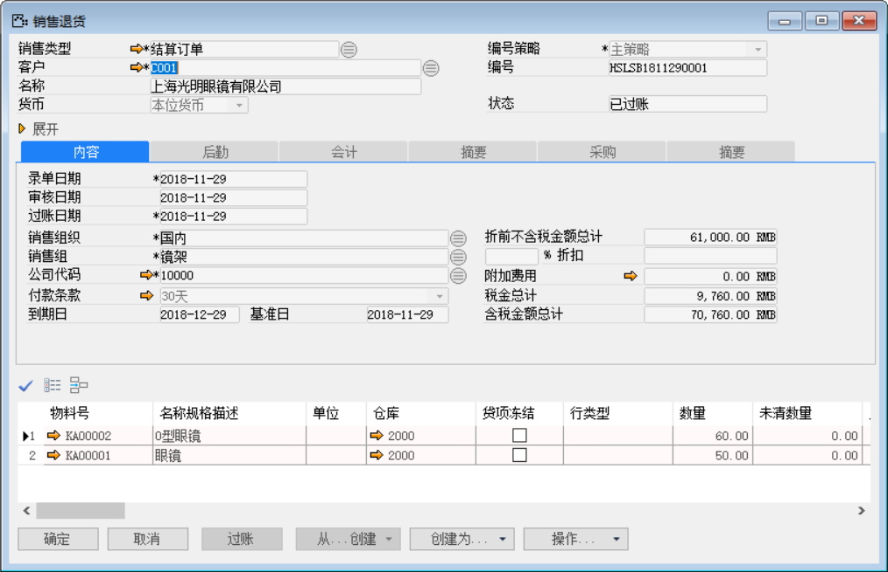 

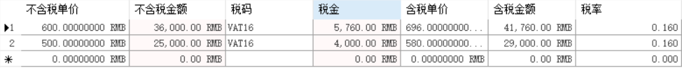 

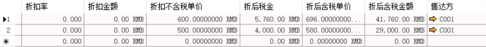 

- 点击【会计】标签下凭证号右侧按钮，打开凭证号：HSLKA1811290002的销售交货财务凭证。

**借（Dr）：库存商品**

**贷（Cr）：发出商品**

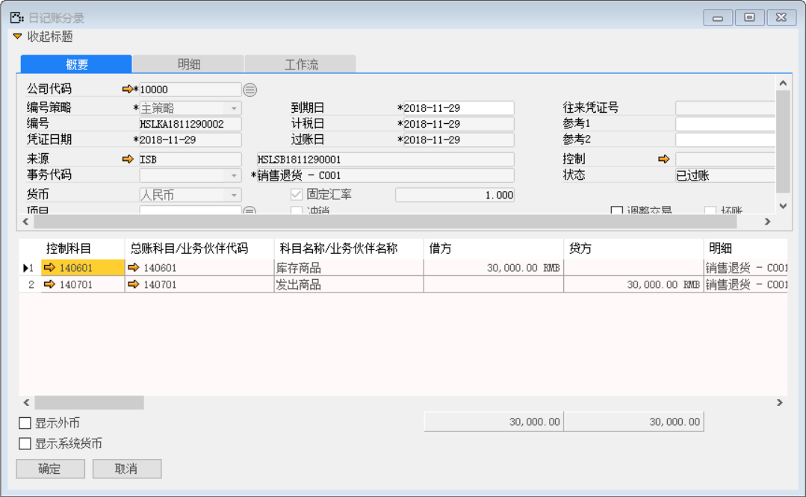 

打开路径：系统菜单—应收账款—应收发票

6、 打开【应收发票】界面，基于销售交货单：HSLSD1811290001创建一张应收发票：HSLSI1811290001；

*注：此处也可以选择销售退货单和销售交货单同时开票。*

- 选择客户等基础性息；

- 点击【从…创建】从销售交货清单中选择销售交单与明细行信息；

- 保存单据并对其进行审批操作；

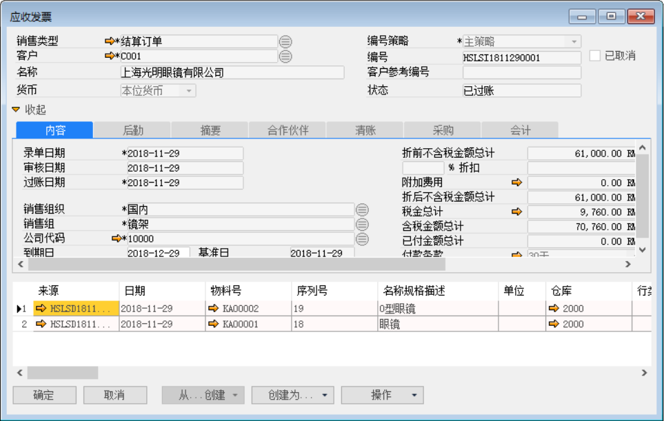 

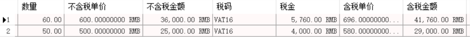 

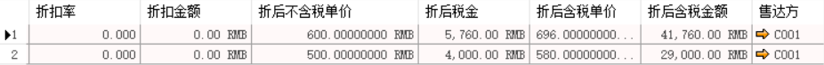 

- 点击【会计】标签下凭证号右侧按钮，打开凭证号：HSLKA1811270003的应收发票财务凭证。

**借（Dr）：销售成本** 

**贷（Cr）：发出商品**

**借（Dr）：应收账款-上海光明眼镜有限公司**

**贷（Cr）：应交增值税-销项税**

**贷（Cr）：主营业务收入-现金**

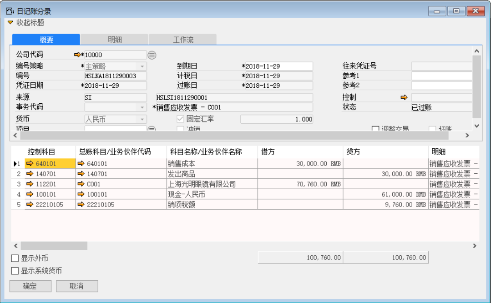 

打开路径：系统菜单—应收账款—收款通知

7、 打开【收款通知】界面，创建一张收款通知单：HSLRM1811290001；

- 选择客户等基础性息；

- 填写金额和点击按钮选择收款内容；

- 保存收款通知单据并对其进行审批过账操作；

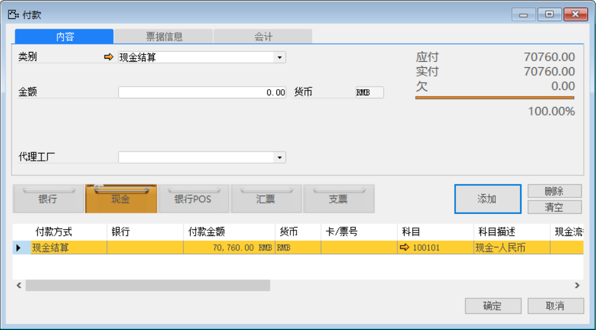 

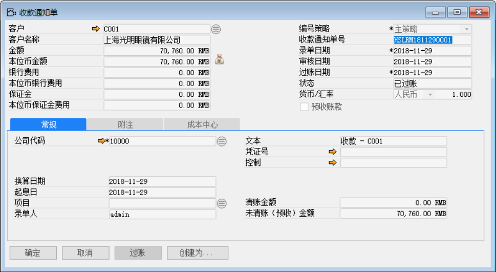 

- 点击【创建为…】按钮创建为清账收款：HSLPM1811290001输入收款金额并点击【清账】按钮选择关联应收发票；

- 点击【添加】保存，点击【分配】将收款金额分配至销售订单；

- 保存单据并对其进行审批过账操作；

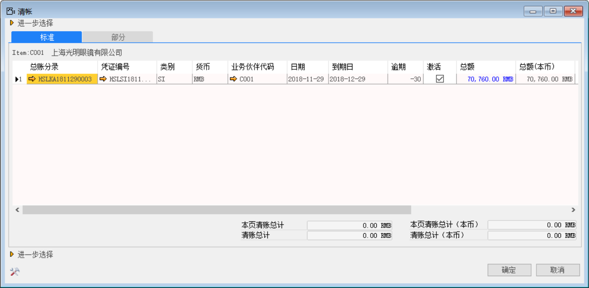 

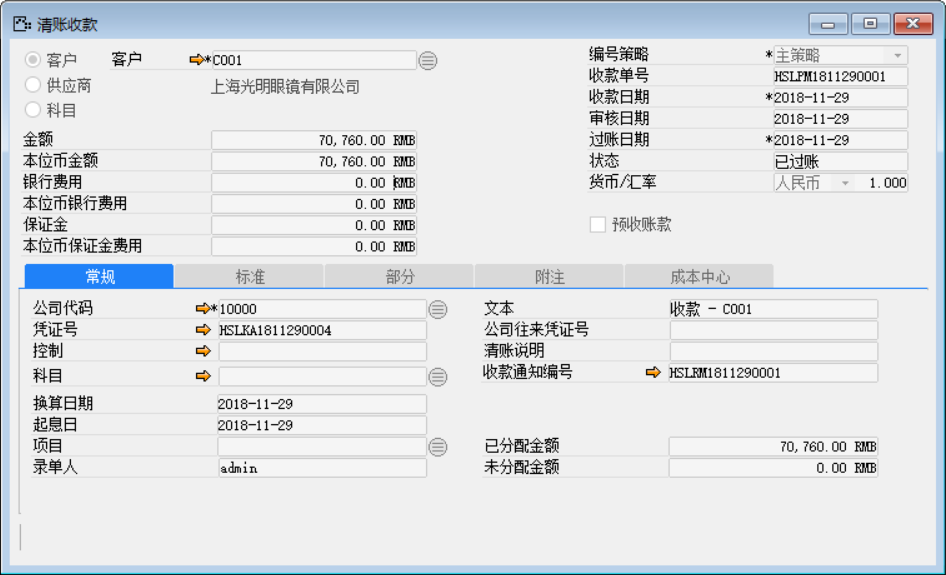 

- 点击【清账收款】界面凭证号右边的按钮，打开凭证号：HSLKA1811290004的收款财务凭证。

**借（Dr）：现金-人民币**

**贷（Cr）：应收账款-上海光明眼镜有限公司**

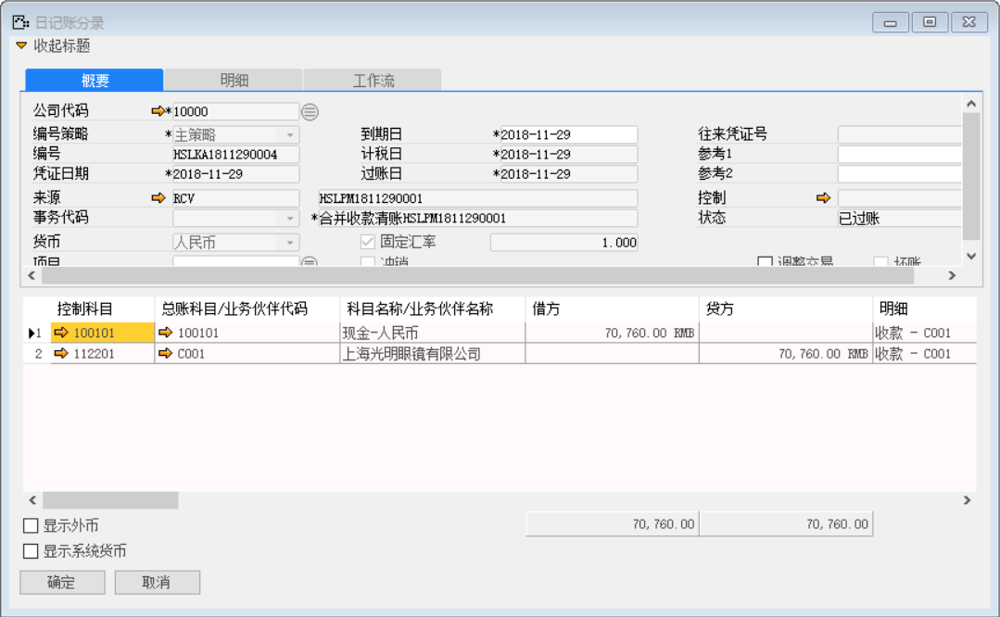