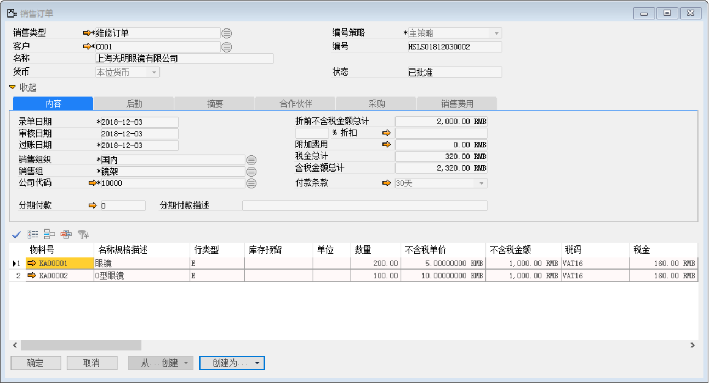
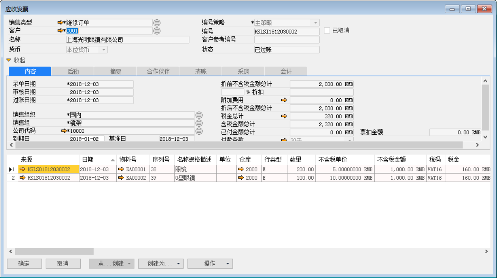
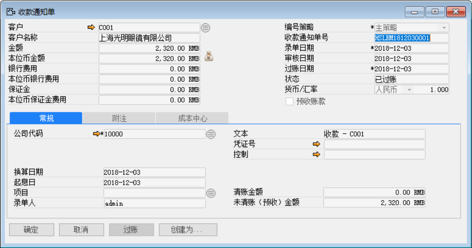
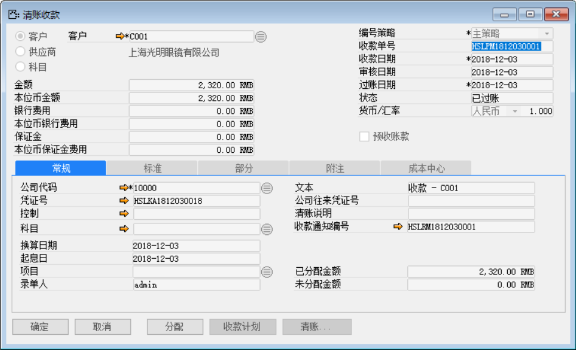
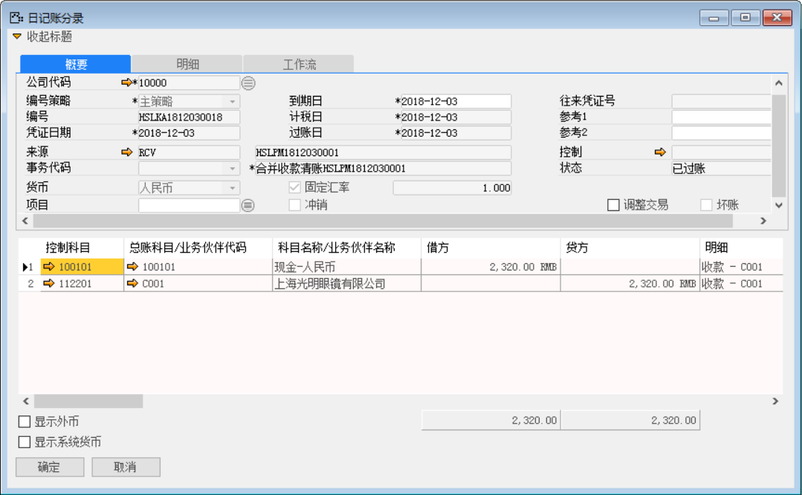

例如：上海光明眼镜有限公司有一批物料：KA00001、KA00002需要维修数量各位200、100。以下内容讲述维修销售业务流程。

打开路径：系统菜单—销售—订单—销售订单

1、 打开【销售订单】界面，创建物料为：KA00001和KA00002的销售订单：HSLSO1812030002；

- 选择销售类型、公司代码和客户代码等信息；

- 物料明细行行类型选择【维修换货】并填写数量与价格等信息；

- 对其保存审批操作。

 

打开路径：系统菜单—应收账款—应收发票

2、 打开【应收发票】界面，基于销售订单：HSLSO1812030002创建应收发票：HSLSI1812030002；

- 选择客户等信息；

- 点击【从…创建】从销售订单清单中选择销售订单与明细行信息；

- 对其保存和审批过账操作；

 

- 点击【会计】标签下凭证号右侧按钮，打开凭证号：HSLKA1812030017的应收发票财务凭证。

**借（Dr）：应收账款-客户**

**贷（Cr）：应交增值税-销项税**

**贷（Cr）：现金-人名币**

 

打开路径：系统菜单—应收账款—收款通知

3、 打开【收款通知】界面，创建一张收款通知单：HSLRM1812030001；

- 选择客户等基础性息；

- 填写金额和点击按钮选择收款内容；

- 保存收款通知单据并对其进行审批过账操作；

 

- 点击【创建为…】按钮创建为清账收款：输入收款金额并点击【清账】按钮选择关联应收发票；

- 保存单据并对其进行审批过账操作；

 

- 点击【清账收款】界面凭证号右边的按钮，打开凭证号：HSLKA1812030018的收款财务凭证。

**借（Dr）：现金-人民币**

**贷（Cr）：应收账款-上海光明眼镜有限公司**

