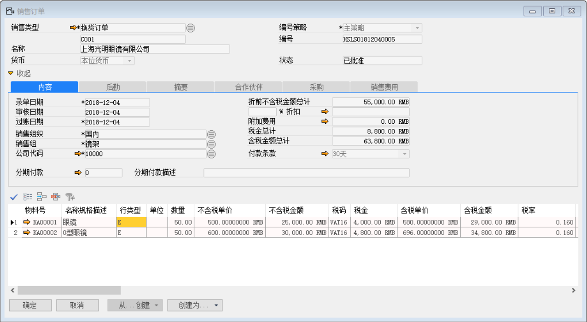
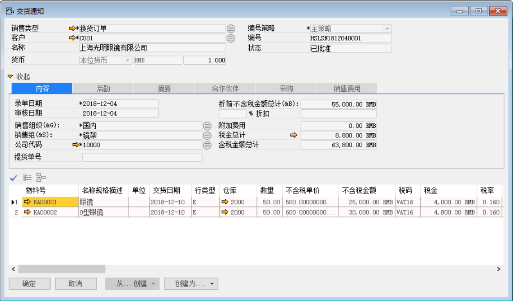
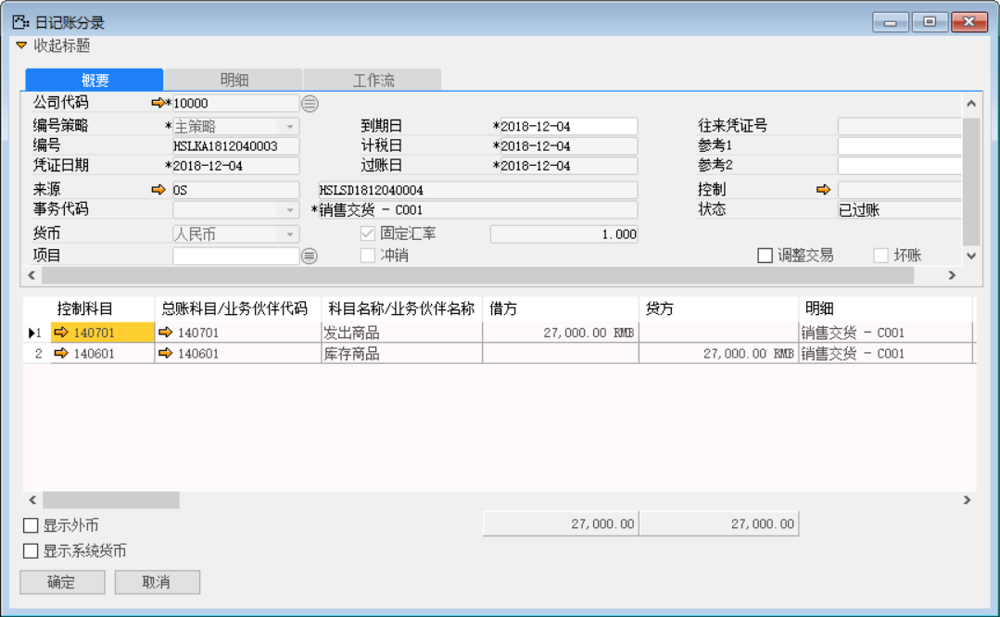
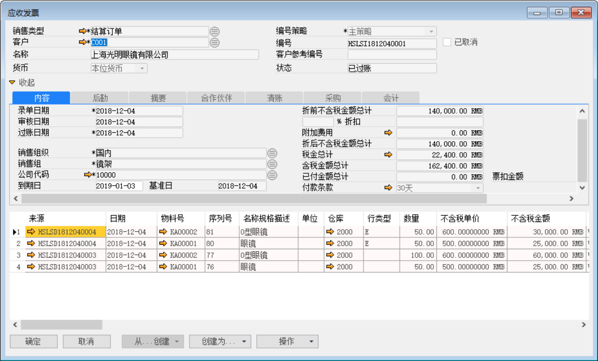
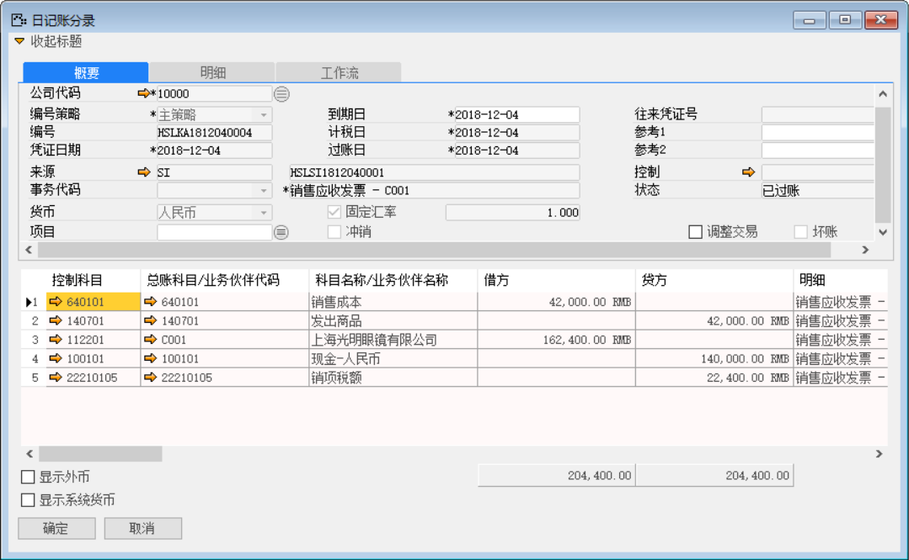
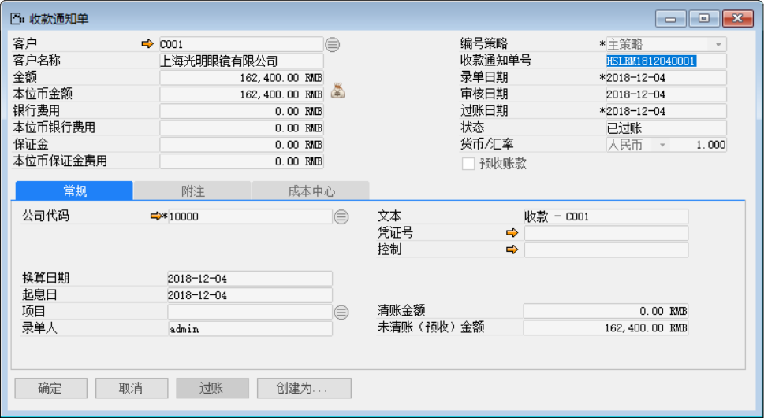
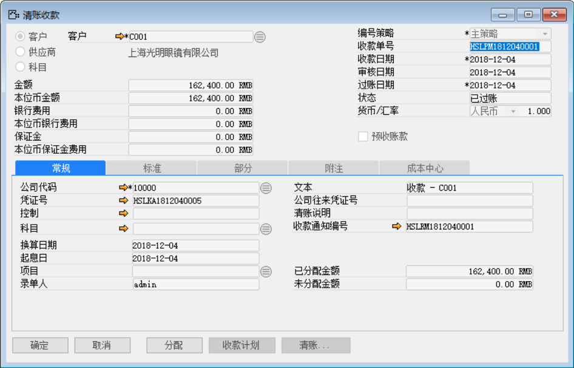
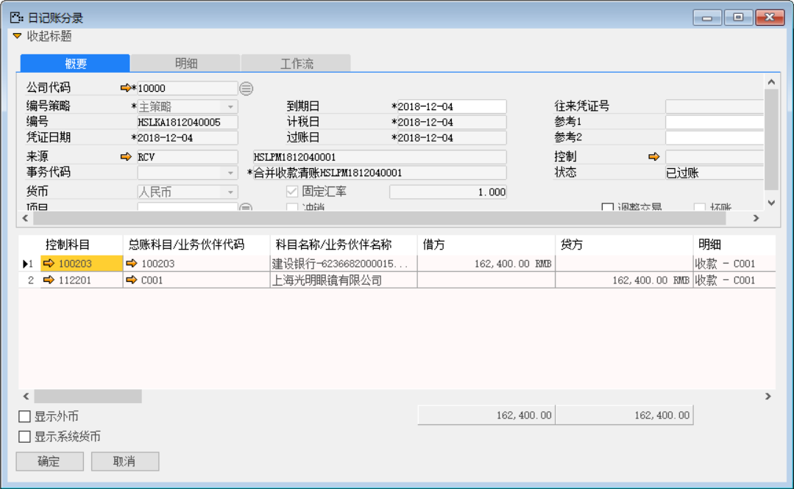

例如：我公司对客户有一批物料：KA00001和KA00002数量为100和150发给客户还未开票，客户经过质检出物料：KA00001和KA00002各有50个有质量问题需退回后换货。以下将介绍在系统中如何操作还未开票换货流程

注：前部分的销售退货流程与销售未开票退货流程一致，换货流程主要在退货后的流程操作有所不同。

1、 未开票换货流程与 “销售未开票退货流程”业务流程一致操作；

打开路径：系统菜单—销售—订单—销售订单

2、 打开【销售订单】界面，创建一张新的销售订单：HSLSO1812040005；

- 选择换货销售类型、客户等信息；

- 销售订单物料明细行行类型选择“维修换货”并且数量和销售退货单的一致；

- 对其保存审批操作；

 

打开路径：系统菜单—销售—销售交货通知

3、 打开【销售交货通知】界面，基于销售订单：创建销售交货通知单：HSLSN1812040001；

- 选择客户等基础性息；

- 点击【从…创建】从销售订单清单中选择销售订单与明细行信息；

 

打开路径：系统菜单—销售—销售交货

4、 打开【销售交货】界面，基于销售交货通知单：创建销售交货单：HSLSD1812040004；

- 选择客户等基础性息；

- 点击【从…创建】从销售交货通知清单中选择销售交货通知单与明细行信息；

- 保存单据并对其进行审批过账操作；

 

- 点击【会计】标签下凭证号右侧按钮，打开凭证号：HSLKA1812040003的销售交货财务凭证。

**借（Dr）：发出商品**

**贷（Cr）：库存商品**

 

打开路径：系统菜单—应收账款—应收发票

5、 打开【应付发票】界面，创建应收发票：HSLSI1812040001；

- 选择客户等类型；

- 点击【从…创建】按钮选择两张销售交货单：与销售交货单：合并开票；

- 对其保存审批操作。

 

- 点击【会计】标签下凭证号右侧按钮，打开凭证号：HSLKA1812040004的应收发票财务凭证。

**借（Dr）:销售成本** 

**贷（Cr）:发出商品**

**借（Dr）: 应收账款-上海光明眼镜有限公司**

**贷（Cr）:应交增值税-销项税**

**贷（Cr）：主营业务收入-现金**

 

打开路径：系统菜单—应收账款—收款通知

6、 打开【收款通知】界面，创建一张收款通知单：HSLRM1812040001；

- 选择客户等基础性息；

- 填写金额和点击按钮选择收款内容；

- 保存收款通知单据并对其进行审批过账操作；

 

- 点击【创建为…】按钮创建为清账收款：输入收款金额并点击【清账】按钮选择关联应收发票；

- 点击【添加】保存，点击【分配】将收款金额分配至销售订单；

- 保存单据并对其进行审批过账操作；

 

- 点击【清账收款】界面凭证号右边的按钮，打开凭证号：HSLKA1812040005的收款财务凭证。

**借（Dr）：银行** 

**贷（Cr）：应收账款-上海光明眼镜有限公司**

