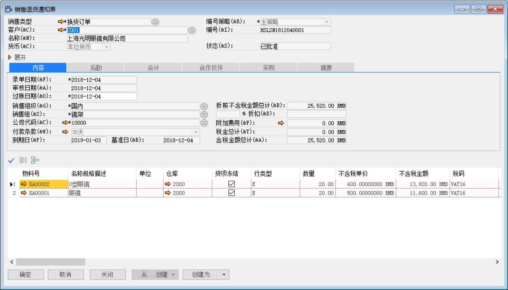
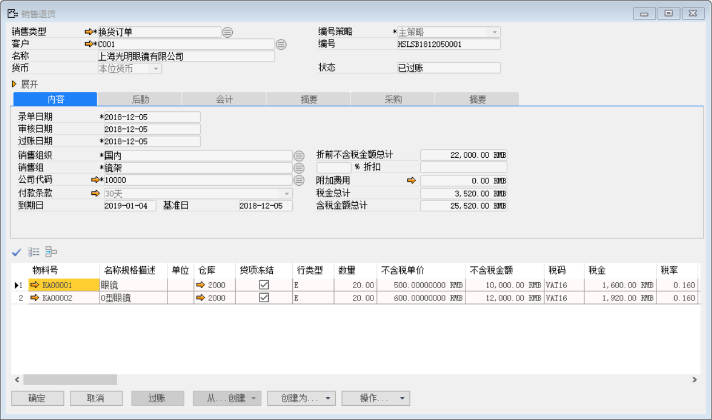
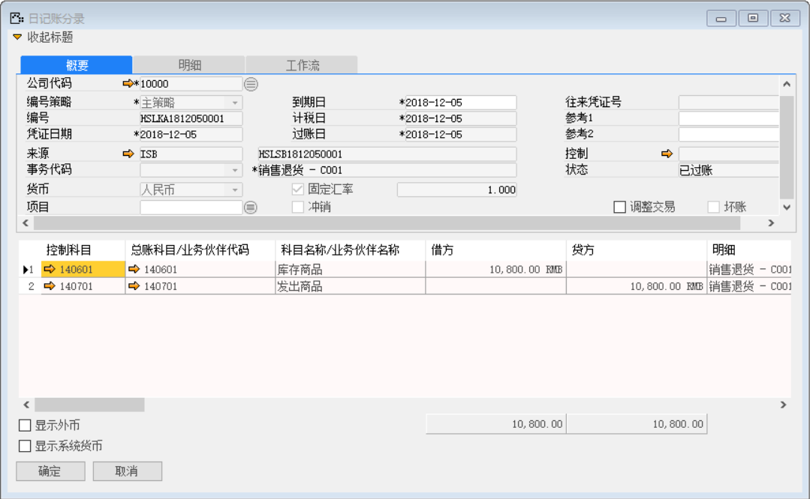
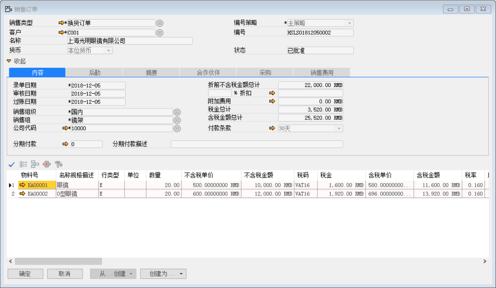
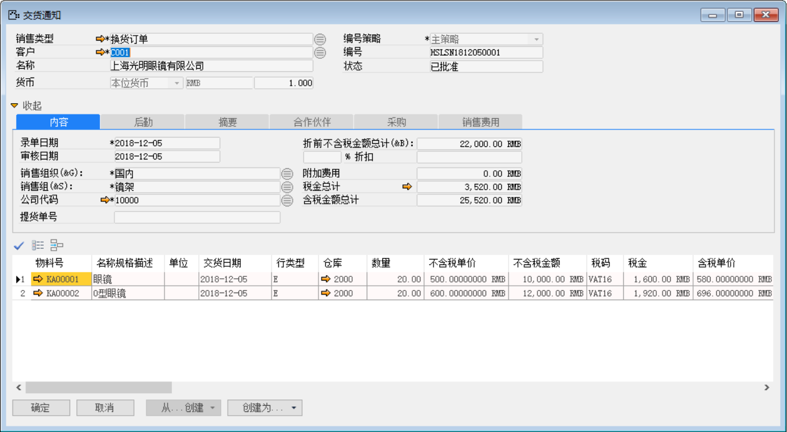
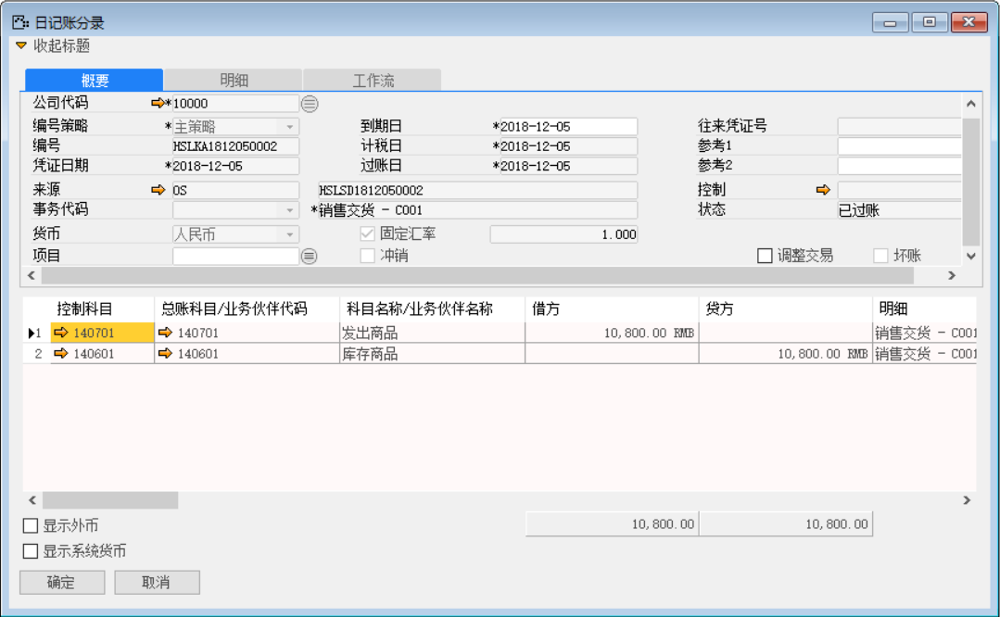
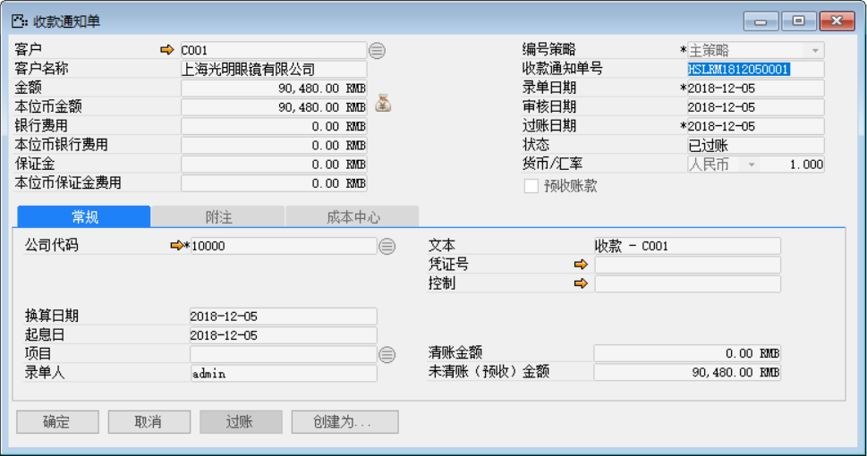
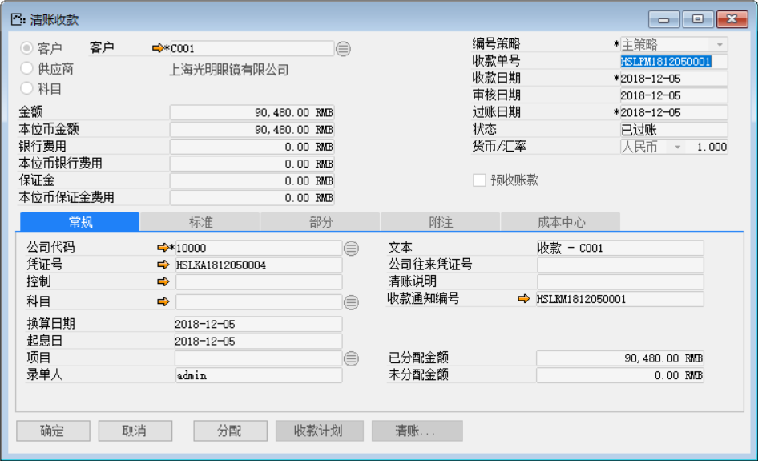
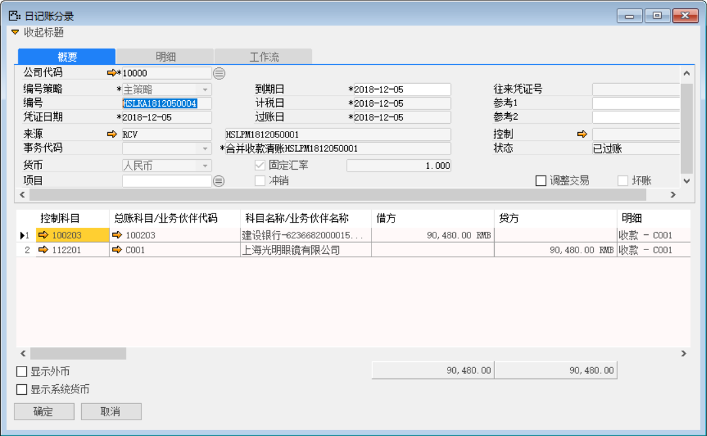

例如：我公司对客户有一批物料：KA00001和KA00002数量为60和80发给客户并已开票，客户发现物料：KA00001和KA00002存在质量问题各有20个需退回后换货。以下将介绍在系统中如何操作已开票换货流程

注：前部分的销售已开票换货流程与销售已开票退货业务流程一致。若已开票并且换不同的物料那直接创建销售订单执行新的销售流程；

打开路径：系统菜单—销售—销售退货通知单

1、 换货流程与“销售已开票退货流程”业务流程基本一致操作，需注意的是在创建销售退货通知单时，销售退货通知单：HSLSN1812040001明细行里的贷项冻结要勾选，行类型选择为维修换货；

 

打开路径：系统菜单—销售—销售退货

2、 打开【销售退货】界面，基于销售退货通知单：HSLSN1812040001创建销售退货单：HSLSB1812050001

- 选择客户等基础性息；

- 点击【从…创建】从销售退货通知清单中选择销售退货通知单与明细行信息；

- 保存单据并对其进行审批过账操作；

 

- 点击【会计】标签下凭证号右侧按钮，打开凭证号：HSLKA1812050001的销售退货财务凭证。

**借（Dr）：库存商品**

**贷（Cr）：发出商品**

 

打开路径：系统菜单—销售—订单—销售订单

3、 打开【销售订单】界面，基于销售退货单：创建销售订单：HSLSO1812050002

- 选择客户等基础性息；

- 点击【从…创建】从销售退货清单中选择销售退货单与明细行信息；

 

打开路径：系统菜单—销售—销售交货通知

4、 打开【销售交货通知单】界面，基于销售订单：HSLSO1812050002创建一张销售交货知单：HSLSN1812050001；

- 选择客户等基础性息；

- 点击【从…创建】从销售订单清单中选择销售订单与明细行信息；

- 保存单据并对其进行审批操作。

 

打开路径：系统菜单—销售—销售交货

5、 打开【销售交货】界面，基于销售交货通知单：HSLSN1812050001创建一张销售通交货单：HSLSD1812050002；

- 选择客户等基础性息；

- 点击【从…创建】从销售交货通知清单中选择销售交货通知单与明细行信息；

- 保存单据并对其进行审批过账操作；

 

- 点击【会计】标签下凭证号右侧按钮，打开凭证号：HSLKA1812050002的销售交货财务凭证。

**借（Dr）：发出商品**

**贷（Cr）：库存商品**

 

打开路径：系统菜单—应收账款—收款通知

6、 	打开【收款通知】界面，创建一张收款通知单：，清账收款需要换货的那张订单应收发票：；

- 选择客户等基础性息；

- 填写金额和点击按钮选择收款内容；

- 保存收款通知单据并对其进行审批过账操作；

 

- 点击【创建为…】按钮创建为清账收款：HSLPM1812050001输入收款金额并点击【清账】按钮选择关联应收发票；

- 点击【添加】保存，点击【分配】将收款金额分配至销售订单；

- 保存单据并对其进行审批过账操作；

 

- 点击【清账收款】界面凭证号右边的按钮，打开凭证号：HSLKA1812050004的收款财务凭证。

**借（Dr）：银行** 

**贷（Cr）：应收账款-上海光明眼镜有限公司**

