打开路径：系统菜单—采购—申请与订单—采购订单

1、 根据物料需求计划所转换生成的采购订单：HSLPO1811300001；

*注：也可以直接手工创建采购订单。*

- 创建物料为CA00001、CA00002、CA00003、CA00004数量分别为2000、1000、2000、2000的采购订单；

- 对其进行审批操作。

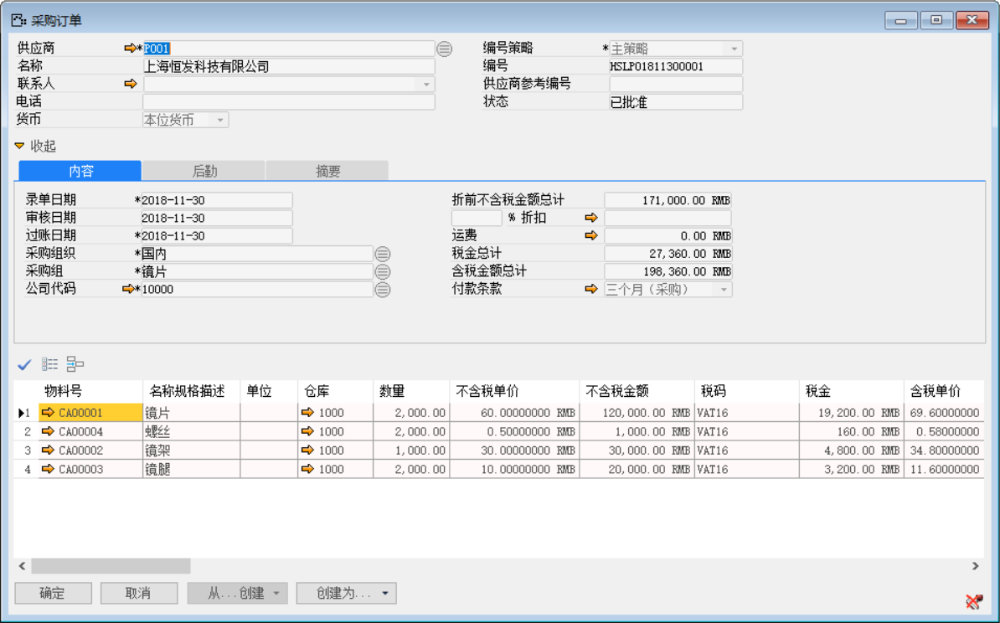 

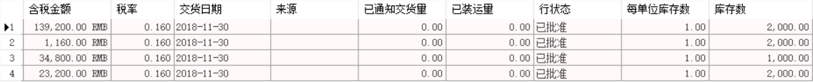 

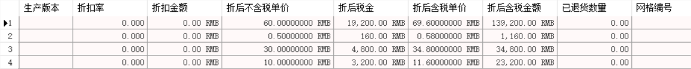 

打开路径：系统菜单—采购—采购收货通知

2、 打开【采购收货通知】界面，基于采购订单：HSLPO1811300001创建一张采购收货通知单：HSLPR1811300001

- 选择供应商等基础性息；

- 点击【从…创建】从采购订单清单中选择采购订单与明细行信息；

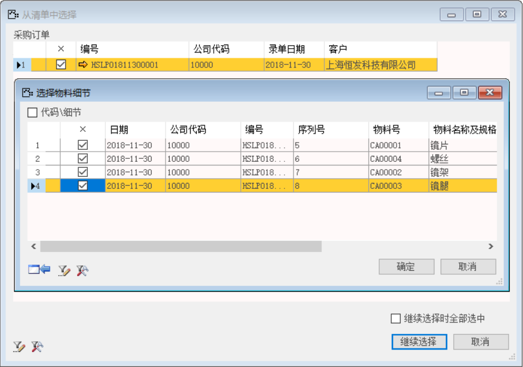 

- 保存单据并对其进行审批操作。

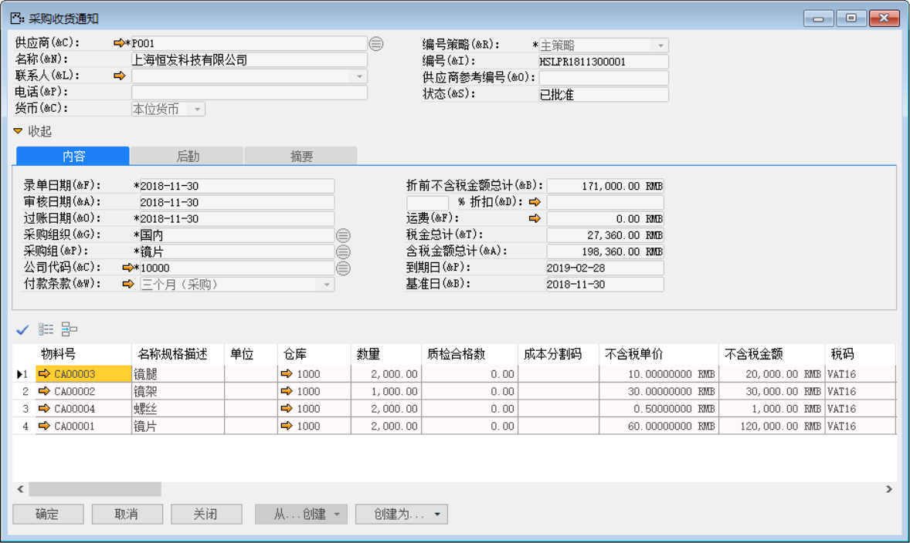 

打开路径：系统菜单—采购—采购收货

3、 打开【采购收货】界面，基于采购收货通知：HSLPR1811300001创建一张采购收货单：HSLPR1811300001

- 选择供应商等基础性息；

- 点击【从…创建】从采购收货通知清单中选择采购收货通知与明细行信息；

- 保存单据并对其进行审批过账操作。

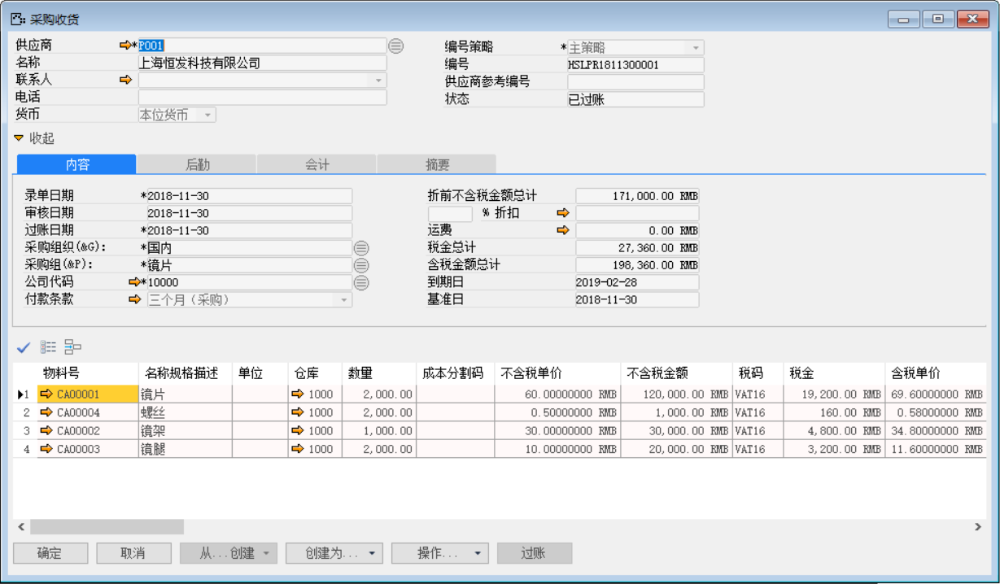 

- 点击【会计】标签下凭证号右侧按钮，打开凭证号：HSLKA1811300001的销售交货财务凭证。

**借（Dr）：原材料** 

**贷（Cr）：应付暂估-供应商**

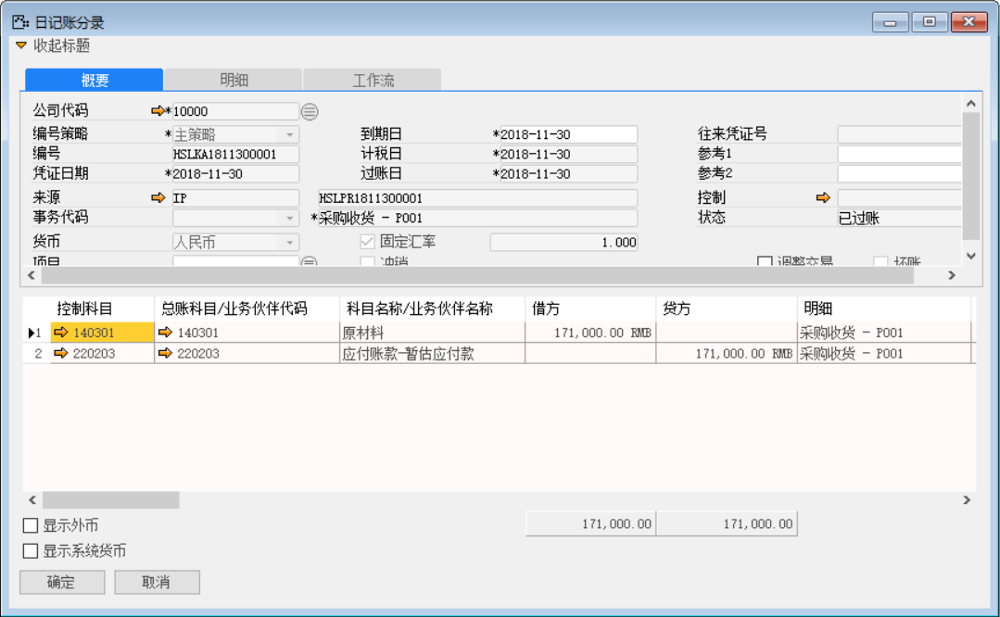 

打开路径：系统菜单—应付账款—应付发票

4、 打开【应付发票】界面，基于采购收货单：HSLPR1811300001创建一张应付发票：HSLPI1811300001；

- 选择供应商等基础性息；

- 点击【从…创建】从采购收货清单中选择采购收货单与明细行信息；

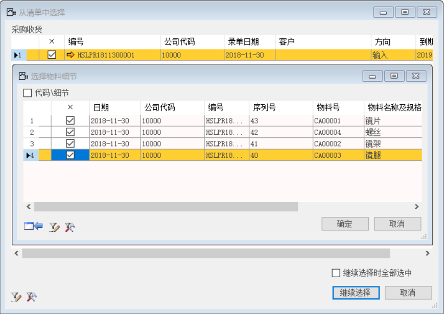 

- 保存单据并对其进行审批操作；

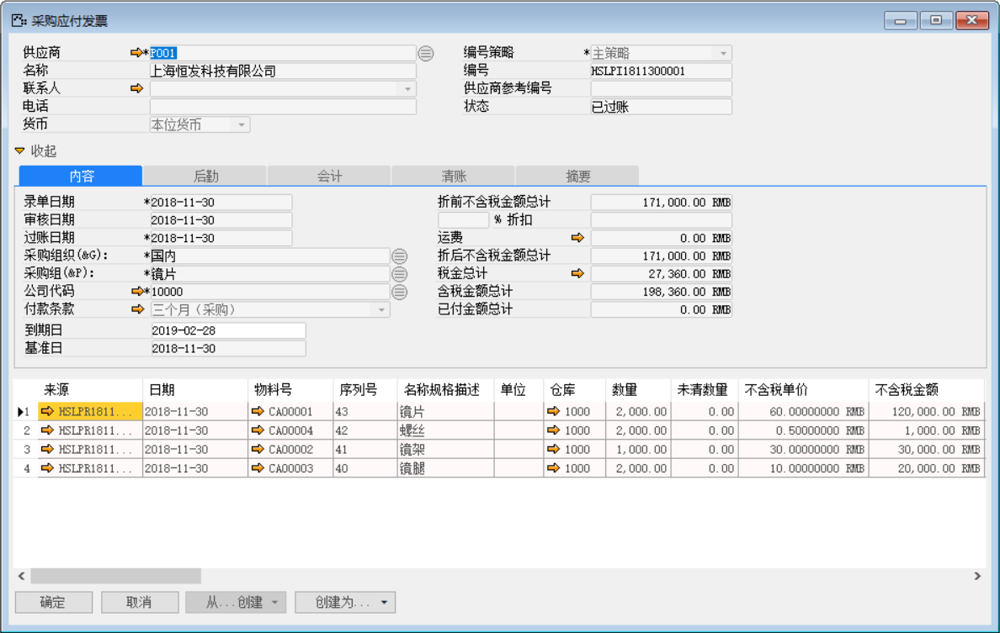 

- 点击【会计】标签下的凭证号右侧按钮，打开凭证号：HSLKA1811300002的应付发票财务凭证。

**借（Dr）:应付暂估-供应商** 

**借（Dr）:应交增值税-进项税** 

**贷（Cr）: 应付账款-供应商** 

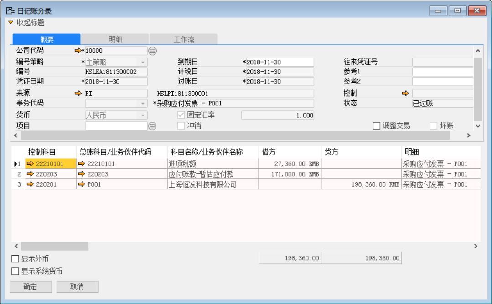 

5、 打开【付款清账】界面，创建预付账款：HSLPA1811300001；

- 选择供应商等基础性息并勾选预付款复选款；

- 点击按钮添加付款方式与金额；

 

- 并对其保存单据与审批过账操作。

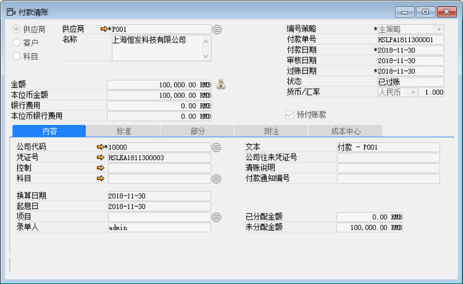 

- 点击【内容】标签下的凭证号右侧按钮，打开凭证号：HSLKA1811300003的应付发票财务凭证。

**借（Dr）：预付账款-供应商**

**贷（Cr）：银行**

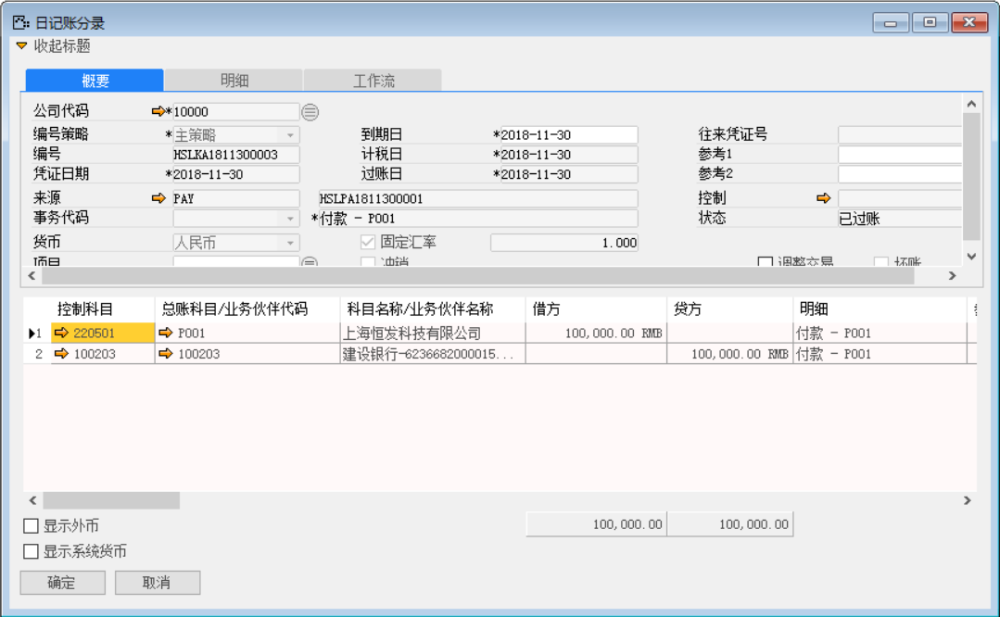 

6、 基于应付发票：HSLPI1811300001创建付款清账：HSLPA1811300002；

- 在应付发票界面点击【创建为…】按钮创建为付款清账单；

- 在付款清账界面点击【清账】按钮关联应付发票与预付账款；

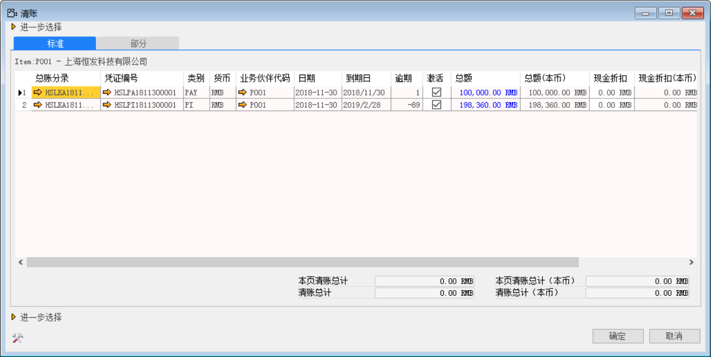 

- 在付款清账界面点击按钮添加付款方式与金额；

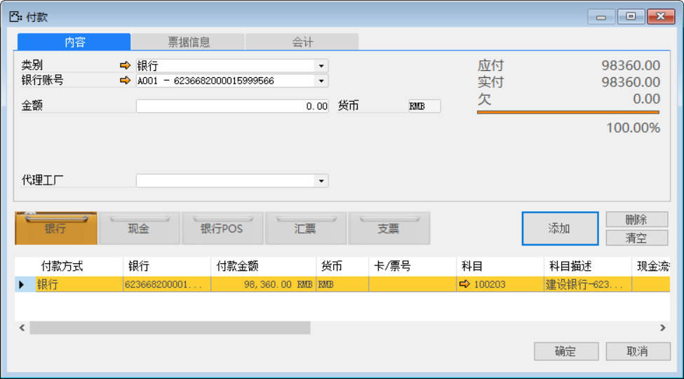 

注：分配：付款单上的分配按钮，可以将此次付款金额分配至对应的采购订单上。

- 保存付款单后，点击【分配】，进入分配界面；

- 在明细栏中勾选‘激活’复选框，鼠标点至‘分配金额’栏，系统自动带

 

- 并对其保存单据与审批过账操作。

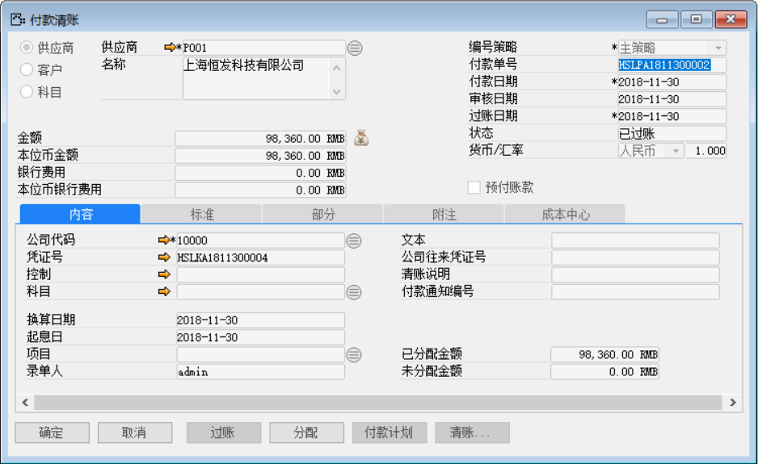 

- 点击【内容】标签下的凭证号右侧按钮，打开凭证号：HSLKA1811300004的付款清账财务凭证。

**借：应付账款-供应商**

**贷：预付账款-供应商**

**贷：银行**

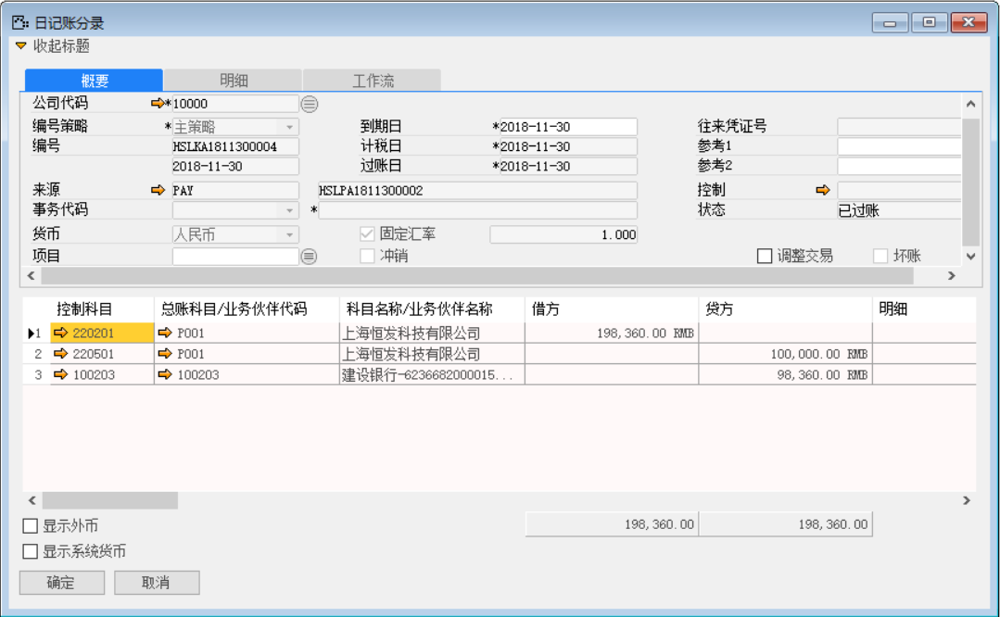