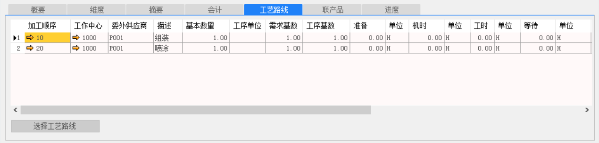
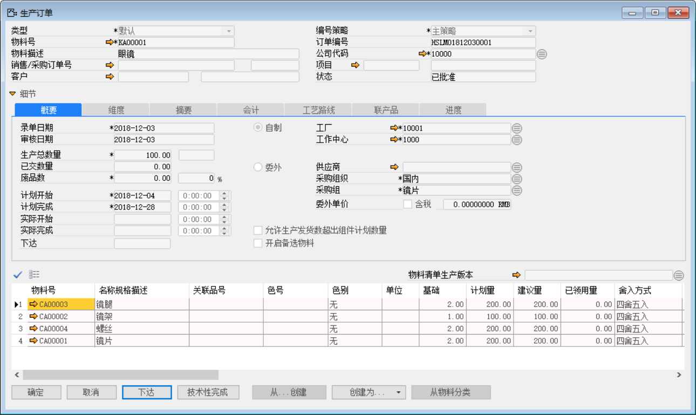
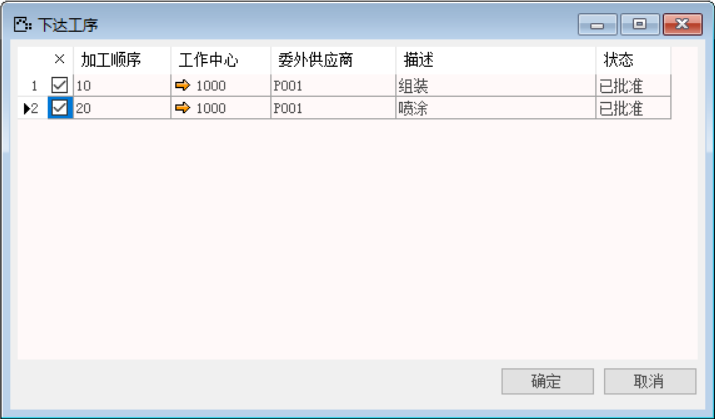
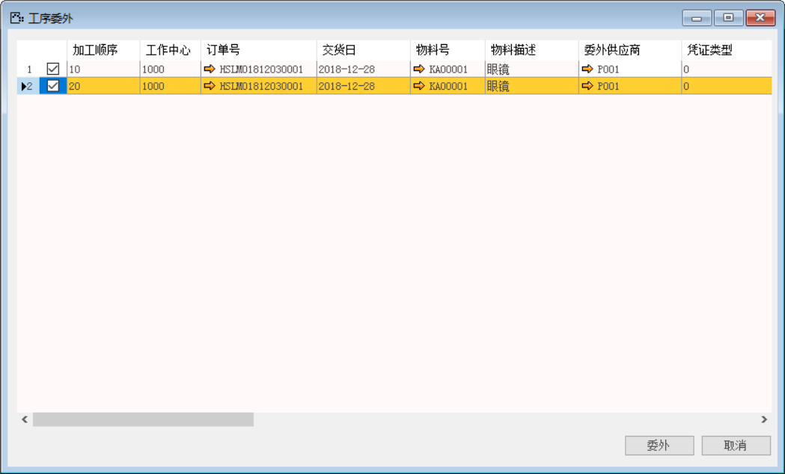
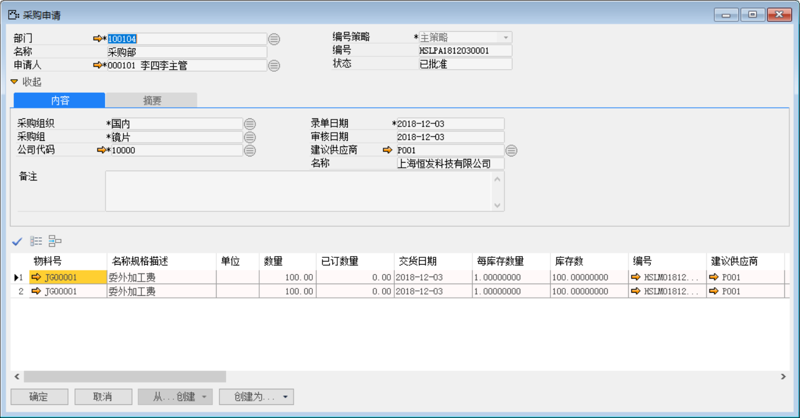
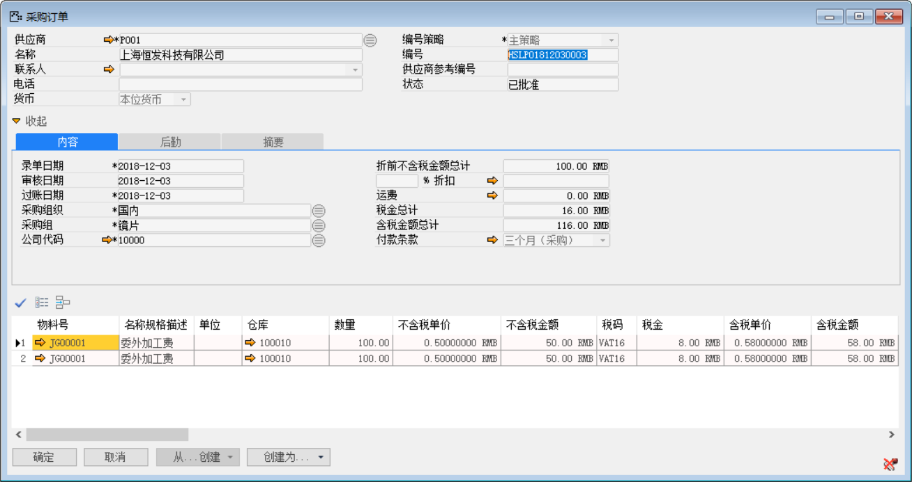
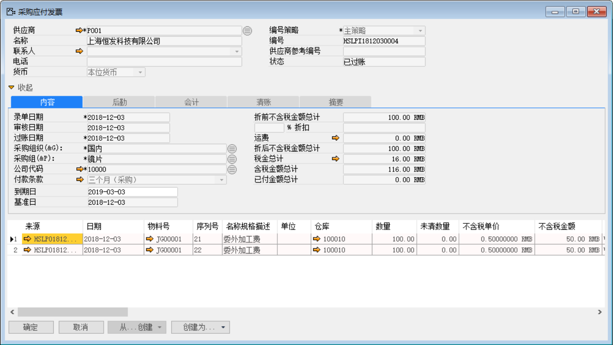
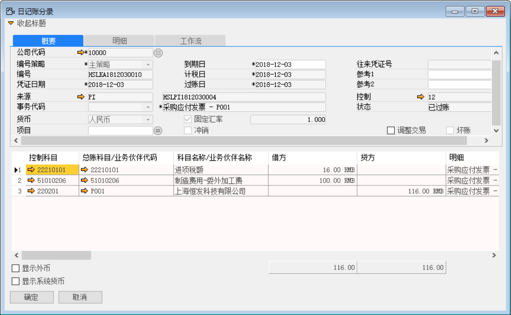
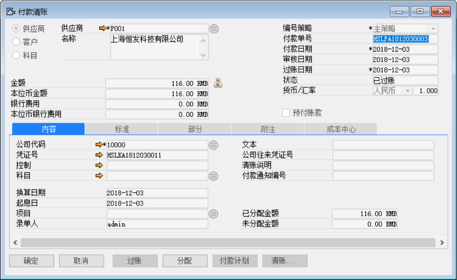
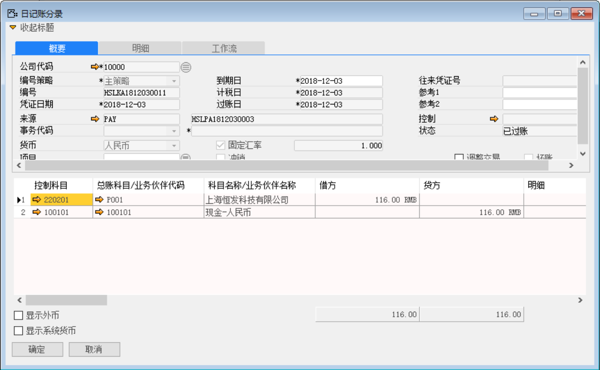

对于采用物料组总账科目的人力物料来讲，在应收发票时生成的日记账分录是和物料组的费用科目、分配科目是有关的，这与原材料的收货过账所获取的总账科目有所不同。

例如：生产有工艺路线的物料：KA00001，并将其中的‘标签’工序进行委外（委外物料为：JG00001（标签人工）），并对完成的委外工序进行采购业务流程操作。

打开路径：系统菜单—生产作业—生产作业—生产订单

1、 创建带有工艺路线的生产订单：HSLMO1812030001并对其保存审批操作；

 

 

2、 在生产订单：HSLMO1812030001点击【下达】按钮，将所有工序都下达；

 

打开路径：系统菜单—生产作业—生产作业—工序委外

3、 打开【工序委外】界面选择要委外的工序的行，并维护委外工序的价格，点击【委外】按钮，确定委外生成一张采购申请单：HSLPA1812030001

 

打开路径：系统菜单—采购—申请与订单—采购订单

4、 对采购申请：HSLPA1812030001审批操作，打开【采购订单】界面，点击【从...创建】按钮并基于采购申请：：HSLPA1812030001创建采购订单：HSLPO1812030003并对其添加审批操作；

 

 

打开路径：系统菜单—应付账款—应付发票

5、 打开【应付发票】界面，点击【从...创建】按钮基于上文的采购订单：HSLPO1812030003创建应付发票，保存后模拟日记账分录：HSLKA1812030010；

 

 

6、 基于应付发票：HSLKA1812030010创建一张付款清账：HSLPA1812030003。

- 在应付发票界面点击【创建为…】按钮创建为付款清账单；

- 在付款清账界面点击【清账】按钮关联应付发票；

- 在付款清账界面点击按钮添加付款方式与金额；

注：分配：付款单上的分配按钮，可以将此次付款金额分配至对应的采购订单上。

- 保存付款单后，点击【分配】，进入分配界面；

- 在明细栏中勾选‘激活’复选框，鼠标点至‘分配金额’栏，系统自动带

- 并对其保存单据与审批过账操作。

 

- 点击【内容】标签下的凭证号右侧按钮，打开凭证号：HSLKA1812030011的付款清账财务凭证。

**借：应付账款-供应商**

**贷：现金**

