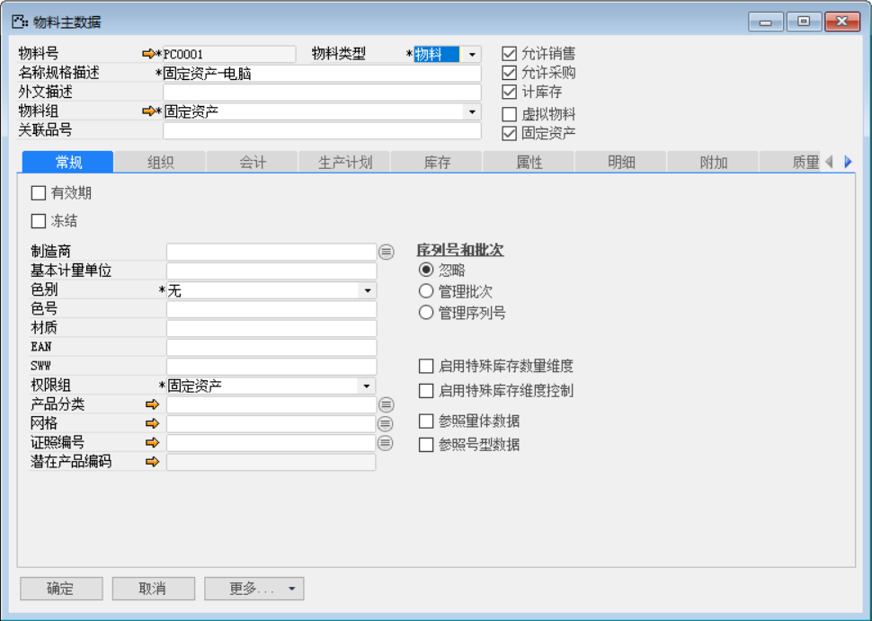
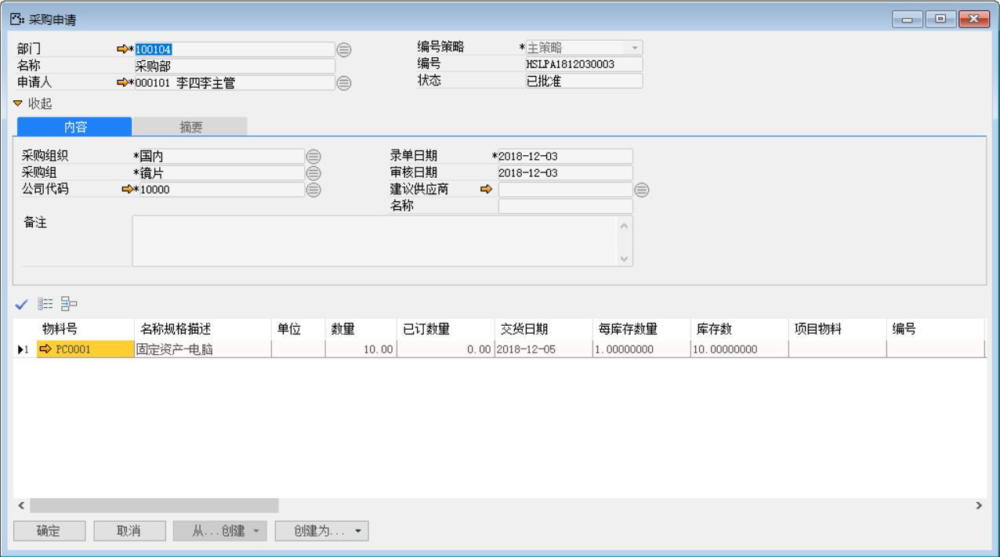
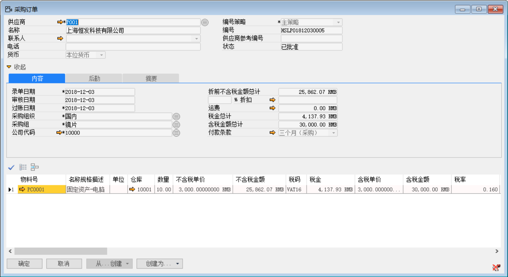
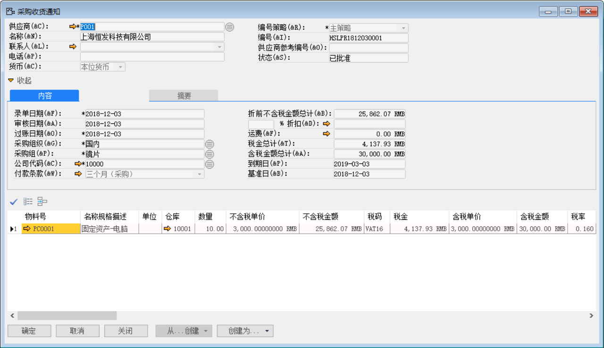
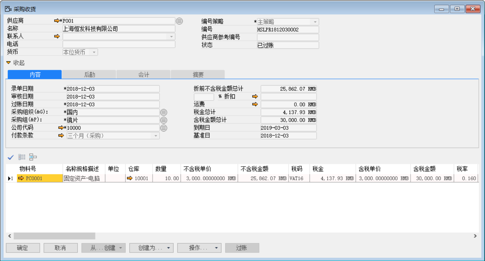
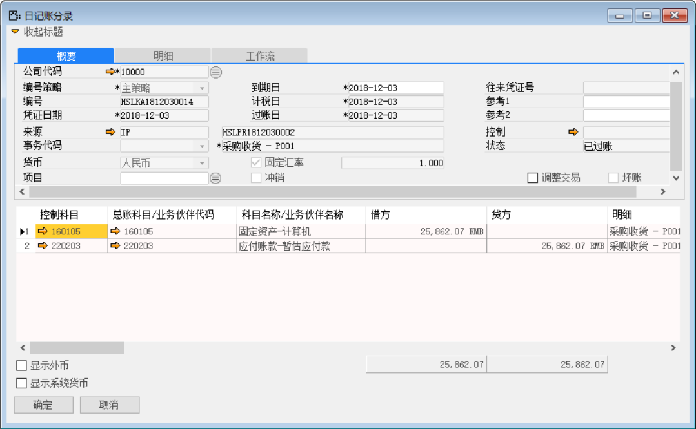
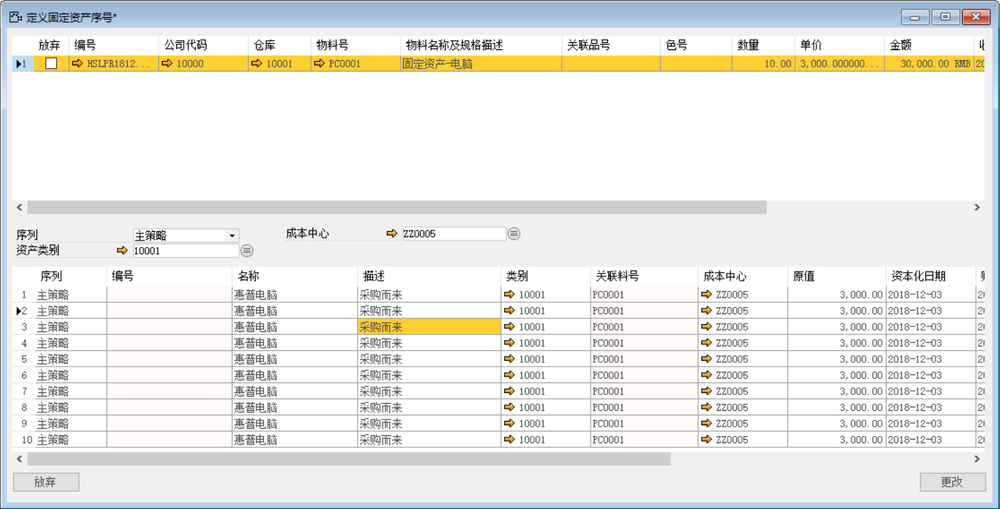
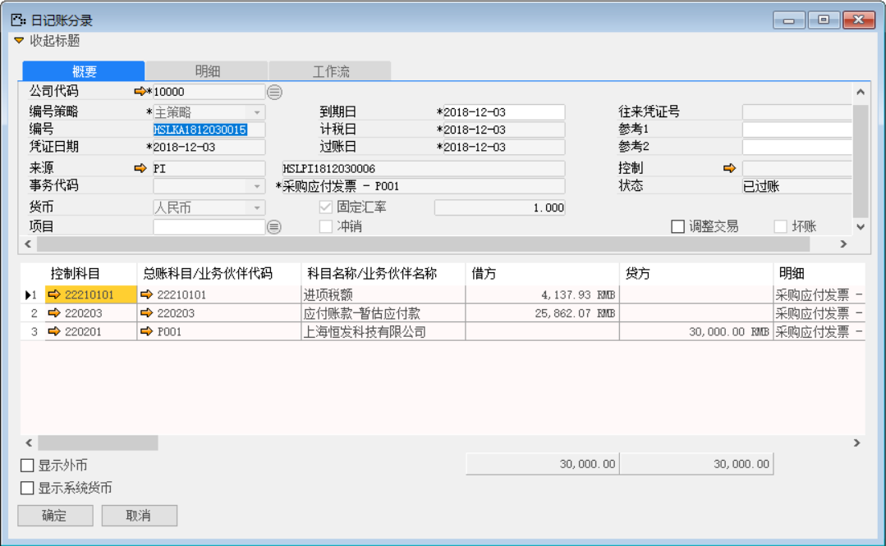
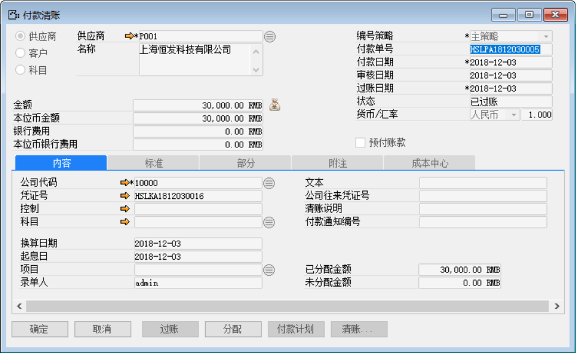
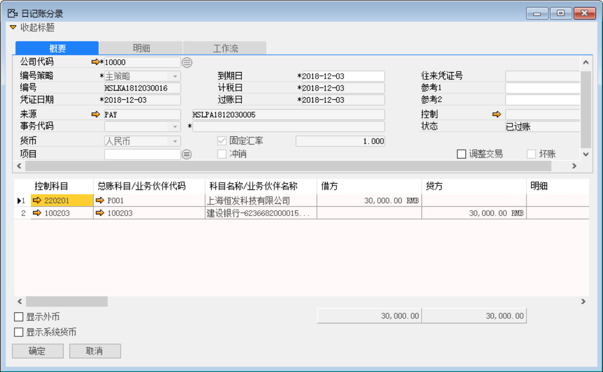

如果物料被定义为‘固定资产’类，那么在入库操作时，系统会自动跳出维护固定资产序列号的窗口。固定资产分两种方式采购，一种是固定资产采购和固定自资产购置，次业务主要讲的是固定资产的采购业务，流程与原材料采购业务一致，但产生的科目不一样。

例如：制造公司有料号为PC0001 (固定资产-电脑)的固定资产物料，通过采购流程对其进行采购申请、采购订单以及采购收货的流程，并维护其固定资产序列号。

打开路径：系统菜单—库存—物料主数据

1、 打开【物料主数据】界面，创建PC0001物料，并选中【固定资产】等复选框，并完成编辑物料其他信息；

 

打开路径：系统菜单—采购—申请与订单—采购申请

2、 打开【采购申请】界面，创建物料为：PC00001的采购申请：HSLPA1812030003；

- 选择部门、申请人、物料等信息；

- 对其保存审批操作。

 

打开路径：系统菜单—采购—申请与订单—采购订单

3、 打开【采购订单】界面，点击【从...创建】按钮基于采购申请：HSLPA1812030003创建采购订单：HSLPO1812030005并选择供应商等信息，对其保存审批操作；

 

打开路径：系统菜单—采购—采购收货通知

4、 打开【采购收货通知】界面，基于采购订单：HSLPO1812030005创建采购收货通知：HSLPR1812030001；

- 选择供应商等基础性息；

- 点击【从…创建】从采购订单清单中选择采购订单与明细行信息；

- 保存单据并对其进行审批操作。

 

打开路径：系统菜单—采购—采购收货

5、 打开【采购收货】界面，基于采购收货通知：HSLPR1812030001创建一张采购收货单：HSLPR181203002；

- 选择供应商等基础性息；

- 点击【从…创建】从采购收货通知清单中选择采购收货通知与明细行信息；

- 保存单据并对其进行审批过账操作。

 

- 点击【会计】标签下凭证号右侧按钮，打开凭证号：HSLKA1812030014的采购收货财务凭证。

**借（Dr）：固定资产-电脑**

**贷（Cr）：应付暂估-供应商**

 

6、 采购收货：HSLPR181203002过账后跳出【定义固定资产序号】的界面，对其进行序列号的管理；

- 选中要定义固定资产序列号的数据行；

- 编辑固定资产序号明细；

- 点击【更改】保存固定资产序号。

 

打开路径：系统菜单—采购—采购收货通知

7、 打开【应付发票】界面，基于采购收货单：HSLPR181203002创建一张应付发票：HSLPI1812030006；

- 选择供应商等基础性息；

- 点击【从…创建】从采购收货清单中选择采购收货单与明细行信息；

- 保存单据并对其进行审批操作；

 

- 点击【会计】标签下的凭证号右侧按钮，打开凭证号：HSLKA1812030015的应付发票财务凭证。

**借（Dr）:应付暂估-供应商** 

**借（Dr）:应交增值税-进项税** 

**贷（Cr）: 应付账款-供应商** 

 

8、 基于应付发票：创建付款清账：HSLPA1812030005；

- 在应付发票界面点击【创建为…】按钮创建为付款清账单；

- 在付款清账界面点击【清账】按钮关联应付发票与预付账款；

- 在付款清账界面点击按钮添加付款方式与金额；

注：分配：付款单上的分配按钮，可以将此次付款金额分配至对应的采购订单上。

- 保存付款单后，点击【分配】，进入分配界面；

- 在明细栏中勾选‘激活’复选框，鼠标点至‘分配金额’栏，系统自动带

- 并对其保存单据与审批过账操作。

 

- 点击【内容】标签下的凭证号右侧按钮，打开凭证号：HSLKA1812030016的付款清账财务凭证。

**借：应付账款-供应商**

**贷：银行**

