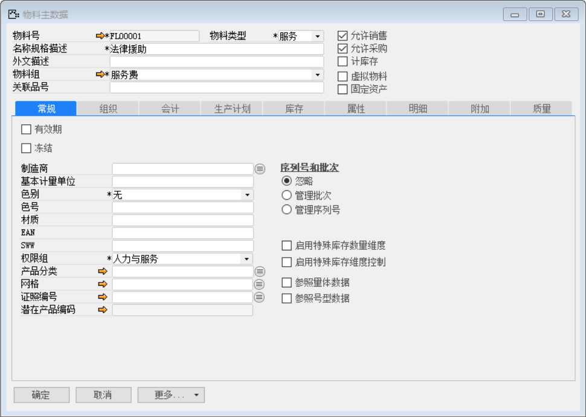
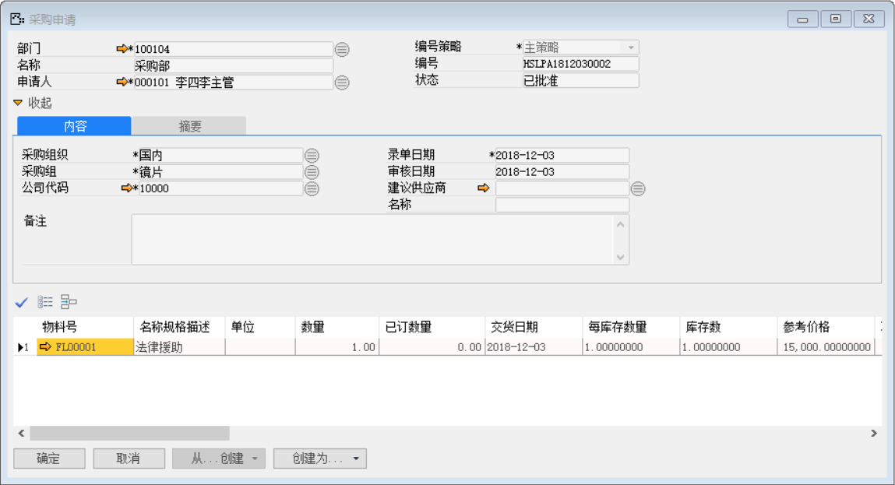
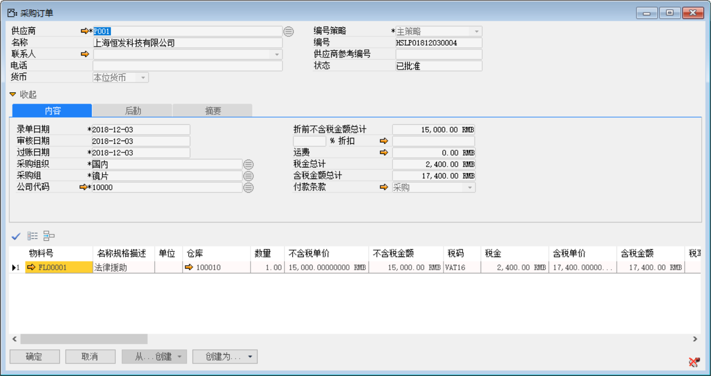
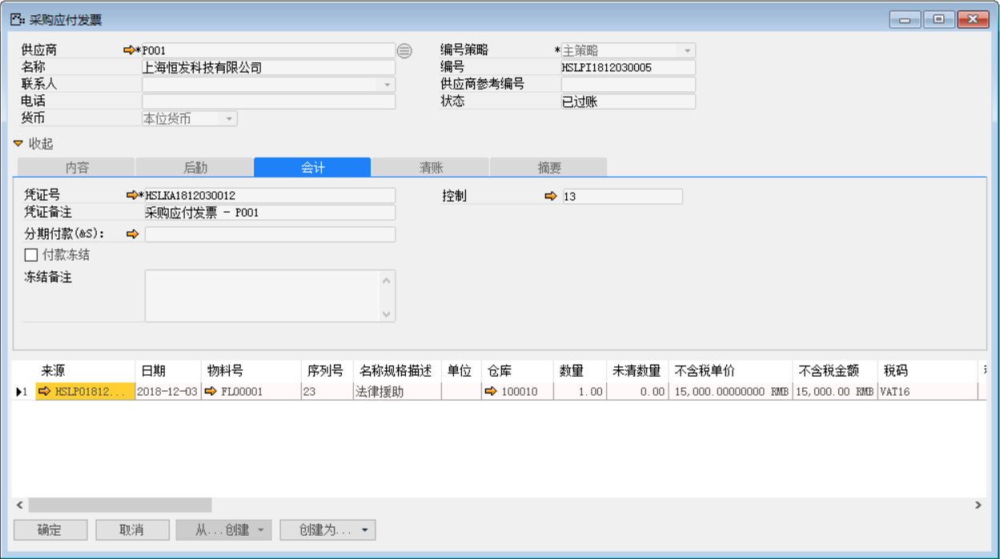
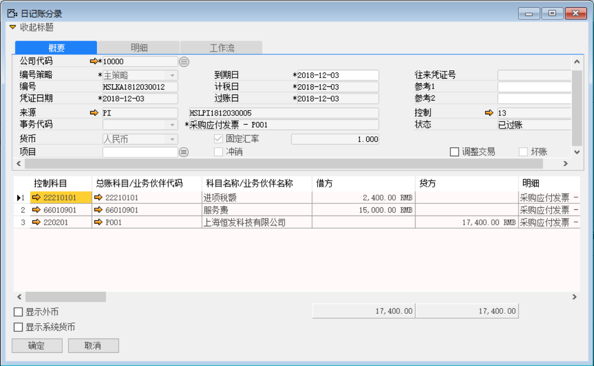
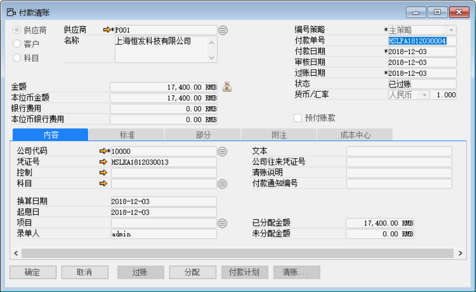
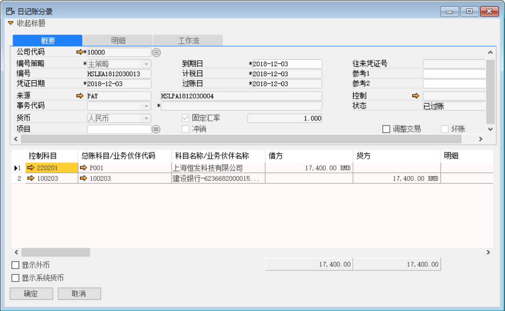

服务类物料采购与人力类物料的采购业务逻辑一致，在本章将新建一个服务类的物料来讲解服务类物料在采购业务。

例如，创建FW10001(法律援助)服务物料，并对该物料进行采购收货操作。

打开路径：系统菜单—库存—物料主数据

1、 打开【物料主数据】界面，创建服务类物料FL00001（法律援助），编辑完成物料信息对其保存审批操作；

 

打开路径：系统菜单—采购—申请与订单—采购申请

2、 打开【采购申请】界面，创建物料为：FL00001的采购申请：HSLPA1812030002；

- 选择部门、申请人、物料等信息；

- 对其保存审批操作。

 

打开路径：系统菜单—采购—申请与订单—采购订单

3、 打开【采购订单】界面，点击【从...创建】按钮基于采购申请：HSLPA1812030002创建采购订单：HSLPO1812030004并对起保存审批操作；

 

打开路径：系统菜单—应付账款—应付发票

4、 打开【应付发票】界面，点击【从...创建】按钮基于上文的采购订单：HSLPO1812030004创建应付发票，保存审批后模拟日记账分录：HSLKA1812030011；

 

 

5、 基于应付发票：HSLKA1812030011创建一张付款清账：HSLPA1812030004。

- 在应付发票界面点击【创建为…】按钮创建为付款清账单；

- 在付款清账界面点击【清账】按钮关联应付发票；

- 在付款清账界面点击按钮添加付款方式与金额；

注：分配：付款单上的分配按钮，可以将此次付款金额分配至对应的采购订单上。

- 保存付款单后，点击【分配】，进入分配界面；

- 在明细栏中勾选‘激活’复选框，鼠标点至‘分配金额’栏，系统自动带

- 并对其保存单据与审批过账操作。

 

- 点击【内容】标签下的凭证号右侧按钮，打开凭证号：HSLKA1812030013的付款清账财务凭证。

**借：应付账款-供应商**

**贷：银行**

