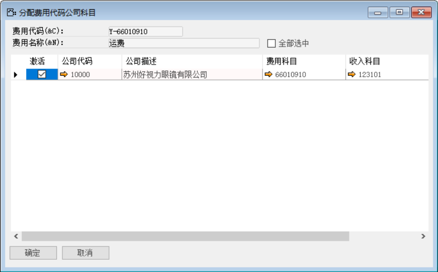
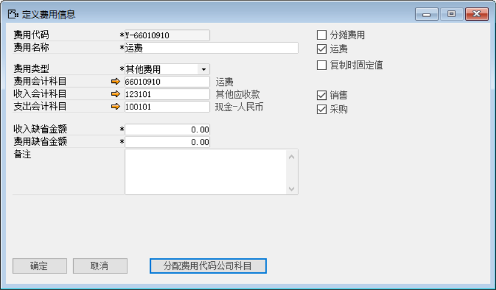
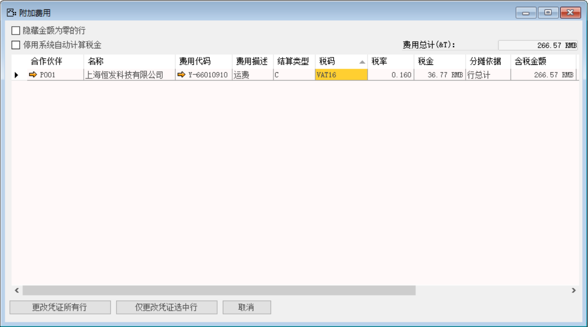
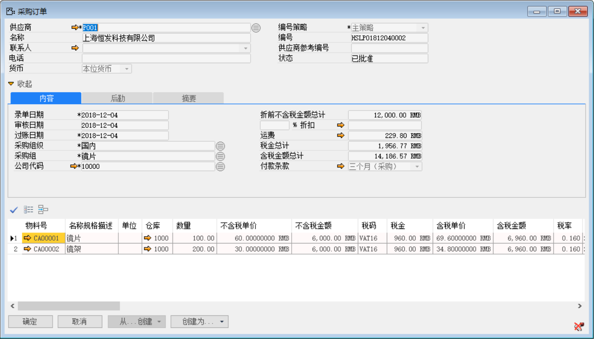
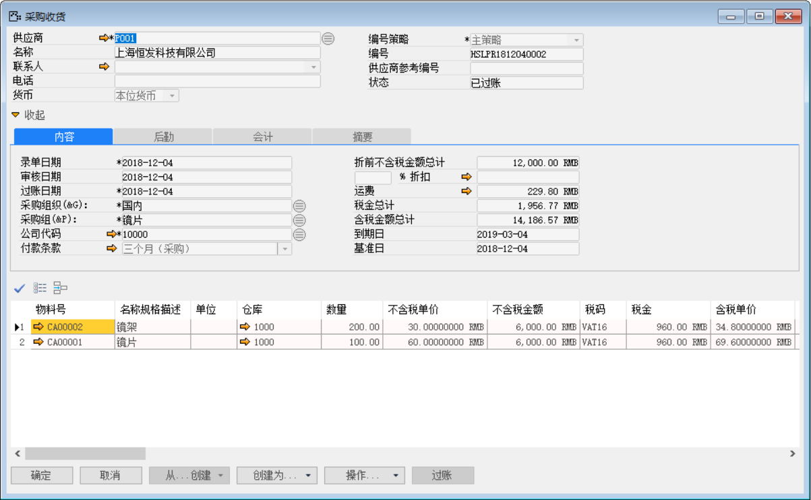
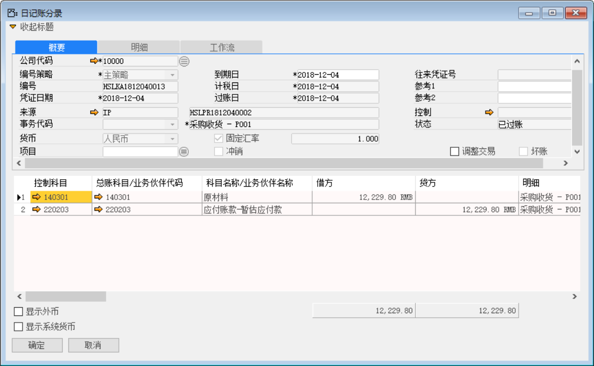
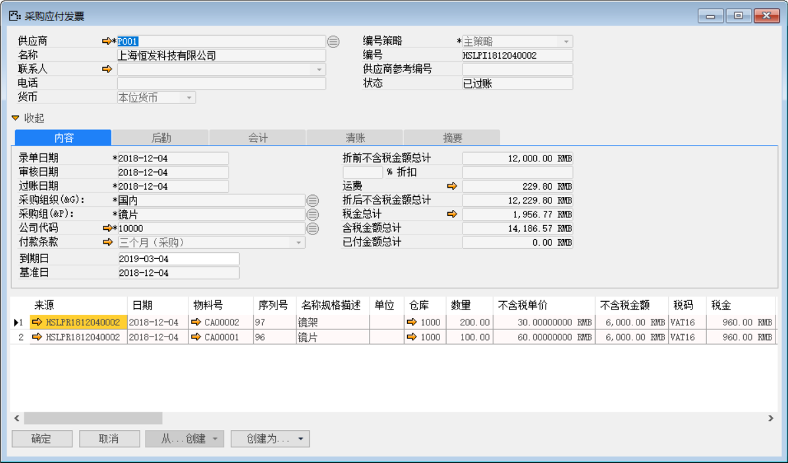
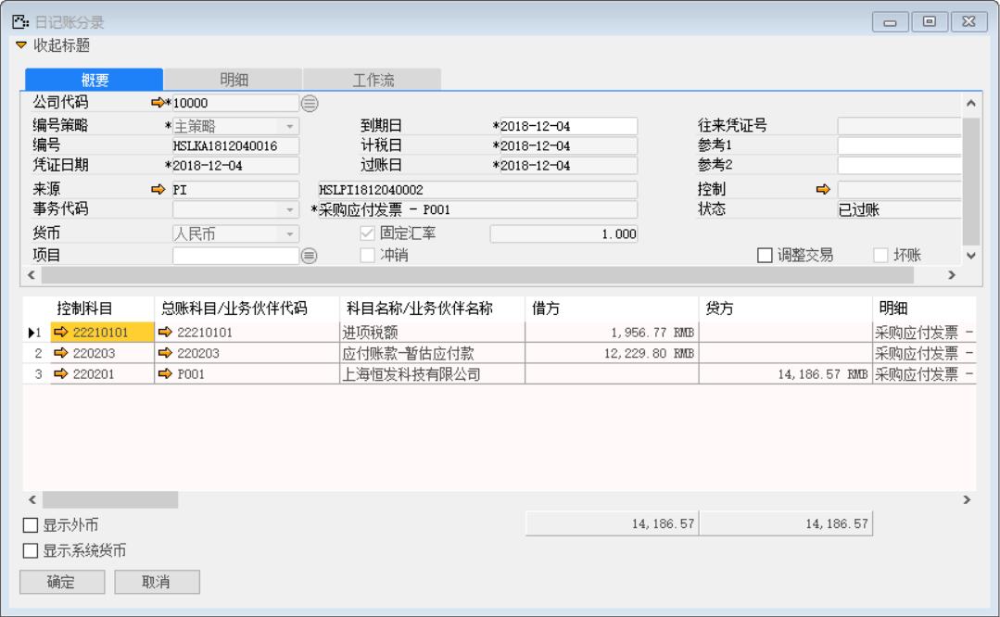
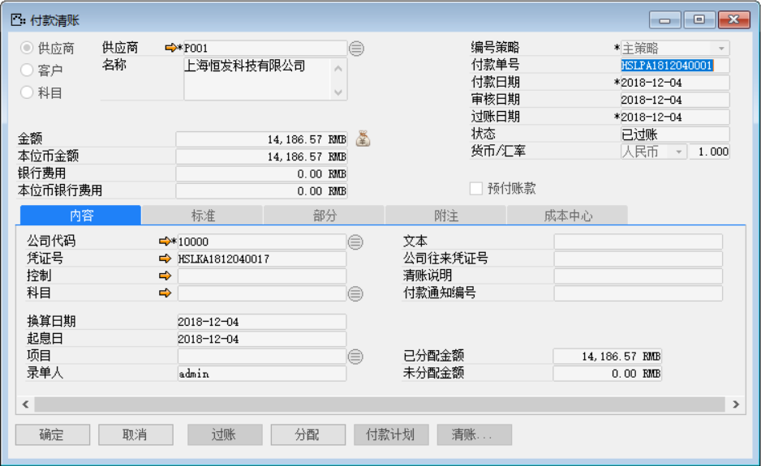
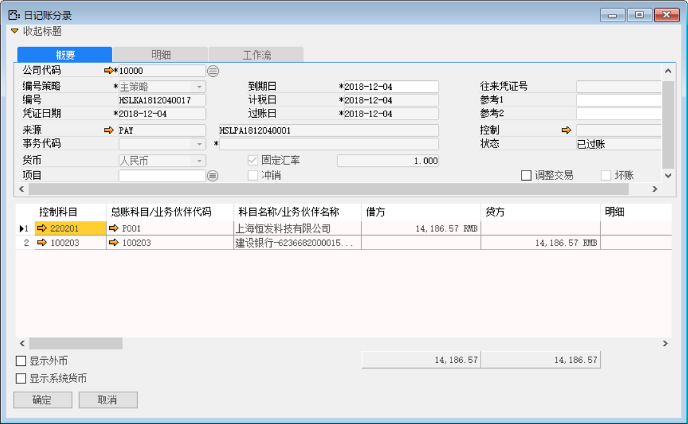

例如：有一张采购订单物料为：CA00001、CA00004数量分别为100、80，运费总金额为200元人民币。以下介绍含有附加费用的采购流程和附加费用开票流程操作。

打开路径：系统菜单—管理—基础定义—会计—定义费用代码

1、 打开【定义费用代码】界面，创建费用代码内容；

- 输入费用代码、费用类型和勾选运费等信息；

- 点击【分配费用代码公司科目】按钮，把费用代码分配到公司科目中；

 

- 对其保存操作；

 

打开路径：系统菜单—采购—申请与订单—采购订单

2、 打开【采购订单】界面，创建物料为：CA00001、CA00002数量分别是：100个和200个一张采购订单：HSLPO1812040002；

- 选择公司代码、供应商等基础信息；

- 点击【内容】标签下运费右边的按钮进入【附加费用】界面输入或选择结算类型税码金额等信息，点击【更改凭证所有行】按钮配进明细行中；

 

- 保存单据并对其进行审批操作。

 

打开路径：系统菜单—采购—采购收货

3、 打开【采购收货】界面，基于采购订单：HSLPO1812040002创建采购收货单：HSLPR1812040002；

- 选择公司代码、供应商等基础信息；

- 点击【从…创建】从采购订单清单中选择采购订单与明细行信息；

- 保存单据并对其进行审批过账操作。

 

- 点击【会计】标签下凭证号右侧按钮，打开凭证号：HSLKA1812040013的销售交货财务凭证。

**借（Dr）：原材料** 

**贷（Cr）：应付暂估-供应商**

 

打开路径：系统菜单—应付账款—应付发票

4、 打开【应付发票】界面，基于采购收货单：HSLPR1812040002创建一张应付发票：HSLPI1812040002；

- 选择供应商等基础性息；

- 点击【从…创建】从采购收货清单中选择采购收货单与明细行信息；

- 保存单据并对其进行审批操作；

 

- 点击【会计】标签下的凭证号右侧按钮，打开凭证号：HSLKA1812040016的应付发票财务凭证。

**借（Dr）: 应付暂估-供应商** 

**借（Dr）:应交增值税-进项税** 

**贷（Cr）: 应付账款-供应商**

 

5、 基于应付发票：HSLPR1812040002创建一张付款清账：HSLPA1812040001。

- 在应付发票界面点击【创建为…】按钮创建为付款清账单；

- 在付款清账界面点击【清账】按钮关联应付发票；

- 在付款清账界面点击按钮添加付款方式与金额；

注：分配：付款单上的分配按钮，可以将此次付款金额分配至对应的采购订单上。

- 保存付款单后，点击【分配】，进入分配界面；

- 在明细栏中勾选‘激活’复选框，鼠标点至‘分配金额’栏，系统自动带

- 并对其保存单据与审批过账操作。

 

- 点击【内容】标签下的凭证号右侧按钮，打开凭证号：HSLKA1812040017的付款清账财务凭证。

**借：应付账款-供应商**

**贷：银行**

