打开路径：系统菜单—管理—基础定义—会计—定义费用代码

1、 打开【定义费用代码】界面，创建费用代码内容；

- 输入费用代码、费用类型和勾选分摊费用等信息；

- 点击【分配费用代码公司科目】按钮，把费用代码分配到公司科目中；

 

- 对其单据保存操作；

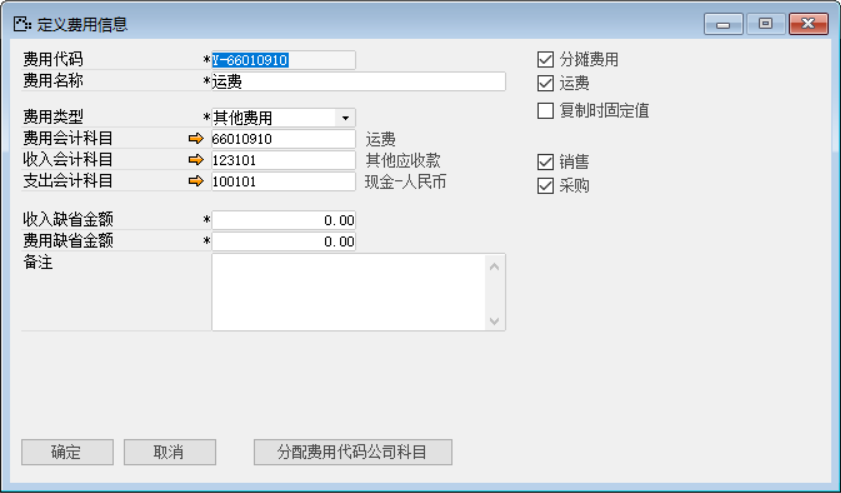 

打开路径：系统菜单—应付账款—服务发票

2、 打开【服务发票】界面，创建一张服务发票：HSLIC1812040002;

- 选择供应商、明细行中选择服务代码（费用代码）、选择税码、金额等基础性息；

- 保存单据并对其进行审批操作；

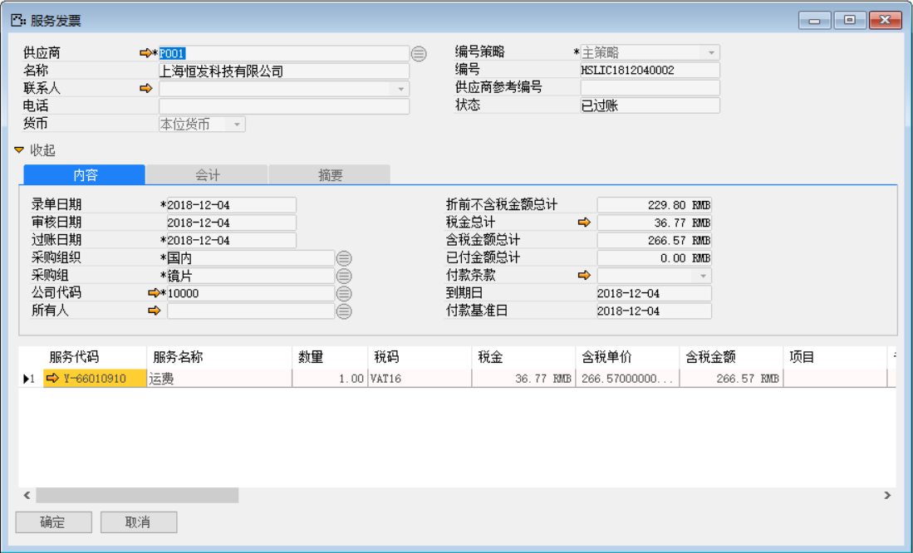 

- 点击【会计】标签下的凭证号右侧按钮，打开凭证号：HSLKA1812040014的服务发票财务凭证。

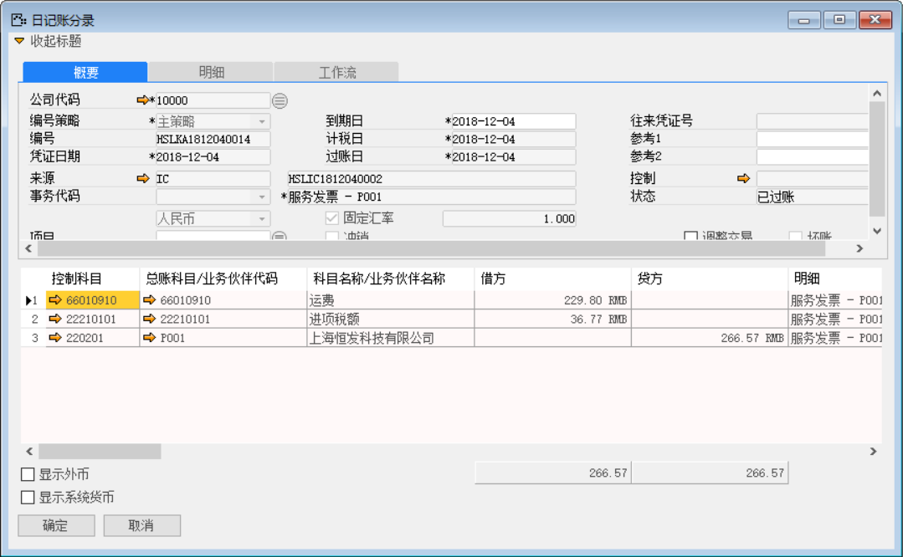 

打开路径：系统菜单—应付账款—服务发分摊

3、 打开【服务分摊】界面，创建一张服务分摊：HSLCS1812040002；

- 选择供应商等信息；

- 点击【收货】按钮选择需要分摊到的采购收货单和明细行：和点击【服务发票】按钮选择需要分摊的服务发票单和明细行； 

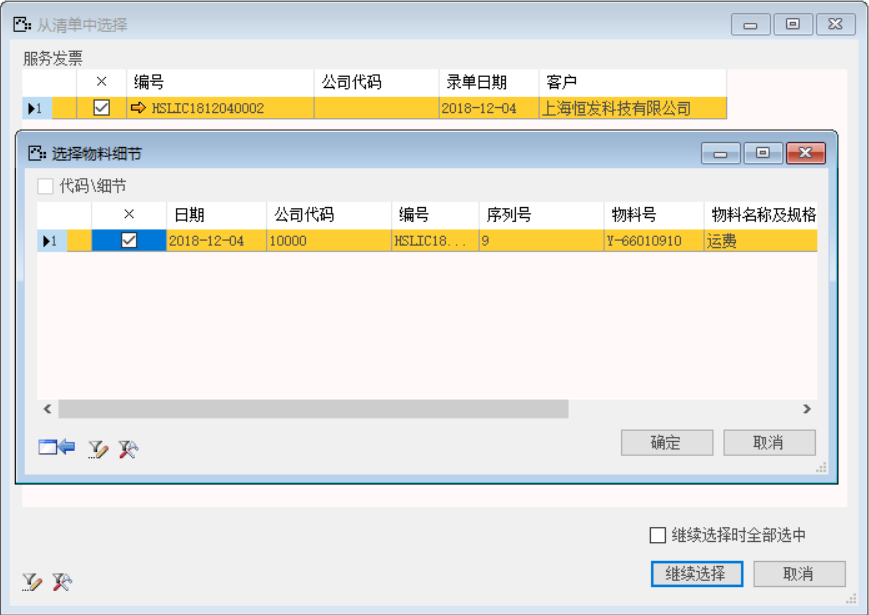 

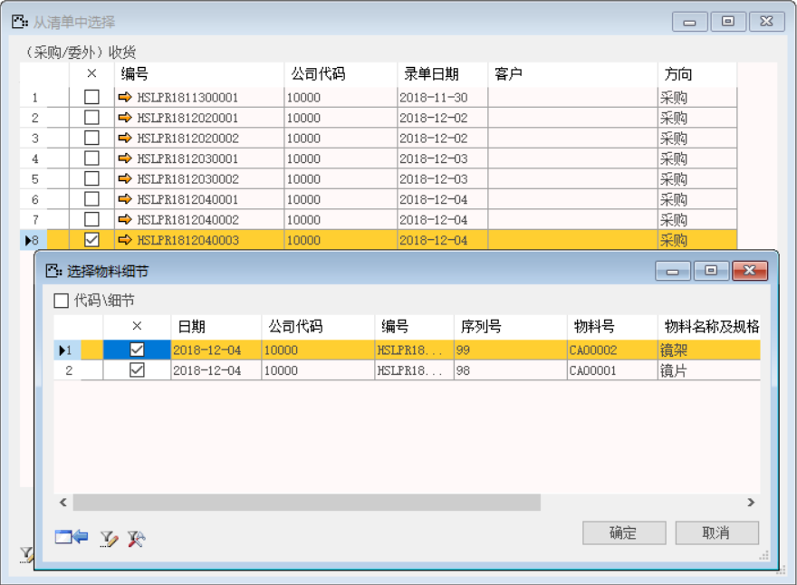 

- 点击【分摊】按钮对其分摊操作；

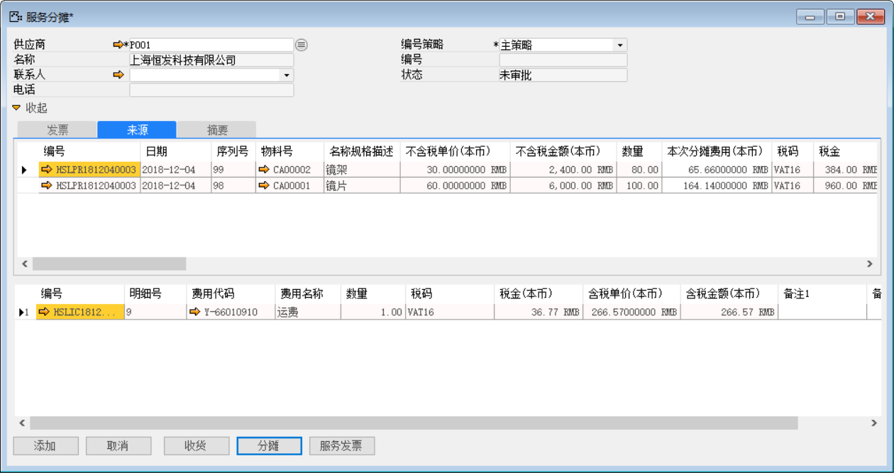 

- 对其保存单据审批操作。

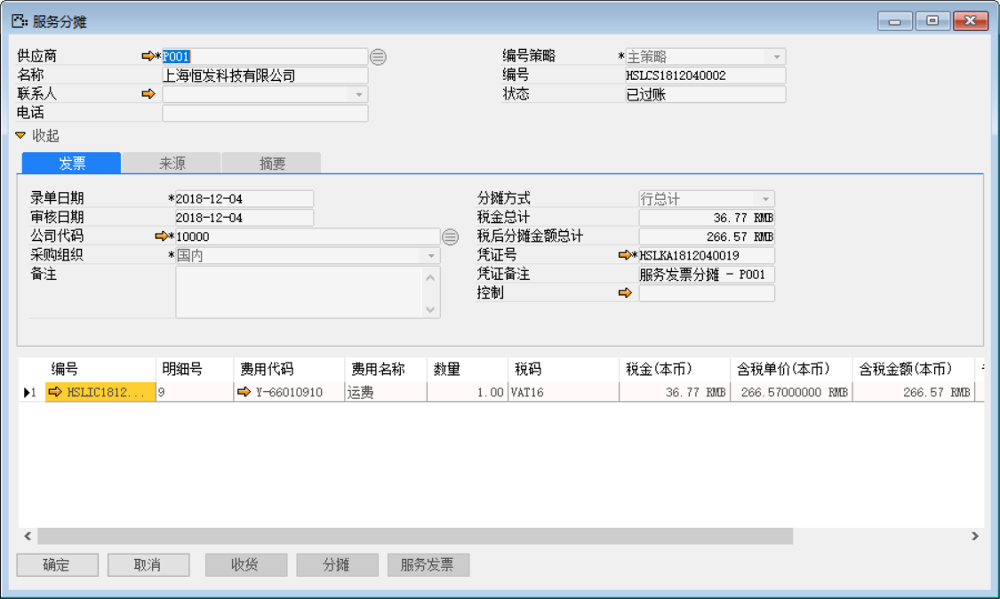 

- 点击凭证号右侧按钮，打开凭证号：HSLKA1812040019的服务分摊财务凭证。

**借（Dr）：存货类科目-原材料**

**借（Dr）：应交增值税-进项税**

**贷（Cr）：应付账款-供应商**

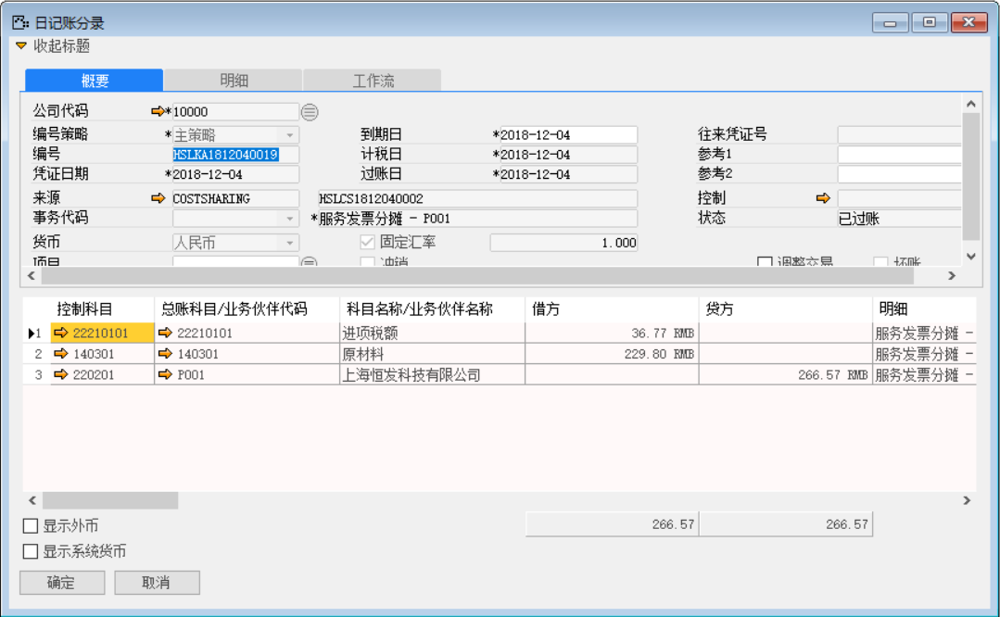 

4、 基于采购收货的应付发票：HSLPI1812040003创建一张付款清账：HSLPA1812040002。

- 在应付发票界面点击【创建为…】按钮创建为付款清账单；

- 在付款清账界面点击【清账】按钮关联应付发票和服务发票；

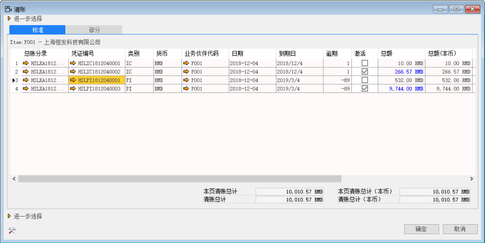 

- 在付款清账界面点击按钮添加付款方式与金额；

注：分配：付款单上的分配按钮，可以将此次付款金额分配至对应的采购订单上。

- 保存付款单后，点击【分配】，进入分配界面；

- 在明细栏中勾选‘激活’复选框，鼠标点至‘分配金额’栏，系统自动带

- 并对其保存单据与审批过账操作。

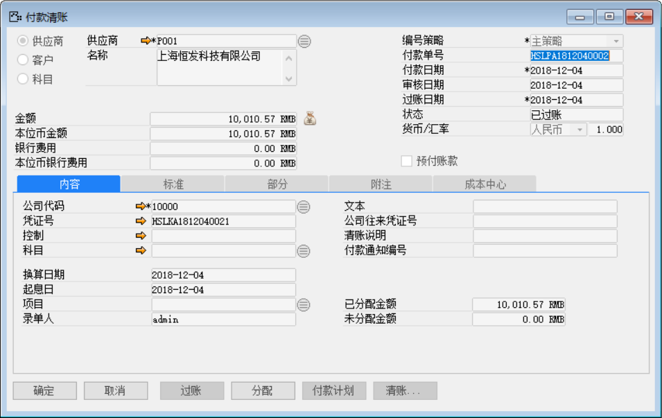 

- 点击【内容】标签下的凭证号右侧按钮，打开凭证号：HSLKA1812040021的付款清账财务凭证。

**借：应付账款-供应商**

**贷：银行**

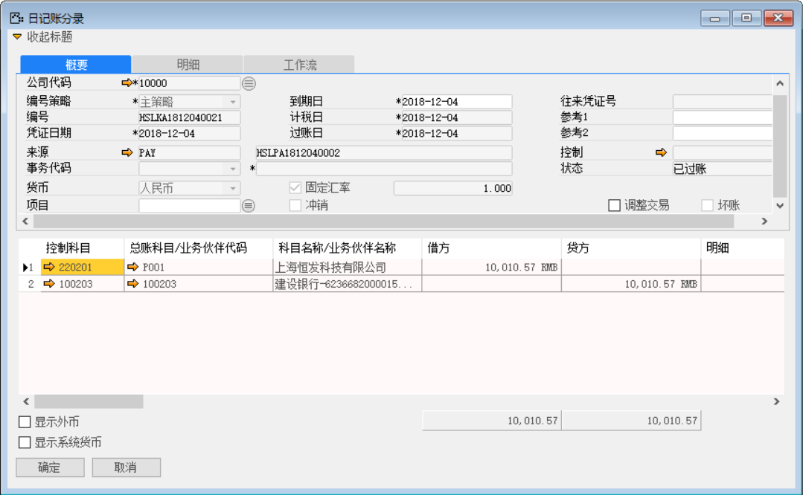