此业务的关键在收货单已经被全部开具了发票，那么再要对这个业务进行退货时，就无法选择已经开具发票的收货单，那么只有空做一张采购退货单（无来源的退货单），做完空白退货单后，需要对该采购退货单进行处理。

打开路径：系统菜单—采购—采购收货

1. 打开【采购收货】界面，基于采购订单：HSLPO1812030001创建采购收货单：HSLPR1812030001；

- 选择公司代码、供应商等基础信息；

- 点击【从…创建】从采购订单清单中选择采购订单与明细行信息；

- 保存单据并对其进行审批过账操作。

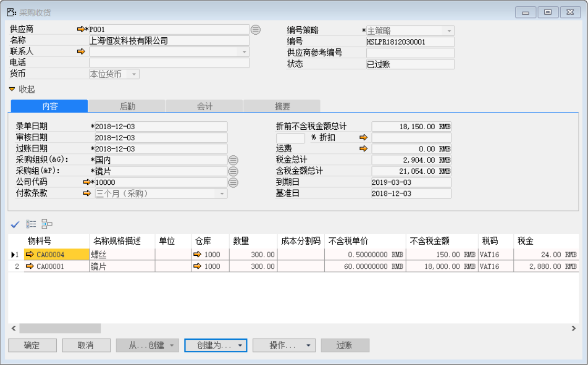 

- 点击【会计】标签下凭证号右侧按钮，打开凭证号：HSLKA1812030002的销售交货财务凭证。

**借（Dr）：原材料** 

**贷（Cr）：应付暂估-供应商**

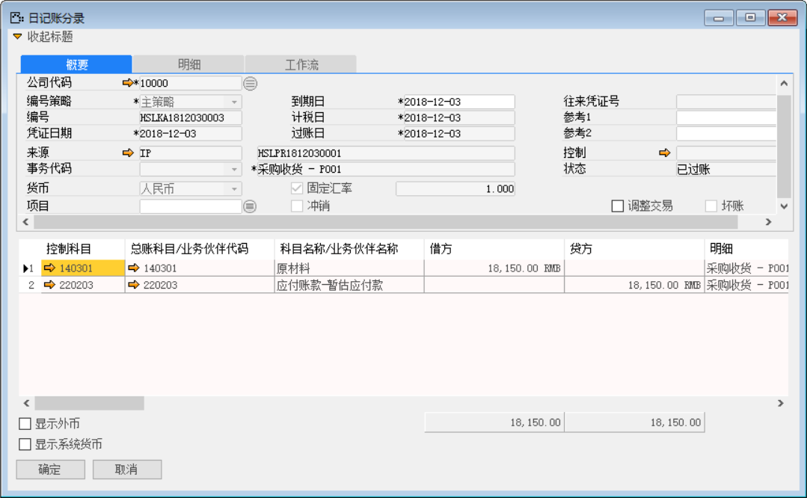 

打开路径：系统菜单—应付账款—应付发票

2. 打开【应付发票】界面，基于采购收货单：HSLPR1812030001创建一张应付发票：HSLPI1812030002；

- 选择供应商等基础性息；

- 点击【从…创建】从采购收货清单中选择采购收货单与明细行信息；

- 保存单据并对其进行审批操作；

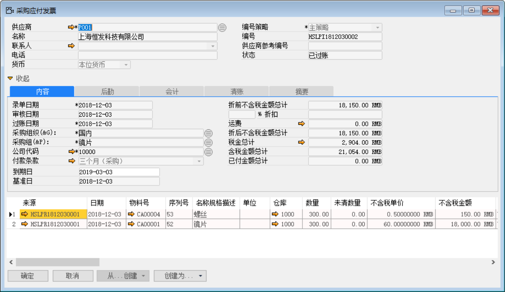 

- 点击【会计】标签下的凭证号右侧按钮，打开凭证号：HSLKA1812030004的应付发票财务凭证。

**借（Dr）: 应付暂估-供应商** 

**借（Dr）:应交增值税-进项税** 

**贷（Cr）: 应付账款-供应商**

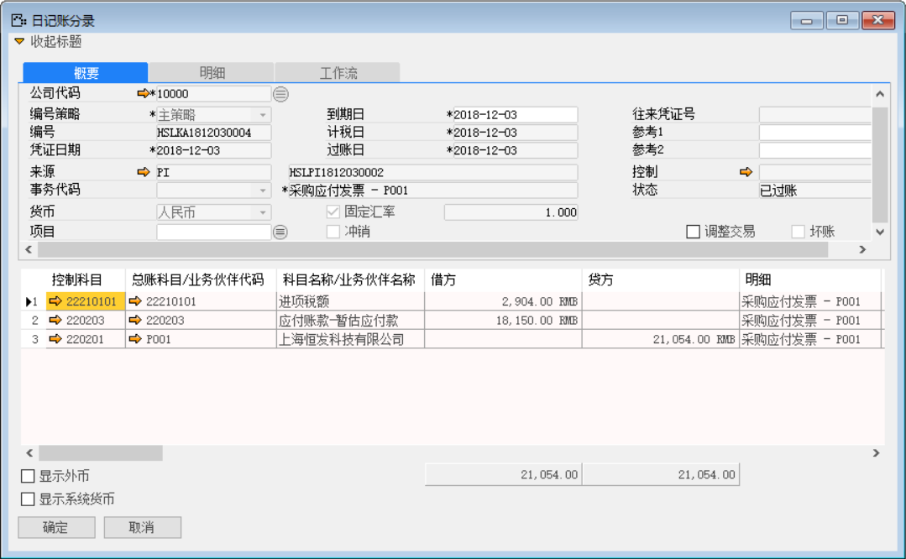 

打开路径：系统菜单—采购—申请与订单—采购退货订单

3. 打开【采购退货订单】界面，创建一张物料是采购收货：HSLPR1812030001的采购退货订单：各退数量100个；

- 选择与采购收货相同的供应商等基础性息；

- 保存单据并对其进行审批操作；

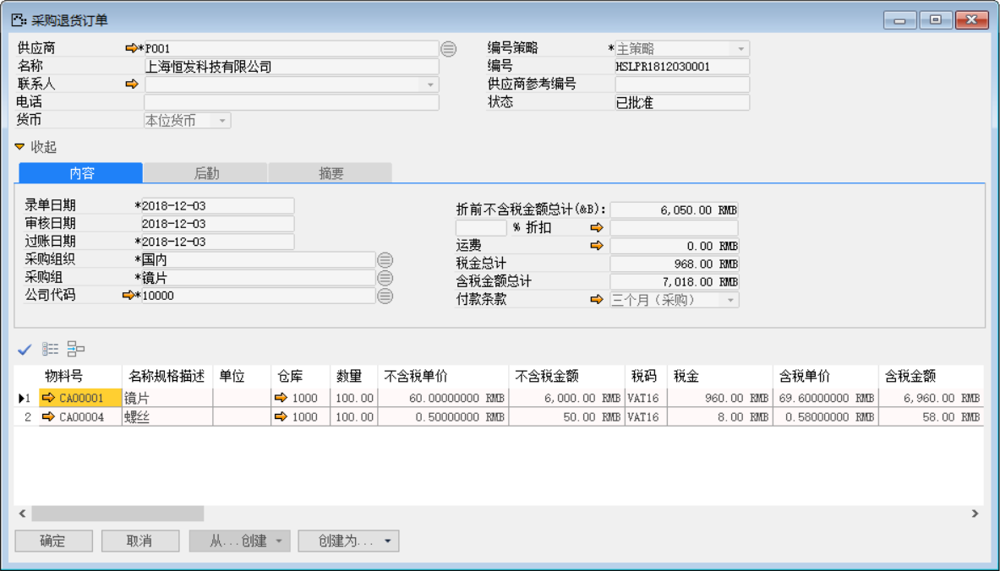 

打开路径：系统菜单—采购—采购退货

4. 打开【采购退货】界面，基于采购退货订单：HSLPR1812030001创建采购退货单：HSLPR1812030001；

- 选择公司代码、供应商等基础信息；

- 点击【从…创建】从采购退货订单清单中选择采购退货订单与明细行信息；

- 保存单据并对其进行审批过账操作。

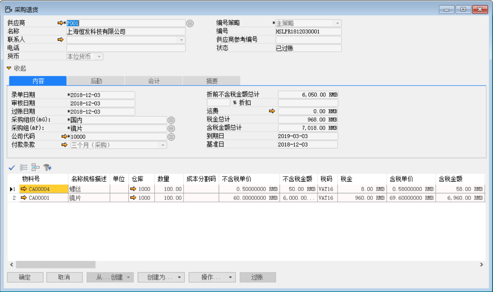 

- 点击【会计】标签下凭证号右侧按钮，打开凭证号：HSLKA1812030005的采购退货财务凭证。

**借（Dr）：应付暂估-供应商**

**贷（Cr）：原材料**

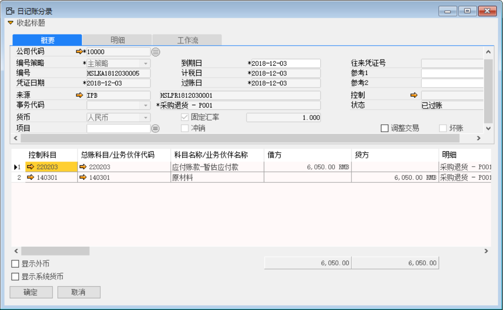 

打开路径：系统菜单—应付账款—应付贷项凭证

5. 打开【应付贷项凭证】界面，基于采购退货：HSLPR1812030001创建应付贷项凭证：HSLPC1812030001；

- 选择公司代码、供应商等基础信息；

- 点击【从…创建】从采购退货清单中选择采购退货单与明细行信息；

- 保存单据并对其进行审批过账操作。

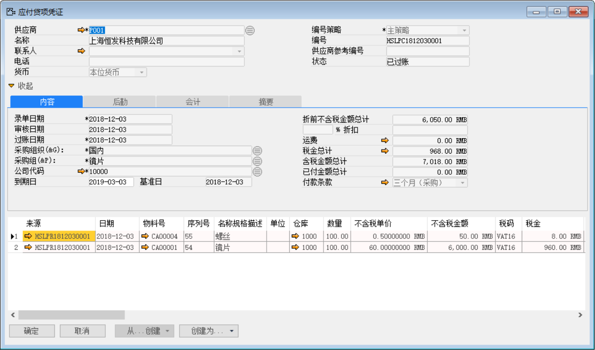 

- 点击【会计】标签下凭证号右侧按钮，打开凭证号：HSLKA1812030006的应付贷项凭证财务凭证。

**借（Dr）: 应付账款-供应商** 

**贷（Cr）:应交增值税-进项税** 

**贷（Cr）: 应付暂估-供应商**

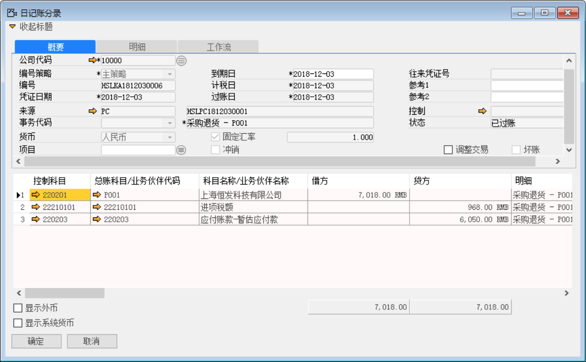

打开路径：系统菜单—应付账款—付款清账

6. 打开【付款清账】创建一张付款清账：HSLPA1812030001。

- 选择供应商等基础信息；

- 在付款清账界面点击【清账】按钮关联应付发票和应付贷项凭证；

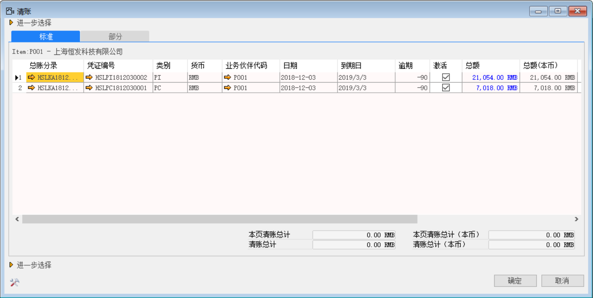 

- 在付款清账界面点击按钮添加付款方式与金额；

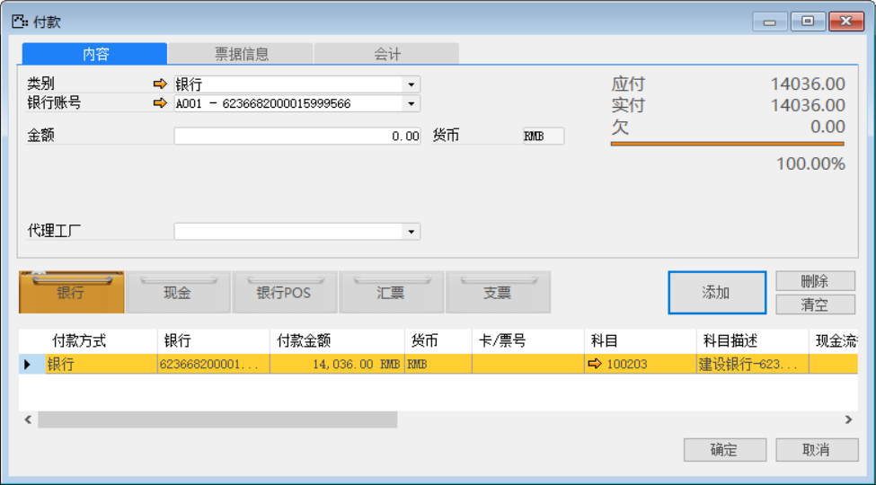 

注：分配：付款单上的分配按钮，可以将此次付款金额分配至对应的采购订单上。

- 保存付款单后，点击【分配】，进入分配界面；

- 在明细栏中勾选‘激活’复选框，鼠标点至‘分配金额’栏，系统自动带

 

- 并对其保存单据与审批过账操作。

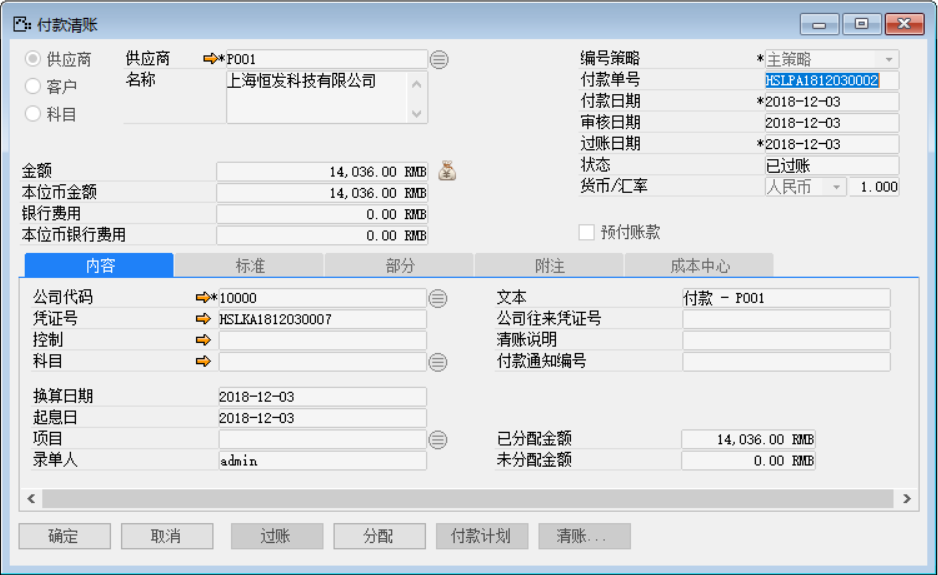 

- 点击【内容】标签下的凭证号右侧按钮，打开凭证号：HSLKA1812030007的付款清账财务凭证。

**借（Dr）：应收账款-上海光明眼镜有限公司**

**借（Dr）：银行-建设银行** 

**贷（Cr）：应收账款-上海光明眼镜有限公司**

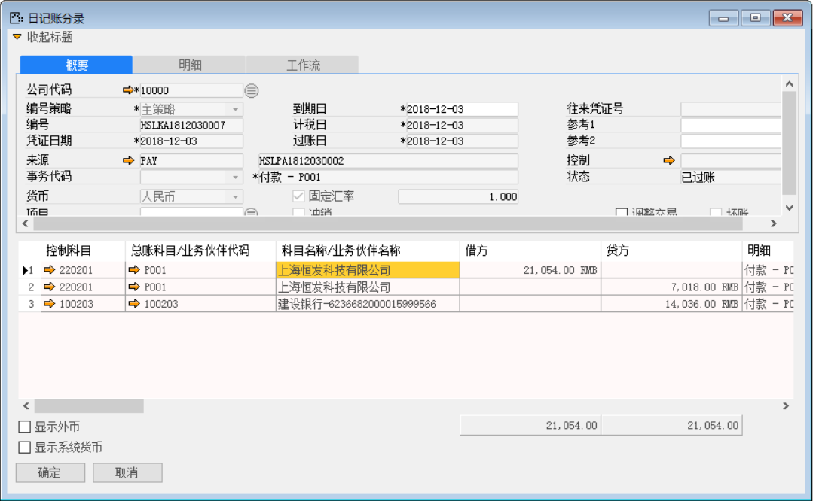