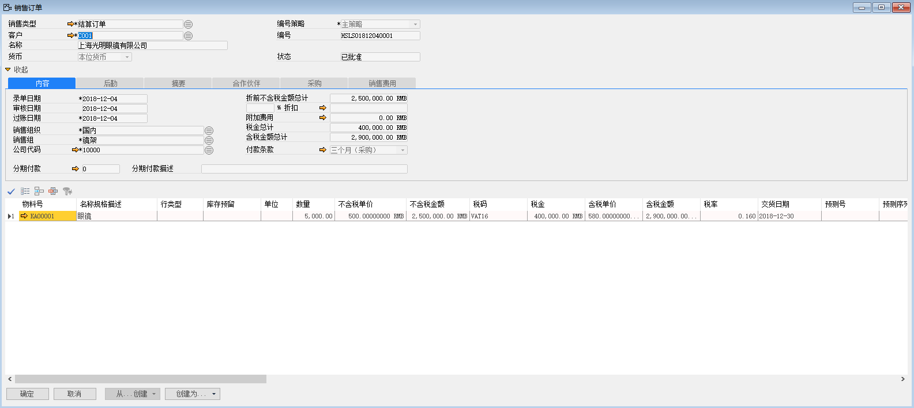
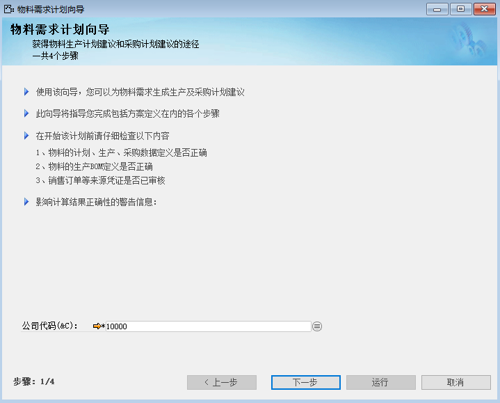
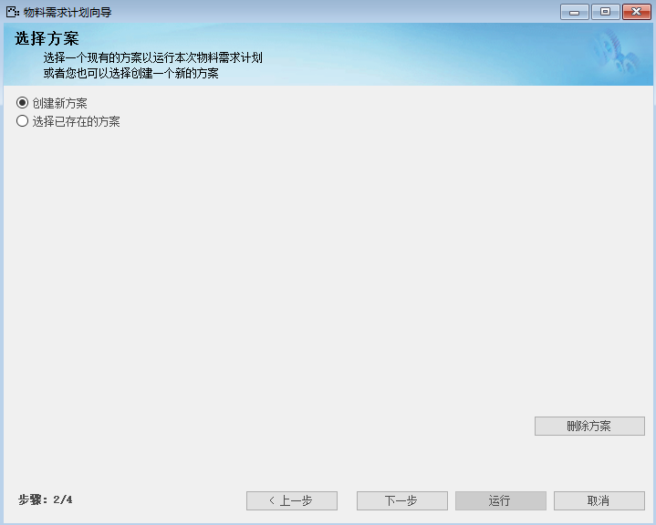
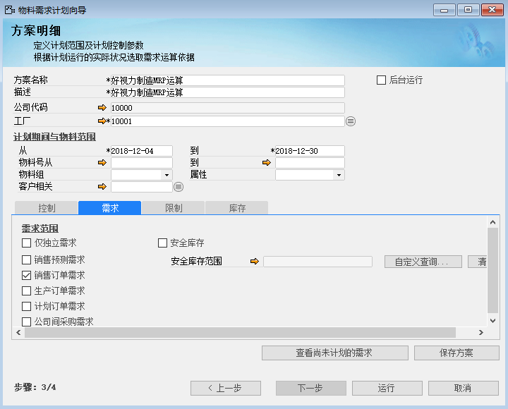
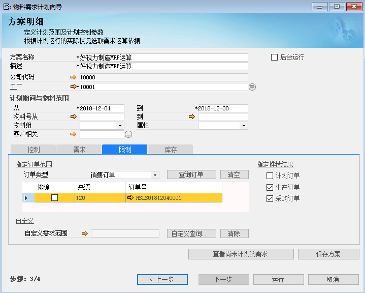
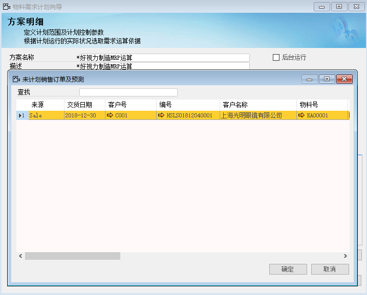
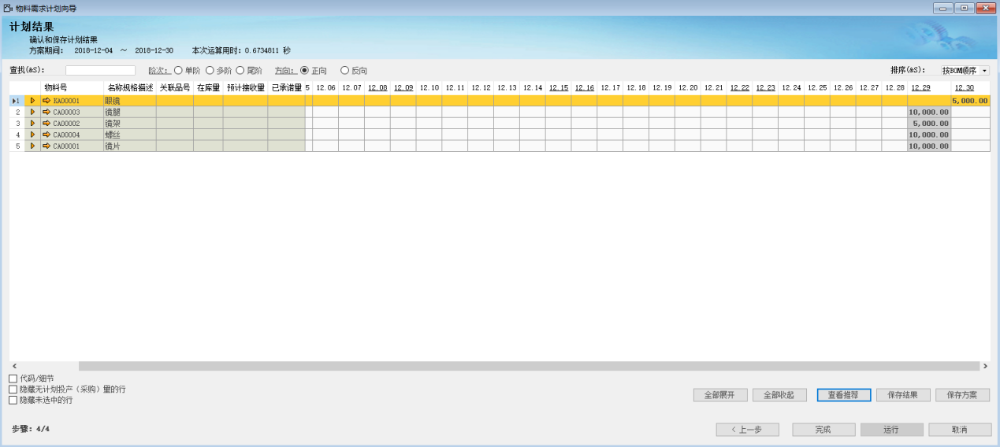

通过MRP运算我们可以得出生产或采购建议。通过MRP计算得到物料采购或生产日期、数量等信息。

进行MRP运算前需要在系统中确认以下几点：

① 是否建立了BOM以及工艺路线（本章不讲解工艺路线）；

② 是否维护物料的日产量、成品率等；

③ 是否有联产品（本章不讲解）；

④ BOM中的物料是否都参与MRP运算，如有遗漏在物料主文件中编辑。

完成上面所述工作，接下来就讲解如何利用销售订单进行MRP运算：

例如：苏州好视力眼镜有限公司收到客户‘上海光明眼镜有限公司’物料为KA00001，数量为5000，交货日期为2018-12-30的销售订单（系统中已经建立好物料主文件、BOM等信息）

1、 依据客户纸质销售订单在系统中创建销售订单；

 

2、 打开路径：从菜单窗口，计划-物料需求计划运算，选择公司代码，左击‘下一步’按钮进入方案选择界面；

 

3、 勾选‘创建新方案’按钮，左击‘下一步’按钮进入方案明细页面；

 

4、 编辑运算方案内容：代码、名称、公司、工厂、计划期间、指定范围、指定推荐结果；

- 方案名称：好视力制造MRP运算

- 描述：好视力制造MRP运算

- 公司代码：10000

- 工厂：10001

- 计划期间从：2018-12-04

- 计划期间到：2018-12-30

- 需求范围：勾选销售订单需求

- 订单类型：销售订单

- 查询订单：销售订单- HSLSO1812040001

- 指定推荐结果：生产订单、采购订单

 

5、 左击‘保存方案’按钮，保存方案；

6、 左击‘运行’得出MRP运算结果；

 

7、 左击展开查看明细信息，确认无误左击‘保存结果’并完成退出运算界面。

注：① 查看推荐：此功能可以查看物料运算的建议单据类型、日期及数量等信息；

② 保存结果：将MRP运算的结果与推荐类型保存中数据库中。
