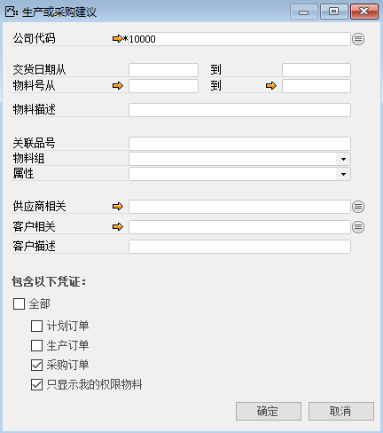
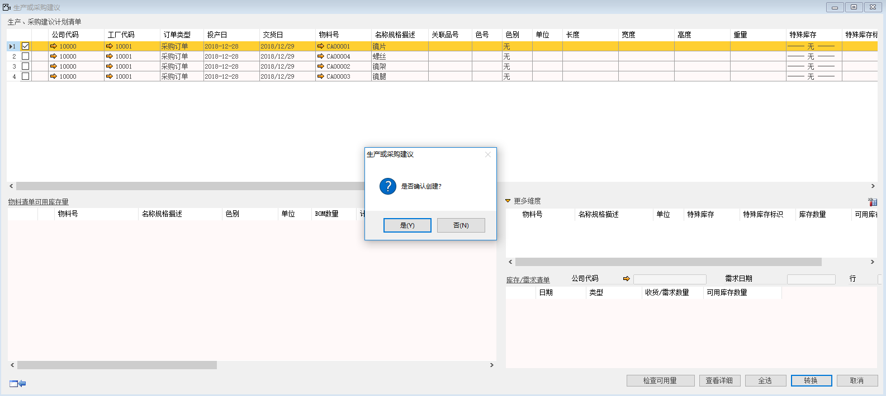
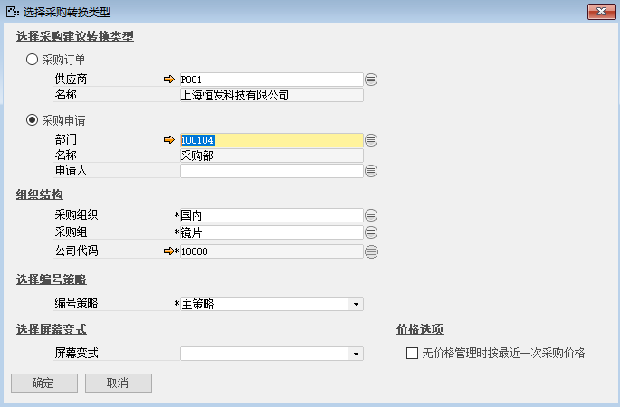
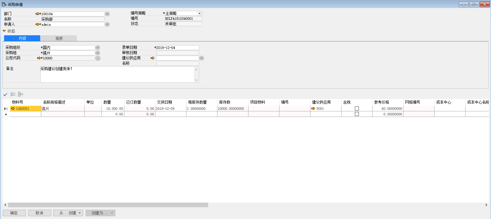

此处转换生成采购申请，后续则依据该采购申请创建采购订单，再进行后续采购业务。

下面讲解如何实现将采购建议转换成采购申请单：

1、 打开路径：从菜单窗口，计划-生产或采购建议，进入筛选条件界面，编辑转换的筛选条件，并左击‘确定’进入建议报表；

- 勾选：采购订单

- 勾选：只显示我的权限物料

 

2、 选中需要转换的行，并左击‘转换’按钮，确认转换后进入转换类型单据选择；

3、 选中‘采购申请’按钮，选择部门、采购组、采购组织、公司代码信息；

- 部门：100104

- 名称：采购部

- 采购组织：国内

- 采购组：镜片

4、左击‘确定’按钮并确认转换，生成一张未审批状态的采购申请单，系统提示：‘本次生成采购申请1张，共生成1张，凭证编号[HSLPA1812040001]是否立即查看创建结果’左击‘确认’按钮进行查看；

