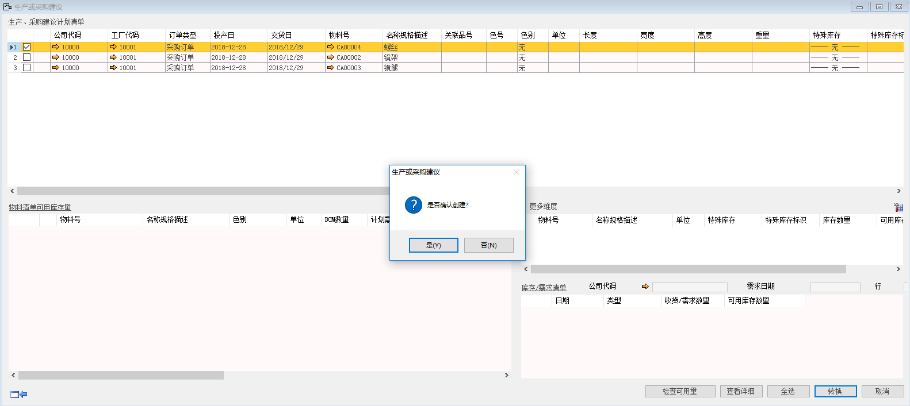
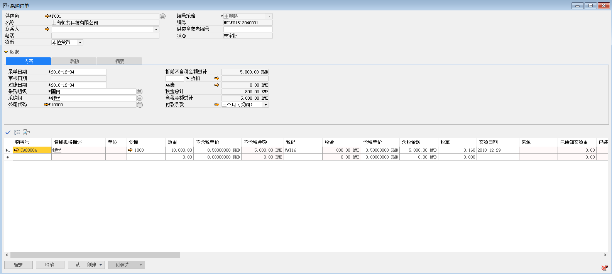

此功能将直接转换生成一张未审批状态的采购订单。不需要生成采购申请，再依据采购申请做采购订单。

在将建议转换成采购订单之前需要确认一点：待转换物料的默认仓库是否有编辑，如果没有请在物料主文件中编辑，并注意区别是否有按工厂的组织权限。

下面讲解如果将采购建议转换成采购订单：

1、 打开路径：从菜单窗口，计划-生产或采购建议，进入筛选条件界面，编辑转换的筛选条件，并左击‘确定’进入建议报表；

- 勾选：采购订单

- 勾选：只显示我的权限物料

 

2、勾选要转换的行，并左击‘转换’按钮，确认转换后进入转换类型单据选择；；

 

3、选中‘采购订单’按钮，选择供应商、名称、采购组、采购组织、公司代码信息；     

- 供应商：P001

- 名称：上海恒发科技有限公司

- 采购组织：国内

- 采购组：螺丝

- 公司代码：10000

 

1、 左击‘确定’按钮并确认转换，生成一张未审批状态的采购订单，系统提示：‘本次生成采购订单1张，共生成1张，凭证编号[HSLPO1812040001]是否立即查看创建结果’左击‘确认’按钮进行查看；

