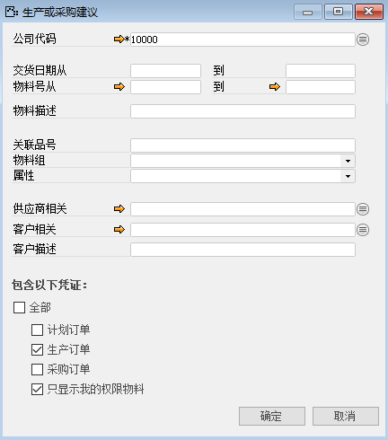
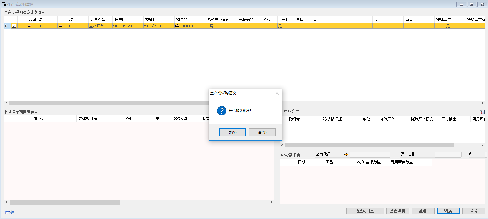
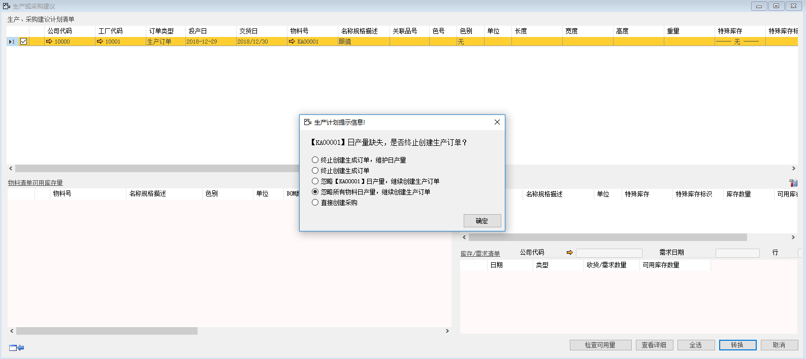
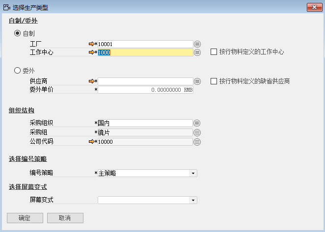
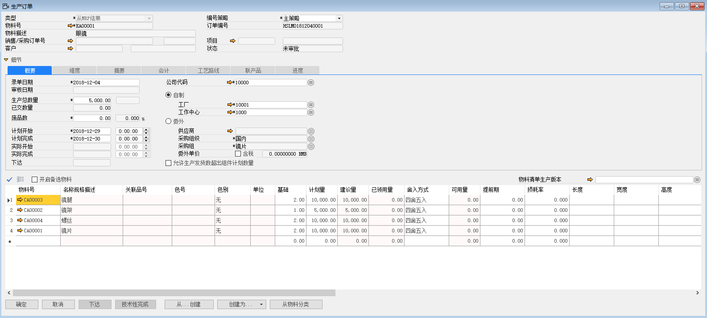

可以转换成生产订单的其获取途径为‘生产’，这样在MRP运算时才会生产生产建议，那么接下来我们讲解如何将生产建议转换为生产订单。

1、 打开路径：从菜单窗口，计划-生产或采购建议，进入筛选条件界面，编辑转换的筛选条件，并左击‘确定’进入建议报表；

- 勾选：生产订单

- 勾选：只显示我的权限物料

 

2、 勾选要转换的行，并左击‘转换’按钮，确认转换后进入系统生产计划提示信息；

 

3、 勾选‘忽略所有物料日产量，继续创建生产订单’左击‘确认’按钮，进入转换界面；

 

4、 勾选‘自制’按钮，填写工作中心、工厂信息；

- 工厂：10001

- 工作中心：1000

 

5、 左击‘确定’按钮并确认转换，生成一张未审批状态的生产订单，系统提示：‘本次生成生产订单1张，共生成1张，凭证编号[HSLMO1812040001]是否立即查看创建结果’左击‘确认’按钮进行查看；

