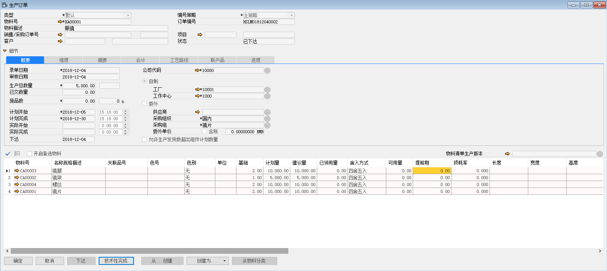
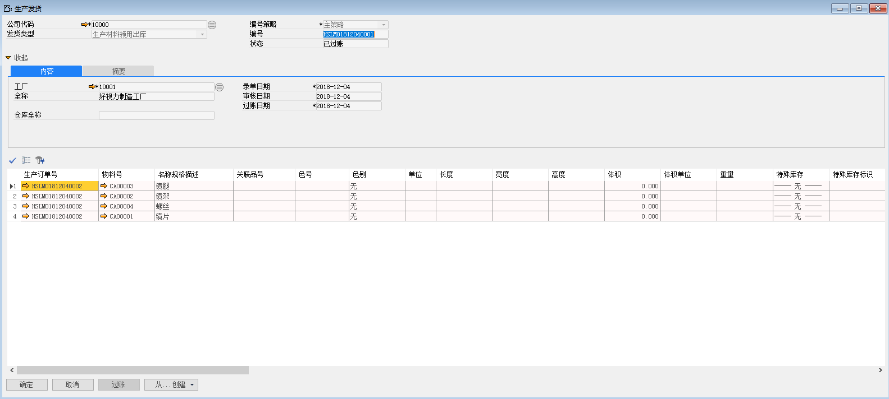
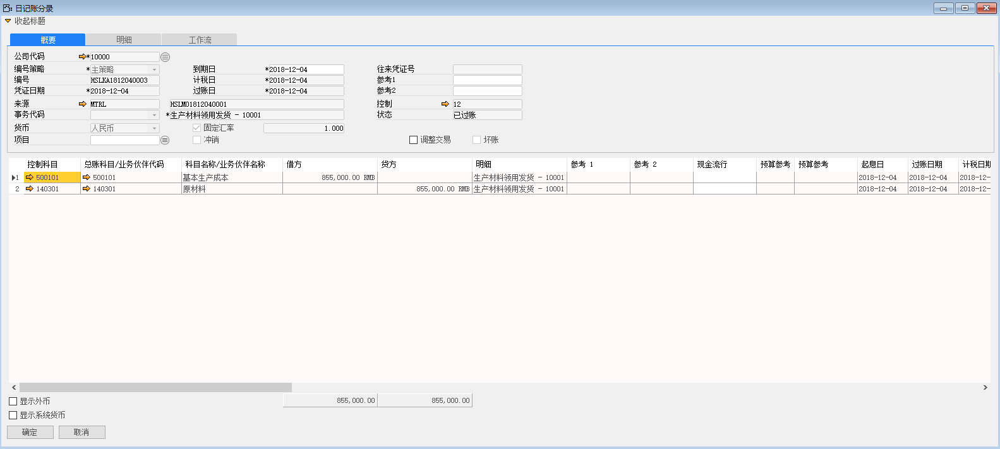
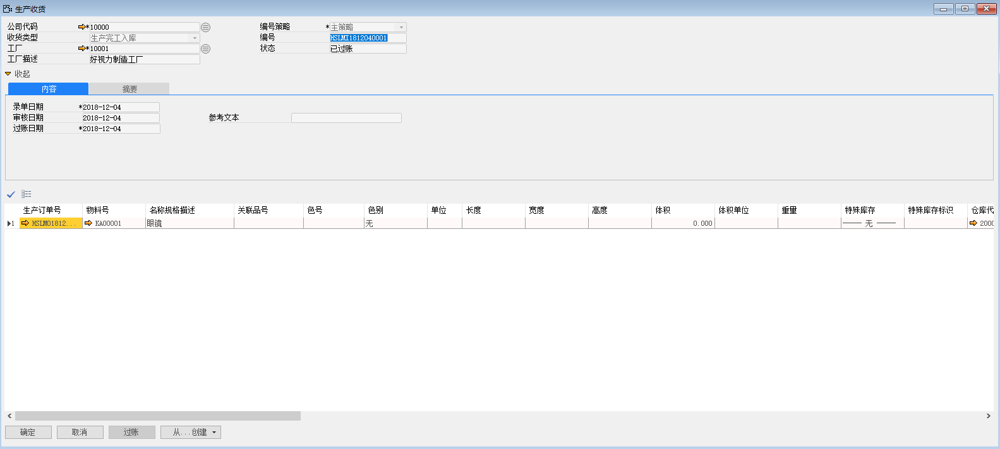
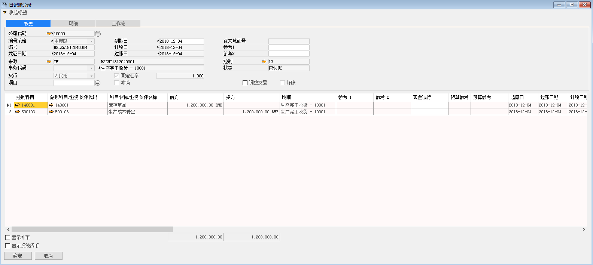

例如：苏州好视力公司需要生产物料KA00001-眼镜，数量为50000个。

1、 打开路径：从菜单窗口，生产作业-生产作业-生产订单，打开订单创建界面；

2、 填写生产订单上信息；

- 类型：默认

- 物料号：KA00001（如定义了物料清单选择父级物料，父级物料描述，子级物料及信息系统自动带出）

- 物料描述：眼镜

- 公司代码：10000

- 勾选：自制

- 工作中心：1000

- 工厂：10001

- 生产总数量：5000

- 计划开始时间：2018-12-05

- 计划完成时间：2018-12-30

3、 信息编辑完成以后，左击‘添加’按钮进行保存，并对该生产订单进行审批，审批通过后，左击‘下达’按钮；

 

4、 在生产订单上左击‘创建为’按钮，左击生产发货，进入生产发货界面，系统自动将信息带到生产发货界面，选择发货仓库-1000，左击‘添加’按钮，进行保存，并对生产发货进行审批，审批通过后，左击‘过账’按钮，完成生产发货出库；

 

5、 生产发货产生财务凭证 

借：基本生产成本 855000 

贷：原材料 855000

 

6、 在生产订单上左击‘创建为’按钮，左击生产收货，进入生产收货界面，系统自动将信息带到生产收货界面，选择收货仓库-2000，左击‘添加’按钮，进行保存，并对生产收货进行审批，审批通过后，左击‘过账’按钮，完成生产收货入库；

 

7、 生产收货产生财务凭证

借：库存商品 1200000 

贷：生产成本转出 1200000 

