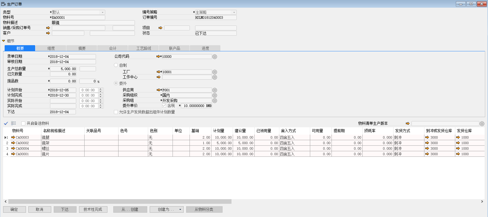
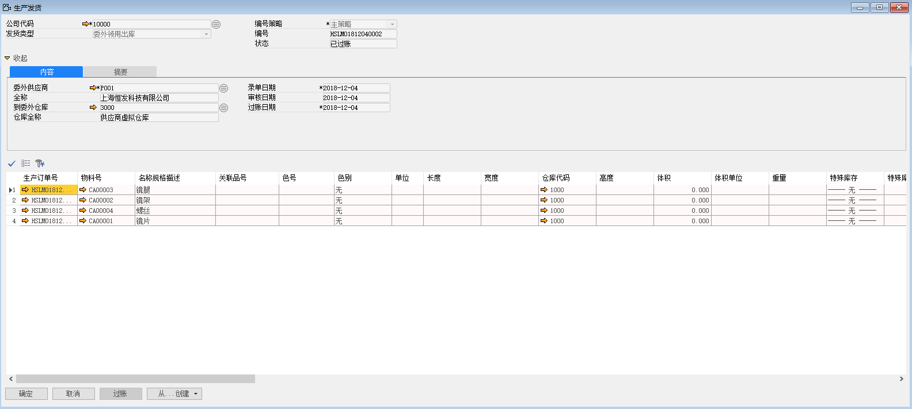
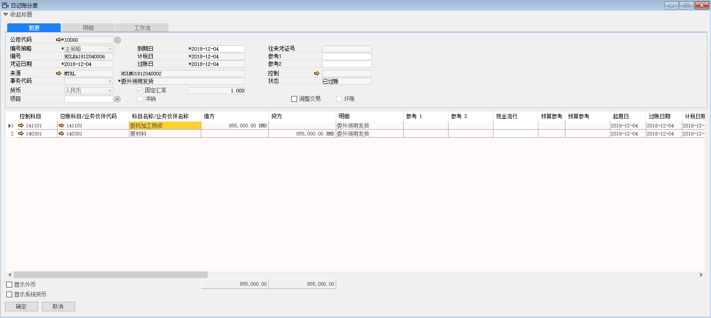
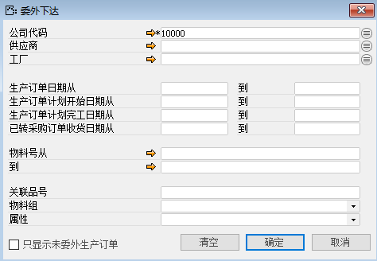
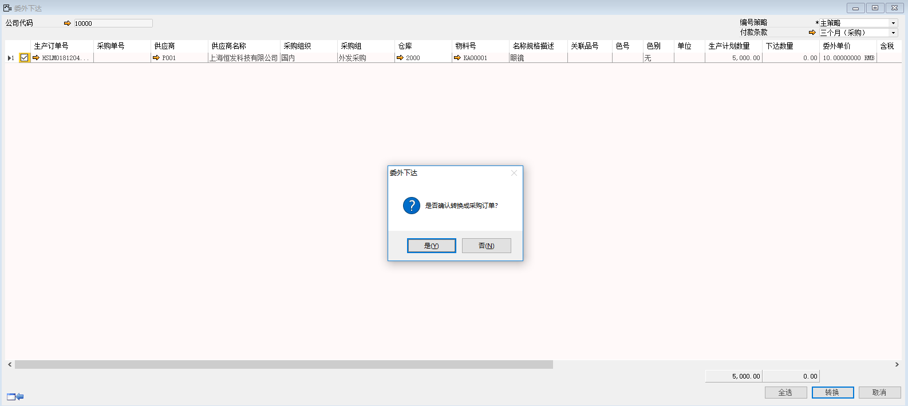
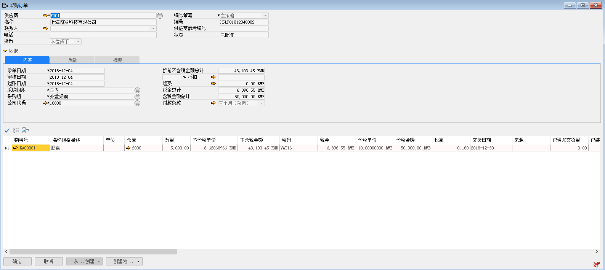
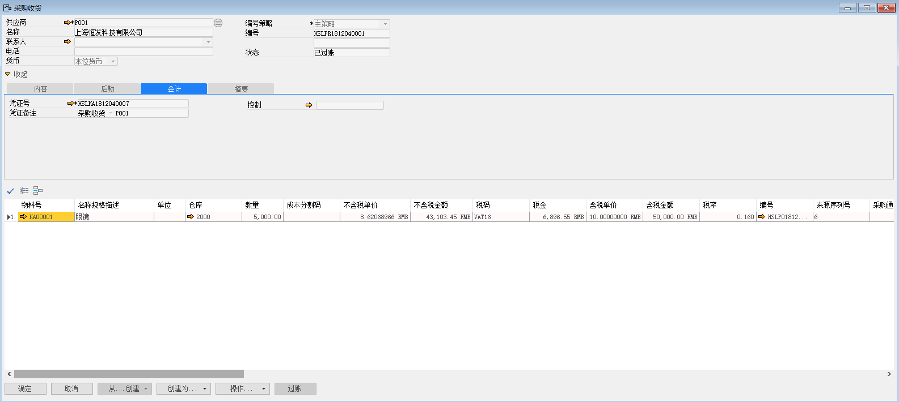
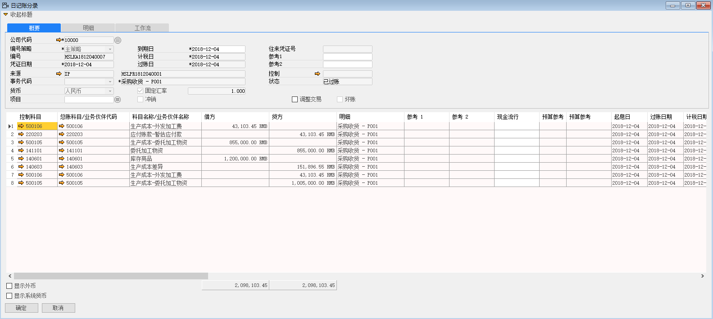

委外工单就是将生产订单全权委托给供应商，并且由公司提供材料给厂商。

在进行委外工单业务开始之前除了正常的数据准备外，我们还需要新建一个供应商虚拟仓库，该仓库用来承接公司所提供给供应商的材料。

例如：苏州好视力公司将物料KA00001-眼镜，数量为50000个的生产订单委托给供应商上海恒发科技有限公司，并由公司提供材料给该厂商。

那么接下来就详细讲解如何从创建委外工单开始到完成成品收货入库的业务流程。

1、 打开路径：从菜单窗口，生产作业-生产作业-生产订单，打开订单创建界面；

2、 填写生产订单上信息；

- 类型：默认

- 物料号：KA00001（如定义了物料清单选择父级物料，父级物料描述，子级物料及信息系统自动带出）

- 物料描述：眼镜

- 公司代码：10000

- 勾选：委外

- 供应商：P001

- 采购组织：国内

- 采购组：外发采购

- 勾选：含税

- 委外单价：10RMB

- 生产总数量：5000

- 计划开始时间：2018-12-05

- 计划完成时间：2018-12-30

- 在组件下发货方式：倒冲

- 倒冲或发货仓库：3000

- 发货仓库：1000

3、 信息编辑完成以后，左击‘添加’按钮进行保存，并对该生产订单进行审批，审批通过后，左击‘下达’按钮；

 

4、 在生产订单上左击‘创建为’按钮，左击生产发货，进入生产发货界面，系统自动将信息带到生产发货界面，选择到委外仓库：3000-供应商虚拟仓库，选择发货仓库：1000-原材料仓库，左击‘添加’按钮，进行保存，并对生产发货进行审批，审批通过后，左击‘过账’按钮，委外的生产发货是将原材料仓库的原材料转移到供应商虚拟仓库的过程；

 

5、  生产发货产生财务凭证 

借：委托加工物资 855000 

贷：原材料 855000

 

6、 打开路径：从菜单窗口，生产作业-生产作业-委外订单下达，进行筛选页面，左击‘确认’按钮，进入委外下达界面；

 

7、 勾选需要转换的行，左击‘转换’按钮，系统提示：‘是否确认转换采购订单’左击‘确认’按钮，进行转换；

 

8、 打开路径：从菜单窗口，采购-申请与订单-采购订单，找到上一步转换的采购订单，并且审批通过，左击‘创建为’按钮，进入到采购收货界面；

 

9、 将采购订单下推过来的采购收货进行审批通过，左击‘过账’按钮，进行委外生产收货；

 

10、 采购收产生财务凭证

借：生产成本-外发加工费 43103.45 

贷：应付账款-暂估 43103.45

借：生产成本-委托加工物资 855000

贷：委托加工物资 855000

借：库存商品 1200000

贷：生产成本差异 151896.55

贷：生产成本-外发加工费 43103.45

贷：生产成本-委托加工物资 1005000

注：KA0001-眼镜 物料成本核算方式：标准成本

