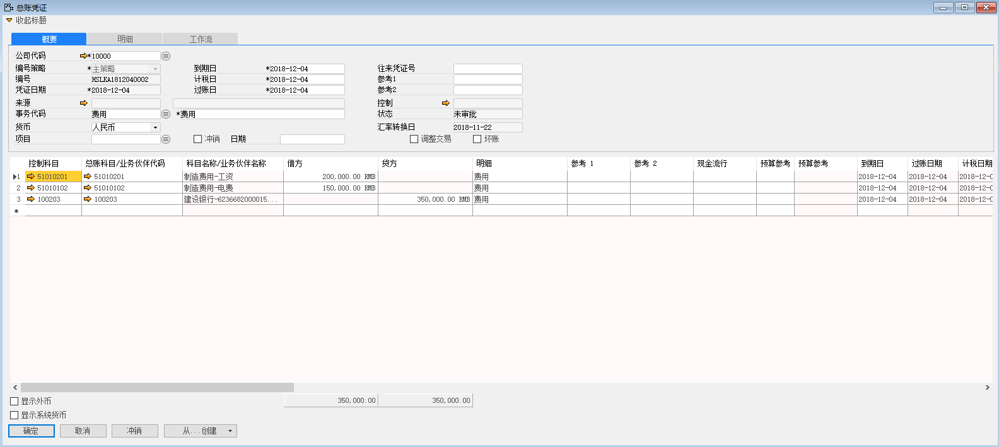

此功能是用来手工创建科目与业务伙伴的总账凭证。

例如：手动创建一张工资、电费的总账凭证，步骤如下：

1、 打开路径：从菜单窗口，总账-总账凭证，打开创建界面，并点击按钮准备创建；

2、 选择公司代码，编号策略，选择货币，编辑凭证描述，借贷方科目，金额，成本中心；

公司代码：10000

编号策略：主策略

事务代码：费用

货币：人民币

借方：制造费用-工资 200000

借方：制造费用-电费 150000

贷方：建设银行-6236682000015999566 350000

成本中心：生产部

3、 编辑完成，左击‘添加’保存。

